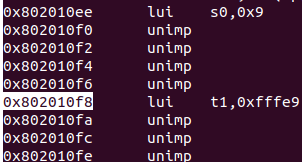
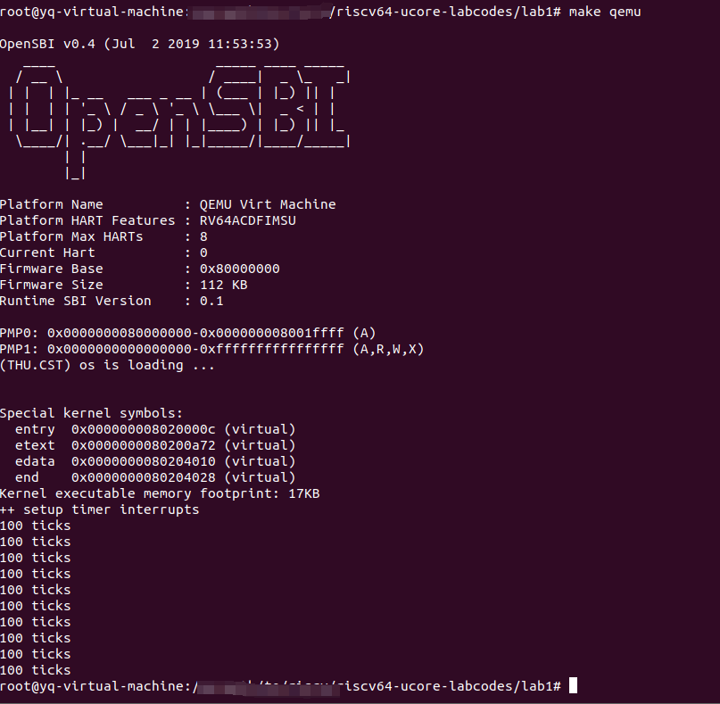
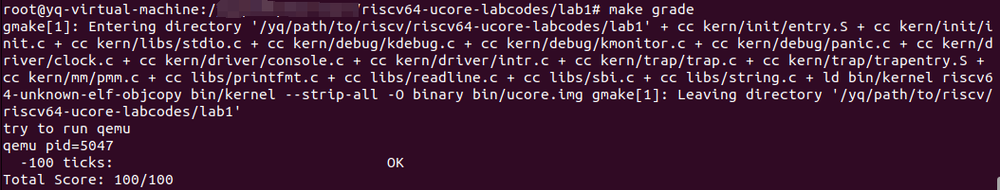
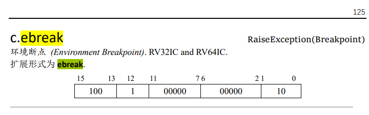
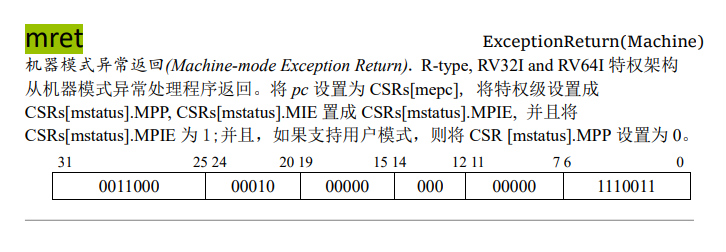
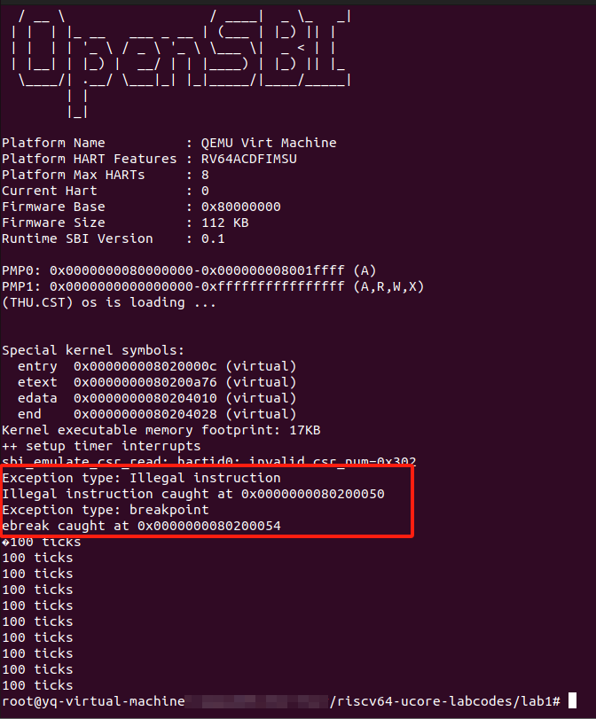

#### 练习1：理解内核启动中的程序入口操作

> 阅读 kern/init/entry.S内容代码，结合操作系统内核启动流程，说明指令 la sp, bootstacktop 完成了什么操作，目的是什么？ tail kern_init 完成了什么操作，目的是什么？

##### 简单阅读
```C
#include <mmu.h>
#include <memlayout.h>

    .section .text,"ax",%progbits
    .globl kern_entry
kern_entry:
    la sp, bootstacktop

    tail kern_init

.section .data
    # .align 2^12
    .align PGSHIFT
    .global bootstack
bootstack:
    .space KSTACKSIZE
    .global bootstacktop
bootstacktop:
```

上述是entry.S的代码，入口点kern_entry处的地址为0x80200000，对应的汇编指令如下：
```
0x80200000 <kern_entry> auipc sp,0x4 
0x80200004 <kern_entry+4> mv sp,sp 
0x80200008 <kern_entry+8> j 0x8020000c <kern_init>
```
la sp, bootstacktop对应auipc sp, 0x4，将sp变为0x80204000，
tail kern_init对应j 0x802000c，跳转到kern_init部分代码

>riscv说明书中有对tail的说明：
>tail symbol pc = &symbol; clobber x[6]
>尾调用(Tail call). 伪指令(Pseudoinstuction), RV32I and RV64I.
>设置 pc 为 symbol，同时覆写 x[6]。实际扩展为 auipc x6, offsetHi 和 jalr x0,
>offsetLo(x6)。

8001bd80
##### 进阶疑问
看似这两个指令都很好理解，那么，为什么bootstacktop所在位置是0x80204000？首先，我们得看包含的两个头文件mmu.h以及memlayout.h，它们的内容如下：

mmu.h
```C
#ifndef __KERN_MM_MMU_H__
#define __KERN_MM_MMU_H__

#define PGSIZE          4096                    // bytes mapped by a page
#define PGSHIFT         12                      // log2(PGSIZE)

#endif /* !__KERN_MM_MMU_H__ */
```
memlayout.h
```C
#ifndef __KERN_MM_MEMLAYOUT_H__
#define __KERN_MM_MEMLAYOUT_H__

#define KSTACKPAGE          2                           // # of pages in kernel stack
#define KSTACKSIZE          (KSTACKPAGE * PGSIZE)       // sizeof kernel stack

#endif /* !__KERN_MM_MEMLAYOUT_H__ */
```
从这两个头文件可知，PGSHIFT为12，KSTACKSIZE为8KB(对应十六进制2000)
回到entry.S，`.align PGSHIFT`意味着对齐设置为12，即对齐4KB($2^{12}$)的边缘，`.space KSTACKSIZE`则意味着开辟8KB的空间。但往最大可能说，就算对齐需要填充整整4KB空间，加上8KB的空间，也到达0x3000而不是0x4000，所以这个问题还没有解决。

接下来需要注意的是`.section`助记符，entry.S中有两个`.section`，一个是代码段(.text)，一个是数据段(.data)。通过`.section .text`提示汇编器和链接器，先在这一部分的位置填装满指令。因此，从0x80200000开始往后的大段内容都是指令，我们也可以看到，kern_init的位置正是0x8020000c，也就正好在跳转指令之后而已。再次观察程序，看到代码终结的位置大致在0x802010f8处，此时对齐4KB正好到0x80202000，再开辟8KB空间恰好是0x80204000。
如下：



#### 练习2：完善中断处理 （需要编程）

> 请编程完善trap.c中的中断处理函数trap，在对时钟中断进行处理的部分填写kern/trap/trap.c函数中处理时钟中断的部分，使操作系统每遇到100次时钟中断后，调用print_ticks子程序，向屏幕上打印一行文字”100 ticks”，在打印完10行后调用sbi.h中的shut_down()函数关机。
要求完成问题1提出的相关函数实现，提交改进后的源代码包（可以编译执行），并在实验报告中简要说明实现过程和定时器中断中断处理的流程。实现要求的部分代码后，运行整个系统，大约每1秒会输出一次”100 ticks”，输出10行。

其实lab1的文档已经描述得很详细了，具体代码也已经上传到gitee，这里总结一下思路：
总体分为三个阶段：
1. 每10ms触发一次时钟中断；
2. 每100次时钟中断，调用一次print_ticks()
3. 调用10次print_ticks后，调用sbi_shutdown()关机
后面两项十分简单，在处理程序中调用两个变量计数就行(ticks和num)，关键在于第一项，如何每10ms触发一次时钟中断？
`sbi_set_timer()`接口，可以传入一个时刻，让它在那个时刻触发一次时钟中断，但是我们需要的是“每10ms”——即时间间隔，而该接口只接受“时刻”。
解决这个问题需要`rdtime`伪指令，根据32位和64位的区别，将其封装在函数`get_cycles`中，通过其获得从运行开始到目前执行的时间。
因此，只需要sbi_set_timer(get_cycles+10ms)就能为下一个10ms设置中断了。将该段代码放在处理函数中，就能实现每次中断都为下一个10ms设置中断。
现在，只需要让“石头滚下”——设置第一个中断。在kern_init()中调用clock_init()，清空ticks并设置第一个时钟中断，这样就完成了任务。

根据这个分析具体编程如下：
```C
case IRQ_S_TIMER:
    clock_set_next_event(); 
    ticks++;
    if (ticks % TICK_NUM == 0) {
        print_ticks();
        num++;
    }
    if(num == 10) {
        sbi_shutdown();
    }
     break;
```
在clock.c中封装着一个gettime函数对于64位系统可以直接读取，对于32位系统需要分成两个32位整数读取time寄存器的值然后拼接。然后在clock_init函数中需要首先将sie寄存器中的时钟使能信号打开，然后设置一个时钟中断信息，并设定timebase = 100000，对于QEMU，模拟出来CPU的主频是10MHz，每个时钟周期也就是100ns，达到timebase共需要10ms，即10ms触发一次时钟中断。每100次时钟中断打印一次信息，也就是每1s打印一次`100 ticks`。num用来标记打印的次数，当num达到10时，我们调用sbi_shutdown函数，实现关机。

运行`make qemu`后效果如下：



运行`make grade`后效果如下：




#### 扩展练习 Challenge1：描述与理解中断流程
> 回答：描述ucore中处理中断异常的流程（从异常的产生开始），其中mov a0，sp的目的是什么？SAVE_ALL中寄寄存器保存在栈中的位置是什么确定的？对于任何中断，__alltraps 中都需要保存所有寄存器吗？请说明理由。


当异常产生后，ucore通过设置异常处理的入口点来响应异常和中断。

`idt_init`函数用于初始化中断描述符表（IDT），其中包括中断和异常的处理函数入口地址。在这里，sscratch 寄存器被设置为0，表示当前处理异常时在内核态执行。然后，将`stvec`寄存器设置为 `__alltraps`函数的地址，由于发生中断或异常时，处理器会自动跳转到`stvec`寄存器指定的地址，即这里当发生异常或者中断时候，会自动跳转到 `__alltraps `函数的地址。

`kern/trap/trapentry.S`这段代码正是我们的中断入口点，具体作用是保存和恢复上下文，并把上下文包装成结构体送到trap函数那里去。具体代码如下：
```C
.globl __alltraps

.align(2) #中断入口点 __alltraps必须四字节对齐
__alltraps:
    SAVE_ALL #保存上下文

    move  a0, sp #传递参数。
    #按照RISCV calling convention, a0寄存器传递参数给接下来调用的函数trap。
    #trap是trap.c里面的一个C语言函数，也就是我们的中断处理程序
    jal trap 
    #trap函数指向完之后，会回到这里向下继续执行__trapret里面的内容，RESTORE_ALL,sret

    .globl __trapret
__trapret:
    RESTORE_ALL
    # return from supervisor call
    sret
```
在这个函数内，首先执行了`SAVE_ALL`宏，将通用寄存器、特殊寄存器和CSR寄存器的状态保存到当前的栈帧中,相当于保存了当前处理器状态的快照，以便在处理完异常或中断后能够恢复到原来的执行状态。

在`SAVE_ALL`宏中，寄存器保存在栈中的位置是相对于栈指针的偏移量确定的，通过乘以`REGBYTES`（一个寄存器的字节数,通常是4字节）来确定具体位置。具体来说，每个寄存器在栈中的位置是根据它们在 SAVE_ALL 宏中的顺序来确定的,他们都占用一个固定数量的字节，根据这个数量的倍数来计算每个寄存器在栈中的偏移量。下面举个例子来说明。
```C
STORE x0, 0 * REGBYTES(sp)
STORE x1, 1 * REGBYTES(sp)
```

x0 寄存器的值被保存在 sp 寄存器指向的内存地址加上 0\*REGBYTES处，x1 寄存器的值被保存在 sp 寄存器指向的内存地址加上 1\*REGBYTES 处，依此类推。

`move a0, sp` 的目的是将栈指针的当前值存储到寄存器 a0 中，然后将 a0 寄存器的值作为参数传递给接下来要调用的函数 trap,实现了将当前栈指针的值传递给中断处理函数，以便中断处理函数能够访问当前的栈帧内容或执行其他操作。这里遵循了`RISC-V 调用约定`，其中 a0 寄存器通常被用来传递函数的第一个参数。

对于_alltraps 中是否都需要保存所有寄存器的问题，这里的答案是否定的。首先，在本程序的宏定义就没有保存 x2 寄存器（sp 寄存器）。这是因为在 RISC-V 的调用约定中，x2 寄存器通常用于保存栈指针，而在异常或中断处理程序的开头，需要保持栈指针不变，以确保能够正常地使用栈来保存其他寄存器和上下文信息。当然，考虑性能原因才是否定这个观点的关键的一个理由。我们不需要保存所有寄存器的状态，因为部分寄存器在这个简单的操作过程中通常不会被修改，保存和恢复它们会造成处理中断异常的效率的降低，这样做就减少了一些不必要的性能开销。

`jal trap`完成了调用trap函数。在`trap_dispatch`函数中，会根据中断或异常的原因（存储在tf->cause字段中）来判断是中断还是异常。如果tf->cause是负数，表示是中断；否则，表示是异常。这个函数将控制权转交给适当的处理程序：interrupt_handler用于中断，exception_handler用于异常。这些程序再根据中断或异常的不同类型来处理，他们的实现比较简单，只是简单地根据scause的数值更仔细地分了下类，做了一些输出就直接返回了。**这里就不细谈他们里面的具体内容了**。

在trap函数指向完之后，会回到这里向下继续执行__trapret里面的`RESTORE_ALL`宏，用于恢复之前保存的寄存器状态。这样，处理器会回到中断或异常发生之前的执行状态，并继续执行中断或异常之后的指令。最后，使用`sret`指令,用于 S 态中断返回到 U 态，实际作用为pc←sepc，从而将控制权交还给用户程序继续执行。

以上就是ucore中处理中断异常的大致流程。

#### 扩增练习 Challenge2：理解上下文切换机制
> 回答：在trapentry.S中汇编代码 csrw sscratch, sp；csrrw s0, sscratch, x0实现了什么操作，目的是什么？save all里面保存了stval scause这些csr，而在restore all里面却不还原它们？那这样store的意义何在呢？

**CSRRW** (control and status register read and write，*读后立即写控制状态寄存器*) 指令格式为
```
csrrw rd，csr，rs1 # t = CSRs[csr]; CSRs[csr] = x[rs1]; x[rd] = t
```
该指令是把CSR寄存器中的值读出并赋值到rd寄存器中，再把rs1寄存器中的值写入CSR寄存器。

**CSRW** (Control and Status Register Set，*写控制状态寄存器*) 指令格式为
```
csrw csr, rs1 # CSRs[csr] = x[rs1] 
```
该指令是把rs1中的值写入CSR寄存器中。

因此，`csrw sscratch, sp`实现了将栈顶指针寄存器sp的值写入到控制状态寄存器（CSR）sscratch中，用于保存原先的栈顶指针到sscratch；`csrrw s0, sscratch, x0`则是先将sscratch寄存器中的值读取到通用寄存器s0中，然后将sscratch寄存器置0。由于RISCV不能直接从CSR写到内存, 需要用csr指令把CSR读取到通用寄存器，再从通用寄存器STORE到内存，因此这两条指令的目的是保存原先的栈顶指针到内存中，以便处理完异常或中断后恢复上下文。同时，由于我们约定：若中断前处于S态，sscratch为0，所以把sscratch置零，表明我们现在处于内核态。

在restore all里面，对于四个CSR：sstatus,sepc,sbadaddr,scause，只还原了其中的sstatus和sepc寄存器，这是因为sbadaddr寄存器和scause寄存器中分别保存的是中断或异常发生的地址以及原因，当我们完成中断或异常处理后，也就不需要这两个寄存器中保存的值，所以可以不用还原这两个寄存器。
```C
// kern/trap/trap.c
/* trap_dispatch - dispatch based on what type of trap occurred */
static inline void trap_dispatch(struct trapframe *tf) {
    //scause的最高位是1，说明trap是由中断引起的
    if ((intptr_t)tf->cause < 0) {
        // interrupts
        interrupt_handler(tf);
    } else {
        // exceptions
        exception_handler(tf);
    }
}
```

之所以保存scause到内存，是因为scause会记录中断发生的原因，还会记录该中断是不是一个外部中断，例如在trap.c中，`trap_dispatch`函数根据scause的正负判断trap是由中断还是异常引起的，从而把中断处理，异常处理的工作分发给各自对应的处理函数`interrupt_handler()`，`exception_handler()`，这些函数再根据scause的值对中断或异常进行分类处理。而sbadaddr寄存器保存最近一次访问内存发生异常时的虚拟地址，当发生访存异常（如地址未对齐、访问权限不足等）时，处理器会将引发异常的地址保存到sbadaddr寄存器中。出错地址用于跟踪和记录访存异常的具体位置，以供进一步的错误分析和调试使用。

#### 扩展练习Challenge3：完善异常中断

> 编程完善在触发一条非法指令异常mret和ebreak，在 kern/trap/trap.c的异常处理函数中捕获，并对其进行处理，简单输出异常类型和异常指令触发地址，即“Illegal instruction caught at 0x(地址)”，“ebreak caught at 0x（地址）”与“Exception type:Illegal instruction"，“Exception type: breakpoint”。

根据实验指导书中的注释：
1. 输出指令异常类型（ breakpoint）
2. 输出异常指令地址
3. 更新 tf->epc寄存器

我们可以编写如下代码来完善非法指令异常处理和断点异常处理：
```C
case IRQ_S_TIMER:
    // 非法指令异常处理
    /* LAB1 CHALLENGE3   YOUR CODE :  */
    cprintf("Exception type: Illegal instruction\n");  // 输出异常类型
    cprintf("Illegal instruction caught at 0x%016llx\n", tf->epc);  // 输出异常指令地址
    tf->epc += 4;  // 更新 tf->epc寄存器
    break;
case CAUSE_BREAKPOINT:
    // 断点异常处理
    /* LAB1 CHALLENGE3   YOUR CODE :  */
    cprintf("Exception type: breakpoint\n");  // 输出异常类型
    cprintf("ebreak caught at 0x%016llx\n", tf->epc);  // 输出异常指令地址
    tf->epc += 2;  // 更新 tf->epc寄存器
    break;
```
需要注意的是，根据riscv标准手册，我们要验证的非法指令`mret`的长度是4个字节，断点指令`ebreak`的长度是2个字节，因而在case IRQ_S_TIMER里更新tf->epc寄存器是加4，在case CAUSE_BREAKPOINT里则是加2。





我们在init.c中通过内联汇编使用`mret`和`ebreak`指令即会触发这两个异常：
```C
asm volatile("ebreak");
asm volatile("mret");
asm volatile("ebreak");
```

运行`make qemu`后效果如下：

