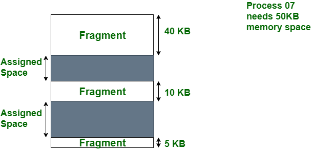
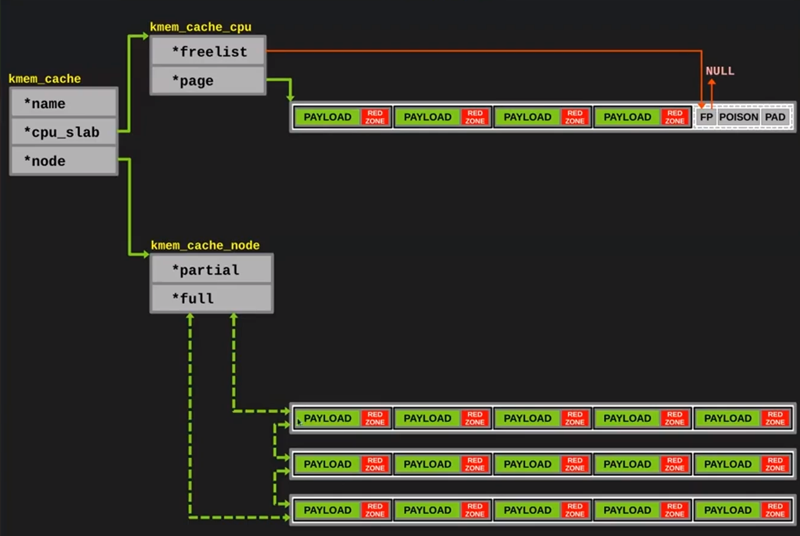
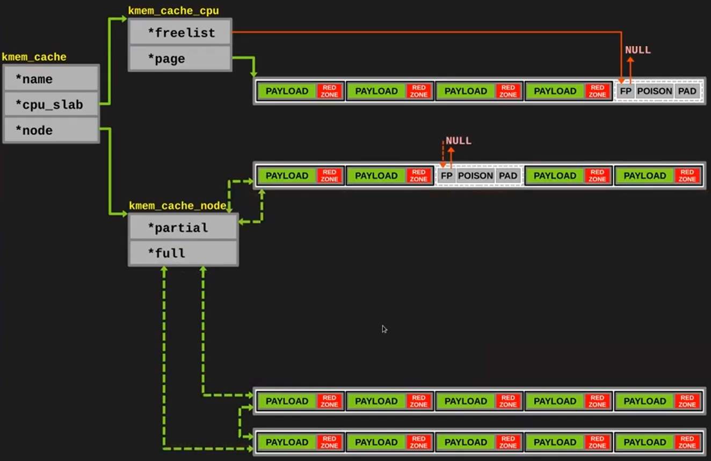
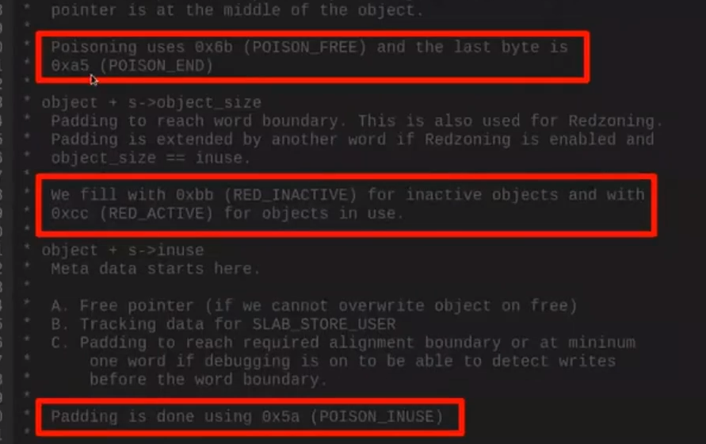

# 练习

对实验报告的要求：
 - 基于markdown格式来完成，以文本方式为主
 - 填写各个基本练习中要求完成的报告内容
 - 完成实验后，请分析ucore_lab中提供的参考答案，并请在实验报告中说明你的实现与参考答案的区别
 - 列出你认为本实验中重要的知识点，以及与对应的OS原理中的知识点，并简要说明你对二者的含义，关系，差异等方面的理解（也可能出现实验中的知识点没有对应的原理知识点）
 - 列出你认为OS原理中很重要，但在实验中没有对应上的知识点

## 练习0：填写已有实验

本实验依赖实验1。请把你做的实验1的代码填入本实验中代码中有“LAB1”的注释相应部分并按照实验手册进行进一步的修改。具体来说，就是跟着实验手册的教程一步步做，然后完成教程后继续完成完成exercise部分的剩余练习。

## 练习1：理解first-fit 连续物理内存分配算法（思考题）
first-fit 连续物理内存分配算法作为物理内存分配一个很基础的方法，需要同学们理解它的实现过程。请大家仔细阅读实验手册的教程并结合`kern/mm/default_pmm.c`中的相关代码，认真分析default_init，default_init_memmap，default_alloc_pages， default_free_pages等相关函数，并描述程序在进行物理内存分配的过程以及各个函数的作用。
请在实验报告中简要说明你的设计实现过程。请回答如下问题：
- 你的first fit算法是否有进一步的改进空间？

### First-fit
##### init
算法的最开始，我们需要初始化一个双向循环链表，其实就是给这个链表一个表头(`free_list`)，用来准备管理我们的物理空闲块。在`default_init`函数中完成这个操作，其功能非常简单，就是让这个表头的两个指针都指向自己。这个表头的首元素`nr_free`记录了空闲页的数量。

##### init_memmap
###### page_init
在空闲链表的初始化之后，接着探测拥有的物理内存空间，然后将其通过该管理起来。

我们有多少物理空间可用呢？在本次实验中，这是写死的，DRAM的空间就是从0x8000 0000到0x8800 0000的128MiB空间。考虑到其中的OpenSBI占用了0x8000 0000到0x8020 0000的空间，而kernel占用了0x8020 0000到end(在链接脚本中定义)的空间，也就是说，实际上我们能用来存东西的空间是从end到0x8800 0000。

那么剩下的空间能够全部当作用户可用的页来使用吗？当然不行，至少我们需要一些额外的信息，例如页状态的标志位、空闲链表的入口点等其它属性也需要存储在这片空间。这些属性存在哪儿呢？每个页的开头吗？这当然也行，但是我们希望的是连续内存的分配，没人会期待自己的可用内存中塞了一些固定不能改的信息(而且可能会被莫名其妙地覆盖掉)。

具体来说`page_init`分配了0x8000(0x88000 -0x80000)个`page`结构体，一个`page`对应了DRAM中的一个页(即4KiB空间)，由于它是连续分布的，内存地址也是连续分布的，因此可以通过一个简单的映射`page2pa`得到对应页的实际物理地址，反过来也可以由`pa2page`得到对应的`page`结构体，因此虽然这个"page"和想象中的页不一样，但这样命名并没有错，因为一个page就代表了一个物理页。

接着，将我们存有`page`的空间置为保留，这部分不能给用户使用。然后对于剩下的空间，我们进行`init_memmap`。
###### init_memmap
在函数`default_init_memmap`中，由于现在整个空闲内存都没有被使用，因此，这算作是一大个空闲块。我们当然可以将所有的页都链入空闲链表，但其是这样做的话每次搜索、插入和删除的成本都会很高，只需要将第一个`page`作为“代表大哥”链入`free_list`即可。为了体现“代表大哥”的身份，在第一个page的property属性被置为它管理小弟的数量n，而其它的page的property属性均为0。

怎么体现页面空闲还是占用呢？并不是看`free_list`，`free_list`只是管理空闲块的，真正要看的是每个page的flag属性，所以每次进入`free_list`的块中的所有页，要把flag置位(`SETPROPERTY`)，反之，则需要清位(`CLEARPROPERTY`)。因此在init里面不能忘记置位。

#### alloc and free
所谓分配，其实就是返回一个指针，并且告诉你，从这儿到那儿的空间，你可以使用了(使用assert检查flag)，快点读写吧！回收则相反，你告诉我哪块内存你不用了，我就把它设置为不可用。

但是仅仅是这样，还不够，因为我们进行着分配和回收的工作，当我们将一块内存分配出去的时候，无所谓，你可以不再管它了；但是进行回收的时候，必须将空闲的空间管理起来，因为我们下次分配的时候，必须明确知道那一块内存是可用的。

于是，我们引入`free_list`，用以管理空闲块。分配的时候，我们需要摘取`free_list`中的一块；回收的时候，我们需要把一个块重新放回到`free_list`里边。摘取哪一块呢？这就是不同算法的差异所在。对于first fit算法，其实就是每次选择`free_list`中的第一个大小合适的块分配，在回收的时候，也按照地址顺序回收。first fit的一大问题就是会产生很多外部碎片(内存块太小了，以至于不能分配)，为了减轻这个问题，我们有必要将回收的地址连续的块合并在一起。

#### 关于优化的思考
##### 关于空间的优化
first fit算法最大的弊端就是在一系列反复的“分配-释放”之后，内存空间会变得零碎(即使有合并)。如何解决这个问题呢？
可以采用“内存紧凑”的方法，就是每隔一段时间，把不连续的内存重新分配一下；但显然这样的弊端也很明显，先不谈按怎样的方式才能排得紧凑，但是内存的I/O就开销巨大(当然可以在进程sleep的时候去挪动)，究竟合不合算，没有实际经验的我也不清楚。
其次就是考虑“动态分配”的方式，就是检查局部内存利用率，然后对于利用率低的部分，将空闲的块进行强制合并。这样思路挺好的，但实现起来挺难的，我们需要实现页的连续分配，如果想要将分隔开的页面连接起来的话，还需要一个链表将不同区域的块链接起来。这倒不是什么难题，难就难在回收的时候，很难梳理清楚归还这个“东拼西凑”的空间的时候，究竟得检查多少相邻空间！

有一句话说得好：“如果空间零碎的问题解决了，它还是first fit算法吗？”或许从这个角度确实没有更好的视角吧。

另外，关于空间，也许flag可以用更小的存储类型？但是flag还有没有其它用途？目前不清楚，而且修改之后究竟有没有提升？也不清楚。(毕竟4KiB对齐，就算优化也可能优化不了多少空间)
最后，应该可以利用缓存的思想，比如内存池

##### 关于时间的优化
关于这点，网上看到一些说法。大致思路是让最后一页也记录property的信息，由此一个空闲块回收的时候，可以直接检查相邻的两页，然后看它们是不是空闲，如果是就依据property找到前面一个块的带头大哥，然后再拿到后面一个块的带头大哥(其实就是后面一页)，直接合并就好。这样原本线性复杂度(`O(size(free_list))`)，就降为了常数级别。

关于这个问题，我觉得虽然这确实属于一种优化，但我不懂其中的优化力度怎样，值不值得每次做这些额外的检查操作。因为两端都连续的回收情况究竟多见还是少见，我不知道；而且这个`free_list`的长度究竟会不会太长？(我还去看了ucore-x86的代码，发现这部分是每一页都连进去的，但是我们的实验中的代码每块只是链入一个页，因此这部分已经优化过了。)不太说得清楚，也许细节决定成败吧。

## 练习2：实现 Best-Fit 连续物理内存分配算法（需要编程）
在完成练习一后，参考kern/mm/default_pmm.c对First Fit算法的实现，编程实现Best Fit页面分配算法，算法的时空复杂度不做要求，能通过测试即可。
请在实验报告中简要说明你的设计实现过程，阐述代码是如何对物理内存进行分配和释放，并回答如下问题：
- 你的 Best-Fit 算法是否有进一步的改进空间？

### Best-Fit
#### 初始化空闲页
##### best_fit_init_memmap
`init_memmap`接收一个物理页的地址`Page* base`和一个`size_t n`作为参数，用于将一段以`base`为基地址的大小为n的连续物理页初始化为空闲页面，其实现和`default_init_memmap`是一样的：
1. 遍历要初始化的这段物理页，清空它们的标志和属性信息，设置其引用计数为0，并将`base`的属性设为n。
2. 根据`base`的值按照由小到大的顺序（相当于物理页的地址从低到高）将其链入`free_list`中，即遍历`free_list`，若找到第一个大于`base`的页，将`base`插入到它前面，若已经到达链表结尾，将`base`插入到链表尾部。

#### 物理内存的分配和释放

##### best_fit_alloc_pages
`best_fit_alloc_pages`接收一个参数`size_t n`，用于分配一段大小为n的连续物理页，其与First Fit算法的分配方式的**不同之处**在于：在遍历空闲链表的过程中，如果找到满足需求的空闲页框，它会记录该页面以及当前找到的最小连续空闲页框数量，从而保证所找到的空闲页数量是和要分配的物理页数量n最为接近，即所谓“最佳”（best）。

其余的操作和First Fit的一致，包括从空闲链表中删除分配出去的页面，然后更新`page + n`处的空闲页属性，并将其链入前面的空闲页之后，将空闲页`nr_free`的数量减n，以及清除掉分配出去的空闲页的属性信息等。

##### best_fit_free_pages
`best_fit_free_pages`接收一个物理页的地址`Page* base`和一个`size_t n`作为参数，用于释放一段分配出去的以`base`为基地址的大小为n的连续物理页，其实现和`default_free_pages`也是一样的：
1. 遍历要释放的这段物理页，清空它们的标志位，设置其引用计数为0。
2. 将`base`的属性设置为释放的页块数，并将其标记为已分配状态，然后令`nr_free`的值增加n，再将`base`重新链入空闲链表。
3. 将当前页与其前后页块合并，具体来说：先判断前面的空闲页块是否与当前页块连续，若连续，则将前一个空闲页块的大小加上当前页块的大小，清除当前页块的属性标记，再从链表中删除当前页块，然后将指针指向前一个空闲页块，以相同的方式将其与后续的页块合并。

##### 问题与改进
###### 时间问题
由于空闲页是采用双向链表存储的，因而在寻找“最佳”空闲页等需要遍历链表的操作中需要的时间复杂度都是线性级别的`O(size(free_list))`，但如果根据空闲页的大小改用堆来存储空闲区块的话，这样无论是增删查改操作的时间复杂度都变成了对数级别的`O(log size(free_list))`，然而由于堆操作的特性，这种方案会产生更多的外部碎片，由于单个的外部碎片无法满足更大内存的进程需求，因而降低了内存利用率。

###### 空间问题
Best Fit和First Fit等动态分区分配算法的主要问题在于在低地址处有可能产生大量的外部碎片，因为频繁的内存分配和释放会产生大量的、连续的小页面块夹杂在已分配的页面中间，即所谓的“外部碎片”，结果就是当再次要求分配连续的内存时，即使整体内存是足够的，也无法满足连续内存的需求。

由上图可见，虽然有足够的空间(55 KB)来运行进程process-07(需要 50 KB)，但由于内存(片段)不连续，所以这55 KB的空间就属于外部碎片，无法被分配给process-07使用，这就造成了内存空间的浪费。

针对动态分区分配算法的外部碎片问题，可以有以下改进方案：
>内存紧缩：移动已分配的内存块的位置，使其尽可能紧挨在一起，形成一个连续的内存空间，从而消除外部碎片。
>>缺点：可能导致大量的数据搬迁操作，增加了系统开销。

>采用分页存储管理方式：利用分页单元把一组非连续的空闲页框映射到连续的线性地址，由于采用了地址转换技术，因而允许不连续的逻辑地址空间在物理内存中进行连续的分配，从而最大限度地利用可用的内存空间。
>>缺点：引入额外的页表和地址转换机制，增加了内存管理的复杂性和开销；会导致一定的内存浪费，因为一个页面可能只占用部分空间而无法利用。

>采用slab内存管理机制：其基本原理是将分配的内存分割成各种尺寸的块（chunk），并把尺寸相同的块分成组（slab），根据收到的数据的大小，选择最适合数据大小的slab。内存中保存着slab内空闲chunk的列表，根据该列表选择chunk，然后将数据缓存于其中。
>>缺点：由于分配的是特定长度的内存，因而还是无法有效利用分配的内存。例如，将100字节的数据缓存到128字节的chunk中，剩余的28字节就浪费了；在分配和释放内存时需要维护相应的数据结构，增加了内存管理的复杂性和开销。

## 扩展练习Challenge：buddy system（伙伴系统）分配算法（需要编程）

Buddy System算法把系统中的可用存储空间划分为存储块(Block)来进行管理, 每个存储块的大小必须是2的n次幂(Pow(2, n)), 即1, 2, 4, 8, 16, 32, 64, 128...

 -  参考[伙伴分配器的一个极简实现](http://coolshell.cn/articles/10427.html)， 在ucore中实现buddy system分配算法，要求有比较充分的测试用例说明实现的正确性，需要有设计文档。

### 基本原理
为什么要有伙伴系统？
从直观上看，伙伴系统其实和best-fit一样，但是伙伴系统是按照2的幂来分配空闲块的，这有什么好处呢？假如我们需要66页的话，还需要分128页给进程，这会产生大量的内碎片，看起来效果很差。

另外，即使是分配很小的一部分页，也会导致整个块的分割。例如我们有1024页，如果我们需要分1页+1000页的话，分完1页之后，伙伴系统就会分裂成两部分，第一部分只剩下511页，第二部分有512页，但我们不能将这两部分合并来分配，这是伙伴系统不允许的。

当然这是很极端的情形，我猜测伙伴系统的设计思想也是基于这种极端情形不太可能发生，反而是每次需要分配的页面基本上都是2的幂。

但是，怎么能肯定呢？除了经验问题之外，我认为还可以引入内存池，让内存池来向buddy system申请空间，每次都是申请2的次幂页。例如，我需要5页，那么内存池不是分出5页，也不是分8页，因为这样会浪费3页；而是假设你可能不只是需要一次5页，你可能需要3次(或许经验？)，于是会给你16页，这时候，如果你真的用了3页，那么你的内存利用率可能就是15/16而不是5/8了。

总而言之，我不认为有什么算法能够百分百的处理内存碎片(这里可以去回想pmm_manager的其它算法，我们发现无论哪一种算法，都能够找到其出现大片内存碎片的反例)，除非你能预测未来需要多少空间，显然这是不可能的。所以只能从统计意义上预测，伙伴系统就是做了这样的尝试。

### 实现思路

## 扩展练习Challenge：任意大小的内存单元slub分配算法（需要编程）

slub算法，实现两层架构的高效内存单元分配，第一层是基于页大小的内存分配，第二层是在第一层基础上实现基于任意大小的内存分配。可简化实现，能够体现其主体思想即可。

 - 参考[linux的slub分配算法/](http://www.ibm.com/developerworks/cn/linux/l-cn-slub/)，在ucore中实现slub分配算法。要求有比较充分的测试用例说明实现的正确性，需要有设计文档。

### 基本原理
发展版本：slob(效率低，但内存紧凑)->slab(非常快，但是很浪费内存)->slub

我们没法规定每次都按照页来分配空间，假如用户进程需要500Byte的话，那么伙伴系统将会拿出1个page(这可能是大多数情况)，也就是4096Byte的空间给它，就会造成空间的浪费。所以我们需要在伙伴系统之上，搭建一个能够管理整个块，使其能够以更小单位分配空间的管理器。

这就是slub(或者是slab、slob)，slub能帮助我们在更小粒度上分配空间。

另外，因为我们的操作系统常常需要管理各种各样的数据结构，例如网络数据包、文件描述符、进程描述块等等，大多数情况下，我们是知道它们的大小的、甚至能够猜测可能的数量；因此，如果用一个管理器——slub，去管理可用空间，使其能够符合这些大小，就能够大大减少内存碎片！

### 运作思路
我们的目标是封装一个`kmalloc`，使得需要分配内存的时候必须经过slub，而不能直接访问buddy system，这个`kmalloc`能够根据字节数分配内存，而不是页数。说白了就是将物理页再次分割，然后进行管理。

我们可以按不同的字节数切割页面，根据需求，选择合理的切割块分配出去。一般情况下，可以有13种切割方式，分别是96B、192B、8B、16B、......、1024B、2048B、4096B、8192B。(为了cpu运行的顺畅，因此要对齐8字节，另外这些也是常常用到的内存大小)

对于每一种分割方式，我们声明一个`kmem_cache`用来管理cache空间，具体如下图，每个kmem_cache有name、cpu_slab、node成员(当然还有其它的，例如object_size，表示kmem_cache的分割单位)。
.png)
我们一开始，向pmm(一般是buddy system)申请一个slab(可能是1page，也可能更多，具体选择方式应该是依据经验)，按照我们预定的大小，将其分割，作为空闲块链入一个单向链表；并且让我们的kmem_cache_cpu管理它(page指针，即使分配的不是一个page，也由第一个page指针管理即可)。

每次需要分配内存的时候，就从当前cpu管理的slab去拿。如果slab中的所有块都处于占用态，那么就可以把这个slab交给`kmem_cache_node`的`full`列表，这是个双向链表，可以方便遍历。如下图：

如果我们free了一块full中内存，那么就把对应的slab交给`partial`管理，这同样是个双向链表，如下图：

刚刚讲到，cache_cpu中的slab交给full了，那么是不是如果需要新的内存块的话，就得向pmm申请呢？并不是的，我们首选从partial中获取slab。只有partial中没有slab的时候，才去向pmm申请一个新的slab。

当我们将一个slab全部释放的时候，我们可以选择将其交还给pmm_manager，也选择可以保留(这可能还是根据经验吧)

上述大致就是slub的思路(其实是slab的，slub似乎没有full链表)

### 如何保护空闲块？
如下图，可以通过检查POISON、RED_ZONE来确认数据是否被跨权使用，就像page中的flag一样，就不多赘述了。

## 扩展练习Challenge：硬件的可用物理内存范围的获取方法（思考题）
  - 如果 OS 无法提前知道当前硬件的可用物理内存范围，请问你有何办法让 OS 获取可用物理内存范围？

> Challenges是选做，完成Challenge的同学可单独提交Challenge。完成得好的同学可获得最终考试成绩的加分。