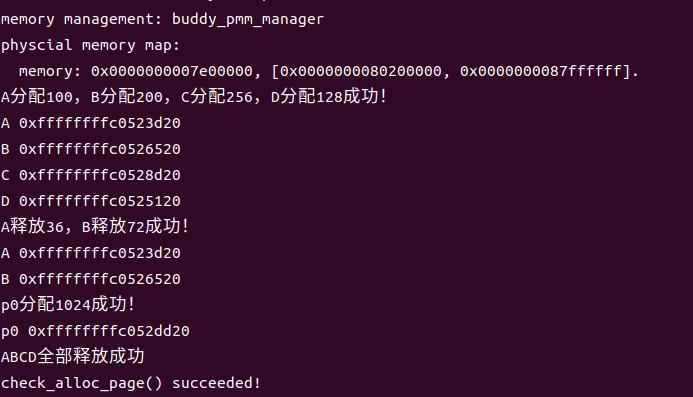

### buddy system（伙伴系统）分配算法
#### 什么是buddy system？
根据实验指导书中给出的相关链接，其中提到了：

伙伴分配的实质就是一种特殊的“分离适配”，即将内存按2的幂进行划分，相当于分离出若干个块大小一致的空闲链表，搜索该链表并给出同需求最佳匹配的大小。

算法大体上是：

>分配内存：
>寻找大小合适的内存块:
>（大于等于所需大小并且最接近2的幂，比如需要27，实际分配32）
>>1.  如果找到了，分配给应用程序。
>>2.  如果没找到，分出合适的内存块。
>>>1. 对半分离出高于所需大小的空闲内存块
>>>2. 如果分到最低限度，分配这个大小。
>>>3. 回溯到步骤1（寻找合适大小的块）
>>>4. 重复该步骤直到一个合适的块

释放内存：

>释放该内存块
>>1. 寻找相邻的块，看其是否释放了。
>>2. 如果相邻块也释放了，合并这两个块，重复上述步骤直到遇上未释放的相邻块，或者达到最高上限（即所有内存都释放了）。

分配器的整体思想：

>通过一个数组形式的完全二叉树来监控管理内存，二叉树的节点用于标记相应内存块的使用状态，高层节点对应大的块，低层节点对应小的块，在分配和释放中我们就通过这些节点的标记属性来进行块的分离合并。如图所示，假设总大小为16单位的内存，我们就建立一个深度为5的满二叉树，根节点从数组下标[0]开始，监控大小16的块；它的左右孩子节点下标[12]，监控大小8的块；第三层节点下标[3-6]监控大小4的块……依此类推。


#### 几个细节
##### 关于二叉树的结构和表示

1. **节点结构**：在这个算法中，每个节点代表一个内存块。节点包含两个重要的属性：
```C
struct buddy2 {
  unsigned size;//表明管理内存的总单元数
  unsigned longest; //二叉树的节点标记，表明对应内存块的空闲单位
};
```
   - `size`：表示该节点（内存块）的大小，通常是2的幂次方。根节点表示整个可用内存的大小，而其他节点表示不同大小的内存块。
   - `longest`：表示从当前节点开始，向下追踪的最大可用内存块的大小。一开始，所有节点的 `longest` 属性初始化为其自身的大小。这个`longest`的巧妙设置也是这个算法最大的特点。

2. **节点编号**：这里运用了数据结构的知识。每个节点都有一个唯一的编号，从0开始。编号规则如下：
   - 根节点编号为0。
   - 如果一个节点的编号为n，则其左子节点编号为2n + 1，右子节点编号为2n + 2。
   - 这种编号方式使得可以在数组这种线性数据结构中轻松表示整个树。

3. **数组表示**：为了更有效地表示二叉树，这里我们将整个树存储在一个数组root中。
```C
struct buddy2 root[100000];//存放二叉树的数组，用于内存分配
```

4. **节点更新**：当分配或释放内存块时，节点的 `longest` 属性可能会更新。如果一个节点的子节点被分配了，那么该节点的 `longest` 属性会等于其子节点中较大的 `longest` 值。这样可以在分配内存块时快速找到最适合大小的块。

##### 跟踪内存分配的结构
`allocRecord` 是一个数据结构，用于记录内存分配的相关信息。

```c
struct allocRecord {
  struct Page* base;//指向分配内存块的起始 `Page` 结构的指针
  int offset;//表示分配内存块的偏移量。在 Buddy System 算法中，每个内存块都可以由一个偏移量唯一标识，这个偏移量通常是相对于整个内存池的起始位置的偏移。
  size_t nr;//表示分配的内存块的大小
};
```

这个数据结构的主要作用是跟踪内存分配的细节并进行维护。当你分配一块内存时，会记录分配的起始位置、偏移量和块的大小。这在释放内存或进行其他内存管理操作时非常有用，因为它允许系统跟踪已分配的内存块以便稍后释放它们或进行其他管理操作。
##### free_list
（我一直有疑问的一个地方，后面询问gpt得到的这个答案。）在Buddy System内存分配算法中，`freelist`是存储物理页的地方，而每个物理页对应二叉树中的一个节点。这就是说二叉树节点与物理页之间有一一对应的关系。当一个物理页是空闲的时候，对应的二叉树节点的`longest`属性表示该节点及其子节点中最大的可用内存块大小。`freelist`中存储的是空闲的物理页的信息，程序使用偏移量来确定在`freelist`中的位置，然后将其转换为一个物理页的指针，以便返回给调用者。
所以在`buddy_alloc_pages`函数里这边就容易理解了。通过对应的index我们根据偏移量来寻找要分配的页。
```C
  rec[nr_block].offset=buddy2_alloc(root,n);
  int i;
  for(i=0;i<rec[nr_block].offset+1;i++)
    le=list_next(le);
  page=le2page(le,page_link);
```
所以，`freelist`是用来存储空闲物理页信息的，而不是存储二叉树节点信息的。二叉树节点信息存储在`root`数组中。在分配内存时，程序通过`buddy2_alloc`函数在二叉树中找到一个合适的节点，然后根据偏移量在`freelist`中找到相应的物理页，最终返回给调用者。这样可以高效地管理和分配空闲内存块。

##### 三个数组或者数据结构的辨析

1. `rec`（`struct allocRecord rec[100000]`）：`rec` 是一个用于记录分配块信息的数组。每个元素 `rec[i]` 存储了一个分配块的信息，包括：

   - `base`：分配块的基地址（`struct Page*`类型）。
   - `offset`：分配块的偏移量，用于在 Buddy System 中定位该块的位置。
   - `nr`：分配块的页数。

   这个数组用于跟踪已经分配的内存块，以便后续释放操作。

2. `freelist`（`list_entry_t free_list`）：`freelist` 是一个双向链表，用于维护所有空闲的内存块。在初始化时，`freelist` 中的每个节点都代表一个空闲的内存块。链表的节点存储了指向物理页的指针（`struct Page*`），链表中的节点数目表示当前可用的空闲页数。这个链表用于在分配内存时查找可用的空闲块，以及在释放内存时将空闲块添加回链表中。

3. `root`（`struct buddy2 root[100000]`）：`root` 是一个数组，用于存储 Buddy System 内存管理算法中的二叉树。每个元素 `root[i]` 代表了二叉树的一个节点，其中包含了以下信息：

   - `size`：该节点管理的内存块的大小。
   - `longest`：该节点及其子节点中最大的可用内存块的大小。

   这个数组用于实现 Buddy System 算法，其中每个节点表示一个内存块，通过适当的计算和更新，算法能够高效地分配和释放内存块。

总之，`rec` 用于记录分配块的信息，`freelist` 用于维护可用的空闲内存块列表，而 `root` 用于实现 Buddy System 算法的内存分配和释放。这三者协作来管理物理内存的分配和释放。
#### 代码分析
关于参考代码的分析：
```C
#include <pmm.h>
#include <list.h>
#include <string.h>
#include <default_pmm.h>
#include <buddy_pmm.h>
#include <assert.h>
//buddy system（伙伴系统）分配算法，前面是一些该分配算法所需要用到的
//定义一些宏
#define LEFT_LEAF(index) ((index) * 2 + 1)//左子树节点的值
#define RIGHT_LEAF(index) ((index) * 2 + 2)//右子树节点的值
#define PARENT(index) ( ((index) + 1) / 2 - 1)//父节点的值
#define IS_POWER_OF_2(x) (!((x)&((x)-1)))//x是不是2的幂
#define MAX(a, b) ((a) > (b) ? (a) : (b))//判断a，b大小
#define UINT32_SHR_OR(a,n) ((a)|((a)>>(n)))//右移n位
#define UINT32_MASK(a)(UINT32_SHR_OR(UINT32_SHR_OR(UINT32_SHR_OR(UINT32_SHR_OR(UINT32_SHR_OR(a,1),2),4),8),16))//大于a的一个最小的2^k
#define UINT32_REMAINDER(a) ((a)&(UINT32_MASK(a)>>1))//除以2的最低幂次方的余数
#define UINT32_ROUND_DOWN(a) (UINT32_REMAINDER(a)?((a)-UINT32_REMAINDER(a)):(a))//小于a的最大的2^k
static unsigned fixsize(unsigned size) {//根据大小找到合适的2的幂的大小
  size |= size >> 1;
  size |= size >> 2;
  size |= size >> 4;
  size |= size >> 8;
  size |= size >> 16;
  return size+1;
}


struct buddy2 {
  unsigned size;//表明管理内存的总单元数
  unsigned longest; //二叉树的节点标记，表明对应内存块的空闲单位
};
struct buddy2 root[100000];//存放二叉树的数组，用于内存分配

free_area_t free_area;
#define free_list (free_area.free_list) //维护所有空闲的内存块，是一个双向链表，在最开始时它的prev和next都指向自身。
#define nr_free (free_area.nr_free) //空闲页的数目

struct allocRecord//记录分配块的信息
{
  struct Page* base;
  int offset;
  size_t nr;//块大小
};

struct allocRecord rec[100000];//存放偏移量的数组
int nr_block;//已分配的块数

static void buddy_init()
{
    list_init(&free_list);
    nr_free=0;
}

//初始化二叉树上的节点，设置正确的 longest 属性
void buddy2_new( int size ) {
  unsigned node_size;
  int i;
  nr_block=0;
  if (size < 1 || !IS_POWER_OF_2(size))
    return;

  root[0].size = size;
  node_size = size * 2;

  for (i = 0; i < 2 * size - 1; ++i) {//因为二叉树的节点总共2n-1
    if (IS_POWER_OF_2(i+1))
      node_size /= 2;
    root[i].longest = node_size;
  }
  return;
}
//初始化内存映射关系,将一段连续的物理页面初始化为可用的空闲页面
static void buddy_init_memmap(struct Page *base, size_t n)
{
    assert(n>0);
    struct Page* p=base;
    for(;p!=base + n;p++)
    {
        assert(PageReserved(p));
        p->flags = 0;
        p->property = 0;
        set_page_ref(p, 0);   
        SetPageProperty(p);
        list_add_before(&free_list,&(p->page_link));     
    }
    nr_free += n;
    int allocpages=UINT32_ROUND_DOWN(n);//保证分配大小是2的幂次方
    buddy2_new(allocpages);//初始化二叉树
}

//内存分配
int buddy2_alloc(struct buddy2* self, int size) {
  unsigned index = 0;//当前要分配的内存块在二叉树中的节点索引
  unsigned node_size;//当前节点管理的内存大小
  unsigned offset = 0;//分配的内存块的偏移量

  if (self==NULL)//无法分配
    return -1;

  if (size <= 0)//分配不合理
    size = 1;
  else if (!IS_POWER_OF_2(size))//不为2的幂时，取比size更大的2的n次幂
    size = fixsize(size);

  if (self[index].longest < size)//可分配内存不足，原因在于longest表示当前节点及其子节点中最大的可用内存块大小
    return -1;

  //不断地向下遍历二叉树，直到找到一个合适的节点来执行分配
  for(node_size = self->size; node_size != size; node_size /= 2 ) {
    if (self[LEFT_LEAF(index)].longest >= size)
    {
       if(self[RIGHT_LEAF(index)].longest>=size)
        {
           index=self[LEFT_LEAF(index)].longest <= self[RIGHT_LEAF(index)].longest? LEFT_LEAF(index):RIGHT_LEAF(index);
         //找到两个相符合的节点中内存较小的结点
        }
       else
       {
         index=LEFT_LEAF(index);
       }  
    }
    else
      index = RIGHT_LEAF(index);
  }

  self[index].longest = 0;//将该节点标记为已使用（将其 longest 设置为0），并计算分配的内存块的偏移量 offset。
  offset = (index + 1) * node_size - self->size;
  while (index) {//更新祖先节点的 longest 值，以反映已分配节点的状态。
    index = PARENT(index);
    self[index].longest = 
      MAX(self[LEFT_LEAF(index)].longest, self[RIGHT_LEAF(index)].longest);
  }
  return offset;//返回分配的内存块的偏移量 offset，表示分配成功
}

static struct Page* buddy_alloc_pages(size_t n){
  assert(n>0);
  if(n>nr_free)
   return NULL;//判断n 是否大于当前可用的空闲页数
  struct Page* page=NULL;
  struct Page* p;
  list_entry_t *le=&free_list,*len;
  rec[nr_block].offset=buddy2_alloc(root,n);//分配内存块，记录偏移量
  int i;
  for(i=0;i<rec[nr_block].offset+1;i++)
    le=list_next(le);
  page=le2page(le,page_link);
  int allocpages;
  if(!IS_POWER_OF_2(n))
   allocpages=fixsize(n);
  else
  {
     allocpages=n;
  }
  //根据需求n得到块大小
  rec[nr_block].base=page;//记录分配块首页
  rec[nr_block].nr=allocpages;//记录分配的页数
  nr_block++;//已分配的块数增加一
  for(i=0;i<allocpages;i++)
  {
    len=list_next(le);
    p=le2page(le,page_link);
    ClearPageProperty(p);
    le=len;
  }//修改每一页的状态
  nr_free-=allocpages;//减去已被分配的页数
  page->property=n;
  return page;//返回分配出去的内存块的指针
}

void buddy_free_pages(struct Page* base, size_t n) {
  unsigned node_size, index = 0;
  unsigned left_longest, right_longest;
  struct buddy2* self=root;
  
  list_entry_t *le=list_next(&free_list);
  int i=0;
  for(i=0;i<nr_block;i++)//检查是否与要释放的内存块的基地址base匹配，跳出循环即找到对应块
  {
    if(rec[i].base==base)
     break;
  }
  int offset=rec[i].offset;
  int pos=i;//暂存i，要释放的内存块在记录数组rec中的索引
  i=0;
  while(i<offset)//遍历freelist链表，找到要释放的内存块在链表中的位置
  {
    le=list_next(le);
    i++;
  }
  int allocpages;
  if(!IS_POWER_OF_2(n))
   allocpages=fixsize(n);
  else
  {
     allocpages=n;
  }
  assert(self && offset >= 0 && offset < self->size);//是否合法
  node_size = 1;
  index = offset + self->size - 1;//计算要释放的内存块在二叉树中的索引index
  nr_free+=allocpages;//更新空闲页的数量
  struct Page* p;
  self[index].longest = allocpages;
  for(i=0;i<allocpages;i++)//循环遍历并回收已分配的页
  {
     p=le2page(le,page_link);
     p->flags=0;
     p->property=0;
     SetPageProperty(p);
     le=list_next(le);
  }
  while (index) {//向上合并空闲页，修改先祖节点的记录值，以反映已释放节点的状态
    index = PARENT(index);
    node_size *= 2;

    left_longest = self[LEFT_LEAF(index)].longest;
    right_longest = self[RIGHT_LEAF(index)].longest;
    
    if (left_longest + right_longest == node_size) 
      self[index].longest = node_size;
    else
      self[index].longest = MAX(left_longest, right_longest);
  }
  /*我们将longest恢复到原来满状态的值。继续向上回溯，检查是否存在合并的块，
  依据就是左右子树longest的值相加是否等于原空闲块满状态的大小，
  如果能够合并，就将父节点longest标记为相加的和*/
  for(i=pos;i<nr_block-1;i++)//更新记录数组rec，删除已释放的内存块的记录
  {
    rec[i]=rec[i+1];
  }
  nr_block--;//更新分配块数的值
}
static size_t buddy_nr_free_pages(void) {
    return nr_free;
}//查询可用的空闲页数

const struct pmm_manager buddy_pmm_manager = {
    .name = "buddy_pmm_manager",
    .init = buddy_init,
    .init_memmap = buddy_init_memmap,
    .alloc_pages = buddy_alloc_pages,
    .free_pages = buddy_free_pages,
    .nr_free_pages = buddy_nr_free_pages,
    .check = buddy_check,
};
```
关于测试函数
```C
static void buddy_check(void) {
    struct Page *p0, *A, *B,*C,*D;
    p0 = A = B = C = D =NULL;
    
    A=alloc_pages(100);
    B=alloc_pages(200);
    C=alloc_pages(256);
    D=alloc_pages(128);
    cprintf("A分配100，B分配200，C分配256，D分配128成功！\n");
    cprintf("A %p\n",A);
    cprintf("B %p\n",B);
    cprintf("C %p\n",C);
    cprintf("D %p\n",D);
    free_pages(A,36);
    free_pages(B,72);
    cprintf("A释放36，B释放72成功！\n");
    cprintf("A %p\n",A);
    cprintf("B %p\n",B);

    p0=alloc_pages(1024);
    cprintf("p0分配1024成功！\n");
    cprintf("p0 %p\n",p0);
    assert(p0 != A);
    free_pages(A+36,100);
    free_pages(B+72,200);
    free_pages(C,256);
    free_pages(D,128);
    cprintf("ABCD全部释放成功\n");
    
}
```
大概的分配空间的情况应该是（每一格是128）
|    A128 |
| --- |
|  D128   |
|   B256  |
|   B256  |
|   C256  |
|   C256  |
|   p0 1024  |
|   p0 1024  |
|  p0 1024   |
|   p0 1024  |
|   p0 1024  |
|  p0 1024   |
|   p0 1024  |
|  p0 1024   |
对应的实际地址我们发现分配的没有任何问题。
最后展示一下参考代码这个check的实际运行情况：


这个代码的实际运行效果非常正确，D也是正确分配到了内存里。
#### 代码的深层思考
体会了参考代码，我们再来回顾一下buddy的一些细节问题。
buddy system内存究竟是如何布局的？下面的图很形象直观：
```C
/*
buddy system中的内存布局

低地址                              高地址
+--------------------------------------+
| |  |    |        |                   |
+--------------------------------------+
低地址的内存块较小             高地址的内存块较大

*/
```
我们再次反思一件事情，上面的代码用了太多复杂的结构来提升内存分配的效率，这一点值得肯定，但是我们这些初学者对于三个不同的结构体的认识仿佛没有特别到位，因此如果我们只用free_list，就像first-fit算法和best-fit算法一样，能不能实现呢？不再使用二叉树保存数据节点之后，上面的check仿佛失去了自己的作用，因为这样节点就不再是连续的内存单位。下面图示free_list的结构：
```C
/*
free_list中的内存块顺序:

1. 一大块连续物理内存被切割后，free_list中的内存块顺序
    addr: 0x34       0x38           0x40
        +----+     +--------+     +---------------+
    <-> | 0x4| <-> | 0x8    | <-> |     0x10      | <->
        +----+     +--------+     +---------------+

2. 几大块物理内存（这几块之间可能不连续）被切割后，free_list中的内存块顺序
    addr: 0x34       0x104       0x38           0x108          0x40                 0x110
        +----+     +----+     +--------+     +--------+     +---------------+     +---------------+
    <-> | 0x4| <-> | 0x4| <-> | 0x8    | <-> | 0x8    | <-> |     0x10      | <-> |     0x10      | <->
        +----+     +----+     +--------+     +--------+     +---------------+     +---------------+
*/
```
这么一看，即空间较小的内存块在双向链表中靠前，空间较大的内存块在双向链表中靠后；低地址在前，高地址在后。这么做是不是会让编程难度降低很多？这种内存规划得到`buddy_init_memmap`的代码：
```C
static void
buddy_init_memmap(struct Page *base, size_t n) {
    assert(n > 0);

    // 设置当前页向后的curr_n个页
    struct Page *p = base;
    for (; p != base + n; p ++) {
        assert(PageReserved(p));
        p->flags = p->property = 0;
        set_page_ref(p, 0);
    }
    // 设置总共的空闲内存页面
    nr_free += n;
    // 设置base指向尚未处理内存的end地址
    base += n;
    while(n != 0)
    {
        size_t curr_n = getLessNearOfPower2(n);
        // 向前挪一块
        base -= curr_n;
        // 设置free pages的数量
        base->property = curr_n;
        // 设置当前页为可用
        SetPageProperty(base);
        // 按照块的大小来插入空闲块，从小到大排序
        // 这里必须使用搜索的方式来插入块而不是直接,因为存在大的内存块不相邻的情况
        list_entry_t* le;
        for(le = list_next(&free_list); le != &free_list; le = list_next(le))
        {
            struct Page *p = le2page(le, page_link);
            // 排序方式以内存块大小优先，地址其次。
            if((p->property > base->property)
                 || (p->property ==  base->property && p > base))
                break;
        }
        list_add_before(le, &(base->page_link));
        n -= curr_n;
    }
}
```
分配空间时，我们没有了对应的offset的帮助，最简单的方法就是遍历双向链表，查找大小合适的内存块。

> 若链表中不存在合适大小的内存块，则对半切割遍历过程中遇到的第一块大小大于所需空间的内存块。
> 如果切割后的两块内存块的大小还是太大，则继续切割第一块内存块。
> 循环该操作，直至切割出合适大小的内存块。

最终buddy_alloc_pages代码如下:
```C
static struct Page *
buddy_alloc_pages(size_t n) {
    assert(n > 0);
    // 向上取2的幂次方，如果当前数为2的幂次方则不变
    size_t lessOfPower2 = getLessNearOfPower2(n);
    if (lessOfPower2 < n)
        n = 2 * lessOfPower2;
    // 如果待分配的空闲页面数量小于所需的内存数量
    if (n > nr_free) {
        return NULL;
    }
    // 查找符合要求的连续页
    struct Page *page = NULL;
    list_entry_t *le = &free_list;
    while ((le = list_next(le)) != &free_list) {
        struct Page *p = le2page(le, page_link);
        if (p->property >= n) {
            page = p;
            break;
        }
    }
    // 如果需要切割内存块时，一定分配切割后的前面那块
    if (page != NULL) {
        // 如果内存块过大，则持续切割内存
        while(page->property > n)
        {
            page->property /= 2;
            // 切割出的右边那一半内存块不用于内存分配
            struct Page *p = page + page->property;
            p->property = page->property;
            SetPageProperty(p);
            list_add_after(&(page->page_link), &(p->page_link));
        }
        nr_free -= n;
        ClearPageProperty(page);
        assert(page->property == n);
        list_del(&(page->page_link));
    }
    return page;
}
```
释放内存时

* 我们要将内存块按照内存块大小从小到大与内存块地址从小到大的顺序插入至双向链表，这是我们这个算法的基础规则。

* 尝试向前合并，一次就够。如果向前合并成功，则一定不能再次向前合并。之后循环向后合并，直至无法合并。

>需要注意的是，在查找两块内存块能否合并时，若当前内存块合并过，则其大小会变为原来的2倍，此时需要遍历比原始大小（合并前内存块大小）更大的内存块。
>判断当前内存块的位置是否正常，如果不正常，则需要断开链表并重新插入至新的位置。
>如果当前内存块没有合并则肯定正常，如果合并过则不一定异常。

```C
static void
buddy_free_pages(struct Page *base, size_t n) {
    assert(n > 0);
    // 向上取2的幂次方，如果当前数为2的幂次方则不变
    size_t lessOfPower2 = getLessNearOfPower2(n);
    if (lessOfPower2 < n)
        n = 2 * lessOfPower2;
    struct Page *p = base;
    for (; p != base + n; p ++) {
        assert(!PageReserved(p) && !PageProperty(p));
        p->flags = 0;
        set_page_ref(p, 0);
    }
    base->property = n;
    SetPageProperty(base);
    nr_free += n;
    list_entry_t *le;
    // 先插入至链表中
    for(le = list_next(&free_list); le != &free_list; le = list_next(le))
    {
        p = le2page(le, page_link);
        if ((base->property <= p->property)
                 || (p->property ==  base->property && p > base))) {
            break;
        }
    }
    list_add_before(le, &(base->page_link));
    // 先向左合并
    if(base->property == p->property && p + p->property == base) {
        p->property += base->property;
        ClearPageProperty(base);
        list_del(&(base->page_link));
        base = p;
        le = &(base->page_link);
    }

    // 之后循环向后合并
    // 此时的le指向插入块的下一个块
    while (le != &free_list) {
        p = le2page(le, page_link);
        // 如果可以合并(大小相等+地址相邻),则合并
        // 如果两个块的大小相同，则它们不一定内存相邻。
        // 也就是说，在一条链上，可能存在多个大小相等但却无法合并的块
        if (base->property == p->property && base + base->property == p)
        {
            // 向右合并
            base->property += p->property;
            ClearPageProperty(p);
            list_del(&(p->page_link));
            le = &(base->page_link);
        }
        // 如果遍历到的内存块一定无法合并，则退出
        else if(base->property < p->property)
        {
            // 如果合并不了，则需要修改base在链表中的位置，使大小相同的聚在一起
            list_entry_t* targetLe = list_next(&base->page_link);
            p = le2page(targetLe, page_link);
            while(p->property < base->property)
                 || (p->property ==  base->property && p > base))
                targetLe = list_next(targetLe);
            // 如果当前内存块的位置不正确，则重置位置
            if(targetLe != list_next(&base->page_link))
            {
                list_del(&(base->page_link));
                list_add_before(targetLe, &(base->page_link));
            }
            // 最后退出
            break;
        }
        le = list_next(le);
    }
}
```
关于这个代码的检查，肯定是不可以用上面检查代码的，不过这个只使用双向循环链表的方法相比于采用二叉树结构的方法肯定是更差的，不仅在效率上，更在一些合并的问题上，这里就不赘述了。

#### 短代码实现的好范例
可以说人外有人，同样对二叉树的结构体觉得麻烦，有些人就可以通过一个数组操作来代替复杂的结构体。
```C
static unsigned int* buddy_page;
static unsigned int buddy_page_num; // store buddy system
static unsigned int max_pages; // maintained by buddy
```

每个节点维护当前段内最长可供分配的连续内存块大小（存放于 buddy_page 中）。节点更新信息如下：
>如果左孩子和右孩子都没被使用，则当前节点设置成当前块大小；
>如果左孩子或右孩子至少一个被使用过，则当前节点设置成两个孩子可分配最长块大小的最大值。

还有一个值得注意的点是，为了管理分配的页面，程序还将额外的页面分配给 buddy system 供其使用。（没想好）

```C
#include <pmm.h>
#include <list.h>
#include <string.h>
#include <buddy_pmm.h>

// 伙伴系统最大深度，决定了可以分配的最小内存块大小
#define BUDDY_MAX_DEPTH 30

// 用于存储伙伴系统的状态信息的全局变量
static unsigned int* buddy_page;
static unsigned int buddy_page_num; // 存储伙伴系统的数量
static unsigned int max_pages; // 由伙伴系统维护的最大内存块数量
static struct Page* buddy_allocatable_base; // 指向可分配内存块的指针

// 定义宏，用于获取两个数中的较大值
#define max(a, b) ((a) > (b) ? (a) : (b))

// 伙伴系统的初始化函数
static void buddy_init(void) {}

// 初始化伙伴系统的内存映射
static void buddy_init_memmap(struct Page *base, size_t n) {
    assert(n > 0);

    // 计算伙伴系统能够管理的最大内存块数量
    max_pages = 1;
    for (int i = 1; i < BUDDY_MAX_DEPTH; ++i, max_pages <<= 1)
        if (max_pages + (max_pages >> 9) >= n)
            break;
    max_pages >>= 1;

    // 计算伙伴系统的数量
    buddy_page_num = (max_pages >> 9) + 1;

    // 打印初始化信息
    cprintf("buddy init: total %d, use %d, free %d\n", n, buddy_page_num, max_pages);

    // 将一些内存块标记为保留状态
    for (int i = 0; i < buddy_page_num; ++i)
        SetPageReserved(base + i);

    // 设置非伙伴内存块为可分配状态
    buddy_allocatable_base = base + buddy_page_num;
    for (struct Page *p = buddy_allocatable_base; p != base + n; ++p) {
        ClearPageReserved(p);
        SetPageProperty(p);
        set_page_ref(p, 0);
    }

    // 初始化伙伴系统内存页，对于每个节点，它的值是左孩子和右孩子的值的两倍
    buddy_page = (unsigned int*)KADDR(page2pa(base));
    for (int i = max_pages; i < max_pages << 1; ++i)
        buddy_page[i] = 1;
    for (int i = max_pages - 1; i > 0; --i)
        buddy_page[i] = buddy_page[i << 1] << 1;
}

// 分配指定数量的内存页
static struct Page* buddy_alloc_pages(size_t n) {
    assert(n > 0);

    // 检查请求的内存页数量是否超过了伙伴系统能够分配的最大内存块数量
    if (n > buddy_page[1]) return NULL;

    unsigned int index = 1, size = max_pages;
    
    // 找到合适的伙伴内存块
    for (; size >= n; size >>= 1) {
        if (buddy_page[index << 1] >= n) index <<= 1;
        else if (buddy_page[index << 1 | 1] >= n) index = index << 1 | 1;
        else break;
    }

    // 标记找到的内存块为已分配状态
    buddy_page[index] = 0;
    
    // 分配所有内存页并清除属性
    struct Page* new_page = buddy_allocatable_base + index * size - max_pages;
    for (struct Page* p = new_page; p != new_page + size; ++p)
        set_page_ref(p, 0), ClearPageProperty(p);

    // 更新伙伴系统的状态信息
    for (; (index >>= 1) > 0; )
        buddy_page[index] = max(buddy_page[index << 1], buddy_page[index << 1 | 1]);

    return new_page;
}

// 释放一组内存页
static void buddy_free_pages(struct Page *base, size_t n) {
    assert(n > 0);
    
    unsigned int index = (unsigned int)(base - buddy_allocatable_base) + max_pages, size = 1;
    
    // 找到第一个有空闲伙伴的节点
    for (; buddy_page[index] > 0; index >>= 1, size <<= 1);

    // 释放所有内存页
    for (struct Page *p = base; p != base + n; ++p) {
        assert(!PageReserved(p) && !PageProperty(p));
        SetPageProperty(p), set_page_ref(p, 0);
    }
    
    // 修改伙伴系统的状态信息
    for (buddy_page[index] = size; size <<= 1, (index >>= 1) > 0;)
        buddy_page[index] = (buddy_page[index << 1] + buddy_page[index << 1 | 1] == size) ? size : max(buddy_page[index << 1], buddy_page[index << 1 | 1]);
}

// 返回可用的内存页数量
static size_t buddy_nr_free_pages(void) { return buddy_page[1]; }


```