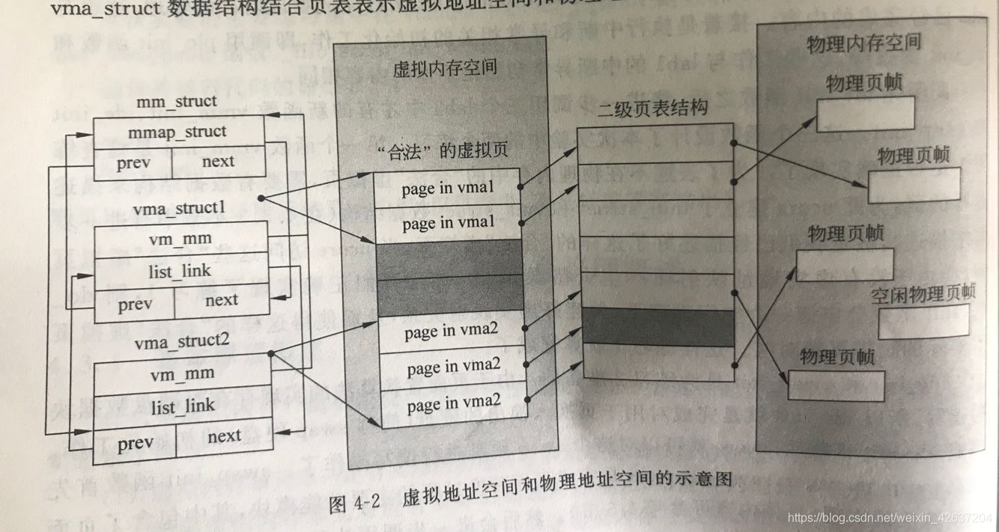
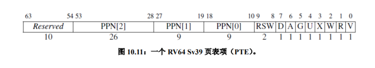
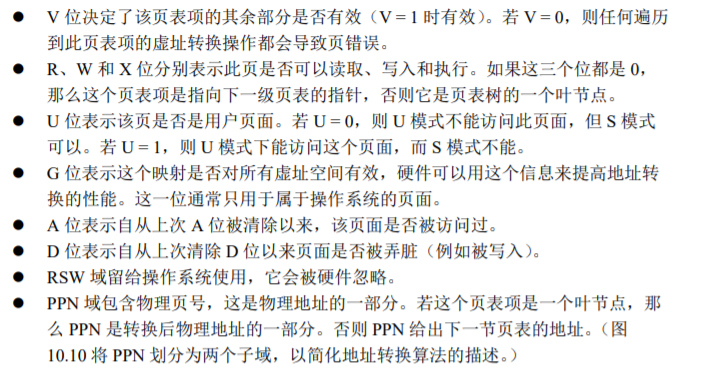
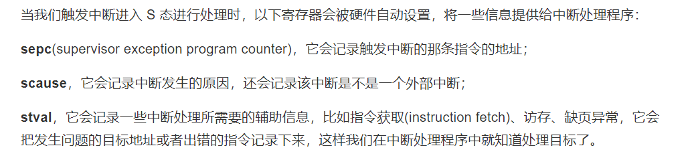
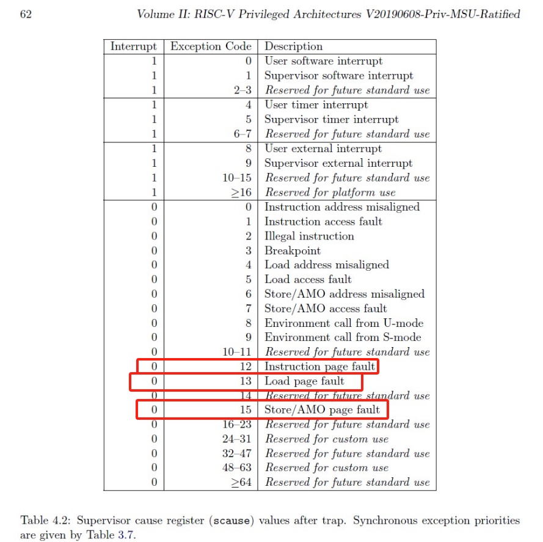

### 练习

对实验报告的要求：
 - 基于markdown格式来完成，以文本方式为主
 - 填写各个基本练习中要求完成的报告内容
 - 完成实验后，请分析ucore_lab中提供的参考答案，并请在实验报告中说明你的实现与参考答案的区别
 - 列出你认为本实验中重要的知识点，以及与对应的OS原理中的知识点，并简要说明你对二者的含义，关系，差异等方面的理解（也可能出现实验中的知识点没有对应的原理知识点）
 - 列出你认为OS原理中很重要，但在实验中没有对应上的知识点
 
#### 练习0：填写已有实验
本实验依赖实验1/2。请把你做的实验1/2的代码填入本实验中代码中有“LAB1”,“LAB2”的注释相应部分。

#### 练习1：理解基于FIFO的页面替换算法（思考题）
描述FIFO页面置换算法下，一个页面从被换入到被换出的过程中，会经过代码里哪些函数/宏的处理（或者说，需要调用哪些函数/宏），并用简单的一两句话描述每个函数在过程中做了什么？（为了方便同学们完成练习，所以实际上我们的项目代码和实验指导的还是略有不同，例如我们将FIFO页面置换算法头文件的大部分代码放在了`kern/mm/swap_fifo.c`文件中，这点请同学们注意）
 - 至少正确指出10个不同的函数分别做了什么？如果少于10个将酌情给分。我们认为只要函数原型不同，就算两个不同的函数。要求指出对执行过程有实际影响,删去后会导致输出结果不同的函数（例如assert）而不是cprintf这样的函数。如果你选择的函数不能完整地体现”从换入到换出“的过程，比如10个函数都是页面换入的时候调用的，或者解释功能的时候只解释了这10个函数在页面换入时的功能，那么也会扣除一定的分数

##### 页面换入

下面是一个页面被换入的过程中主要调用的函数/宏：


- exception_handler
```C
// kern\trap\trap.c
void exception_handler(struct trapframe *tf)
```
当触发缺页异常，即程序试图访问或写入不存在的页面时，该函数就会调用缺页处理函数 pgfault_handler 进行处理。

- pgfault_handler
```C
// kern\trap\trap.c
static int pgfault_handler(struct trapframe *tf)
```
打印缺页信息，然后将内存管理结构`check_mm_struct`、错误码、异常地址等参数传给 do_pgfault 函数进行页面置换等操作。

- do_pgfault
```C
// kern\mm\vmm.c
int do_pgfault(struct mm_struct *mm, <error-type> error_code, uintptr_t addr)
``` 
首先调用 find_vma 函数查找包含`addr`的`vma`并判断其是否可写，然后调用 get_pte 函数来获取`addr`对应的页表项`ptep`，若`ptep`不存在，则为`addr`分配一个物理页并将其与`addr`映射；否则将`ptep`看作一个交换条目，从磁盘加载数据到内存页，将物理地址与逻辑地址映射，记录该页面的访问情况。

- find_vma
```C
// kern\mm\vmm.c
struct vma_struct *find_vma(struct mm_struct *mm, uintptr_t addr)
```
在内存管理结构`mm`中查找包含地址`addr`的虚拟内存区域（`vma`），先看`mm->mmap_cache`是否满足条件，否则遍历`mm->mmap_list`进行查找。

 do_pgfault 中用 PTE_U 初始化了一个权限标志 perm（permission），如果`vma->vm_flags & VM_WRITE == 1`，即找到的 vma 的vm_flags 含有VM_WRITE 标志，就为 perm 添加 PTE_R 和 PTE_W 标志。这些标志都被定义为宏，它们的作用如下：

- PTE_U
```C
// kern\mm\mmu.h
#define PTE_U     0x010 // User
```
页表项和页目录项的标志位，含有该标志即表示该项允许用户访问。

- VM_WRITE
```C
// kern\mm\vmm.h
#define VM_WRITE                0x00000002
```
vma的标志位，含有该标志即表示该vma可写。

- PTE_R
```C
// kern\mm\vmm.h
#define PTE_R     0x002 // Read
```
页表项和页目录项的标志位，含有该标志即表示该项可读。

- PTE_W
```C
// kern\mm\vmm.h
#define PTE_W     0x004 // Write
```
页表项和页目录项的标志位，含有该标志即表示该项可写。

再来看 do_pgfault 中用到的其他函数：
- get_pte
```C
// kern\mm\pmm.c
pte_t *get_pte(pde_t *pgdir, uintptr_t la, bool create)
```
根据传入的线性地址`la`和页目录表`pgdir`获取对应的页表项，并返回该页表项对应的内核虚拟地址。必要时会为各级页表项对应的页表各分配一个页。

- pgdir_alloc_page
```C
// kern\mm\pmm.c
struct Page *pgdir_alloc_page(pde_t *pgdir, uintptr_t la, uint32_t perm)
```
调用 alloc_page 函数分配一个物理页，然后调用 page_insert 函数将其映射到给定的线性地址`la`上，同时设置相应的权限和可交换标记。

- swap_in
```C
// kern\mm\swap.c
int swap_in(struct mm_struct *mm, uintptr_t addr, struct Page **ptr_result)
```
页面换入的核心：为`ptr_result`分配一个内存页，根据`addr`获取要交换的页表项，再调用 swapfs_read 函数把相应磁盘页中的内容读取到分配的内存页中来。

- page_insert
```C
// kern\mm\pmm.c
int page_insert(pde_t *pgdir, struct Page *page, uintptr_t la, uint32_t perm) 
```
在物理页和线性地址`la`之间建立映射：先获取`la`对应的页表项，然后看该页表项当前对应的页是否为要映射的页`page`，否则释放原先映射的页并清除原映射，将新的映射关系写入页表项，由于页表改变了，因此最后要调用 tlb_invalidate 函数刷新TLB。

- tlb_invalidate
```C
// kern\mm\pmm.c
void tlb_invalidate(pde_t *pgdir, uintptr_t la) {flush_tlb()}
```

- flush_tlb();
```C
// kern\mm\pmm.h
static inline void flush_tlb() { asm volatile("sfence.vma"); }
```
tlb_invalidate 函数内部调用了flush_tlb函数，用于执行实际的TLB无效化操作。flush_tlb 函数使用了内联汇编，通过"sfence.vma"指令来刷新TLB。"sfence.vma"指令是用于刷新虚拟地址映射（VMA）的特权指令，它会使TLB中的所有条目无效化。

- swap_map_swappable
```C
// kern\mm\swap.c
int swap_map_swappable(struct mm_struct *mm, uintptr_t addr, struct Page *page, int swap_in)
```
调用页面交换管理器`sm`的`map_swappable`接口来设置页面可交换。

经过前面这些函数的封装处理，程序此时终于进入FIFO算法的实现部分。我们来看可以被设置为`sm`的`map_swappable`接口的 _fifo_map_swappable函数：

- _fifo_map_swappable
```C
// kern\mm\swap_fifo.c
static int _fifo_map_swappable(struct mm_struct *mm, uintptr_t addr, struct Page *page, int swap_in)
```
将最近访问的页面`page`链入页面访问队列的末尾，该队列是由双向链表实现的，链表头指针`head`的前一个节点指针指向队头，后一个节点指针指向队尾，故需要把`page`插入到`head`之后。

swap_in 函数是页面换入过程中的核心函数，而它最主要的功能正是通过调用 swapfs_read 函数来实现的，下面介绍 swapfs_read 的实现：

- swapfs_read
```C
// kern\mm\swap.c
int swapfs_read(swap_entry_t entry, struct Page *page)
```
将交换项`entry`的偏移和`page`的虚拟内核地址等参数传给 ide_read_secs 函数，并以它的结果作为返回值。

- ide_read_secs
```C
// kern\driver\ide.c
int ide_read_secs(unsigned short ideno, uint32_t secno, void *dst, size_t nsecs) 
```
复制磁盘中读取指定扇区的数据到目标内存中：通过将基扇区号`secno`乘以每个扇区的大小 `SECTSIZE` 得到基偏移量 `iobase`。
使用 memcpy 函数将从磁盘上的起始位置`&ide[iobase]`开始的连续数据复制到目标内存`dst`中。复制的字节数为要读取的扇区数`nsecs`乘以每个扇区的大小`SECTSIZE`。

由以上分析，ide_read_secs 函数才是真正实现从磁盘读取数据的函数，虽然它接受`ideno`为参数来决定选择哪块磁盘，但实际上只定义了一块磁盘，所以没用到`ideno`。而swapfs_read 在调用它时，传入的扇区数`nsecs`也是固定的，它等于一个页所需要的扇区数，即4096/512=8，因而基扇区号`secno`即等于交换项的偏移乘`nsecs`。

由于所谓的“磁盘”不过是内核的静态存储(static)区中的一块内存，所以所谓的“磁盘IO”也只是通过 memcpy 函数在内存间的复制。

##### 页面换出
下面是一个页面被换出的过程中主要调用的函数/宏：


- alloc_pages
```C
// kern\mm\pmm.c
struct Page *alloc_pages(size_t n)
```
调用`pmm->alloc_pages`来分配连续n个页大小的内存空间，如果返回的`page != NULL`，表明有足够的物理页面而不必换出其他页面，则跳出循环，或者希望分配多个连续的页，但我们换出页面的时候并不能换出连续的页面，这时也跳出循环，或者`swap_init_ok == 0`，表示还未初始化成功，也跳出循环，之后返回分配的内存页；否则调用swap_out函数换出页面到硬盘上。

- swap_out
```C
// kern\mm\swap.c
int swap_out(struct mm_struct *mm, int n, int in_tick)
```
将n个内存页换到磁盘上。由alloc_pages函数的分析，n其实只能是1。函数首先调用页面换出算法的接口`sm->swap_out_victim`寻找可以换出的页，找到后还要获取页面对应页表项，确保页表项的有效位为1，即确认页面当前在内存中，然后把要换出的物理页写到硬盘上的交换区，并释放该页，最后刷新TLB，返回n。

- _fifo_swap_out_victim
```C
// kern\mm\swap_fifo.c
static int _fifo_swap_out_victim(struct mm_struct *mm, struct Page ** ptr_page, int in_tick)
```
将最早访问的页从链表中卸下。由于最早访问的页位于页面访问队列的头部，根据上文对页面访问队列实现的分析，`head`的前一个节点指针即指向队头，因此从链表中删去该节点，并将该节点对应的页面指针保存到`ptr_page`中。

- PTE_V
```C
// // kern\mm\mmu.h
#define PTE_V     0x001 // Valid
```
页表项和页目录项的标志位，含有该标志即表示该项有效。

- swapfs_write
```C
// kern\mm\swap.c
int swapfs_write(swap_entry_t entry, struct Page *page)
```
也是调用 ide_write_secs 函数，并以它的结果作为返回值。

- ide_write_secs
```C
// kern\fs\swapfs.c
int ide_write_secs(unsigned short ideno, uint32_t secno, const void *src, size_t nsecs)
```
复制给定内存地址上的数据到磁盘指定的扇区，其实现与 ide_read_secs 函数基本一致，不同之处仅在于 memcpy 的方向而已。


#### 练习2：深入理解不同分页模式的工作原理（思考题）
get_pte()函数（位于`kern/mm/pmm.c`）用于在页表中查找或创建页表项，从而实现对指定线性地址对应的物理页的访问和映射操作。这在操作系统中的分页机制下，是实现虚拟内存与物理内存之间映射关系非常重要的内容。
 - get_pte()函数中有两段形式类似的代码， 结合sv32，sv39，sv48的异同，解释这两段代码为什么如此相像。
 - 目前get_pte()函数将页表项的查找和页表项的分配合并在一个函数里，你认为这种写法好吗？有没有必要把两个功能拆开？

##### 问题解答
###### 关于两段相像代码
这两段代码的功能都是查询页目录获取下一级页表地址，其逻辑功能相似，代码内容当然相似。sv32、sv39、sv48甚至没应用的sv57，只不过是页表级数的问题而已，分别对应两级、三级、四级、五级页表。本次实验采用的是sv39，有2层页目录，因此有两段相关代码；相似的，sv32仅需要一段即可，sv48则需要3段。
详细内容请看以下代码解析中的[#两端类似代码的逻辑]

###### 关于页表项的查找和分配
感觉没什么问题，一般而言，我们要查询页表，都是意味着我们需要这个页，而不是说检查它是否有效。所以一般情况下，查询即意味着要分配。但是我的知识面比较窄，也可能有没注意到的其它应用方式，不过，`get_pte`函数也有一个`create`参数，如果将这个参数设置为0，则不会创建。具体见代码解析中的[#两端类似代码的逻辑]的第4点。

##### 代码实现详细解析
###### pte和pde
pte即：page table entry，pde即：page director entry；pde是x86中页表目录的称呼，在riscv中，其实都是页表项(大大页、大页，因为我们有的情况下会直接使用一个大大页或者大页，其实不应该把两者区分开，这个问题稍后再谈论)
`pte_t`和`pde_t`都是`uintptr_t`的重定义，`uintptr_t`本身是`uint`的重定义。我们在上次实验中也用到了`uintptr_t`，这种类型可以方便指针和整数的转换；有时候，我们希望操作一个指针，这样我们可以访问其指向内存的内容，但有的时候，我们希望对这个指针本身做出修改，这时候，它应该是一个整数。在C/C++中，`int`转为`int*`是会报错的(*error C2440: “初始化”: 无法从“int”转换为“int *”*)，但是使用`uintptr_t`则不会，另外由于`uint`是根据系统位数定义的，所以能够很好解决不同位数的兼容问题。相关代码如下：
```C
#if __riscv_xlen == 64
  typedef uint64_t uint_t;
#elif __riscv_xlen == 32
  typedef uint32_t uint_t;

typedef uint_t uintptr_t;

typedef uintptr_t pte_t;
typedef uintptr_t pde_t;
```

###### pgdir
pgdir是大大页的地址，一般由`stap`寄存器传递(体现为`mm->pgdir`)
这里的`la`是指线性虚拟地址，`PDX1(la)、PDX0(la)、PTX(la)`则是分别获取la大大页的页号、大页的页号以及物理页表的页号，la的结构以及`PDX1、PDX0、PTX`的相关代码如下所示，即通过移位以及按位与操作，获取39-31、30-22、21-13位。
```C
// +--------9-------+-------9--------+-------9--------+---------12----------+
// | Page Directory | Page Directory |   Page Table   | Offset within Page  |
// |     Index 1    |    Index 2     |                |                     |
// +----------------+----------------+----------------+---------------------+
//  \-- PDX1(la) --/ \-- PDX0(la) --/ \--- PTX(la) --/ \---- PGOFF(la) ----/
//  \-------------------PPN(la)----------------------/

#define PTXSHIFT        12                      // offset of PTX in a linear address
#define PDX0SHIFT       21                      // offset of PDX0 in a linear address
#define PDX1SHIFT       30                      // offset of PDX0 in a linear address

#define PDX1(la) ((((uintptr_t)(la)) >> PDX1SHIFT) & 0x1FF)
#define PDX0(la) ((((uintptr_t)(la)) >> PDX0SHIFT) & 0x1FF)
#define PTX(la) ((((uintptr_t)(la)) >> PTXSHIFT) & 0x1FF)

pde_t *pdep1 = &pgdir[PDX1(la)];
```
###### 两端类似代码的逻辑
这两段代码的功能都是查询页目录获取下一级页表地址，下图可以直观看出：
![[sv39虚拟地址访问图.png]]

1. 首先判断页表项是不是有效，如果是有效的，那么只需要将页表项转为一个物理地址，这个物理地址就是下一级页表的地址。具体实现方式如下，先清空页表项的低10位，然后左移两位，就能够得到一个物理地址。
```C
#define PTE_ADDR(pte)   (((uintptr_t)(pte) & ~0x3FF) << (PTXSHIFT - PTE_PPN_SHIFT))
#define PDE_ADDR(pde)   PTE_ADDR(pde)
pde_t *pdep0 = &((pde_t *)KADDR(PDE_ADDR(*pdep1)))[PDX0(la)];
```
2. 如果页表项不是有效的，意味着现在还没有物理页分配。如果`create`标识是`true`则我们分配一个页，无页可以分配或者`create`为`false`的话，则返回`NULL`。
3. 分配页。首先调用`alloc_page`，这是lab2实现的页面分配算法，然后初始化该页面(设置引用位 + 获取物理地址 + 清空页空间)，接着更新该页表项，具体代码如下：
```C
    if (!(*pdep1 & PTE_V)) {                    //invalid page
        struct Page *page;
        if (!create || (page = alloc_page()) == NULL) {    //we can't get a page, this alloc_page means get 1 page
            return NULL;
        }
        set_page_ref(page, 1);
        uintptr_t pa = page2pa(page);
        memset(KADDR(pa), 0, PGSIZE);
        *pdep1 = pte_create(page2ppn(page), PTE_U | PTE_V); //user can use
    }
```

4. 更新页表项的方式，相关代码如下。`ppn`即物理页号。`page2ppn`可以将一个`page`结构体的指针，转为`ppn_t`类型，具体方式就是用这个`page`指针，减去page结构体的起始指针`pages`，得到其相对与`pages`的页号，但是`pages`对应的物理地址是0x80000000，因此还需要加上0x80000才能得到其真实的物理页号。`pte_create`将得到的物理页号左移10位(并置位)，这样就能够得到一个新的页表项。
```C
static inline ppn_t page2ppn(struct Page *page) { return page - pages + nbase; }
*pdep1 = pte_create(page2ppn(page), PTE_U | PTE_V);
```
###### 直接使用大大页和大页
假设我们并不用大大页和大页作为页表目录，而是直接使用一个大大页和大页作为分配的空间，那么上述代码就失效了。
首先，我们只能够分配一个page，初始化也只是针对一个page。另外，并没有判断`PTR_X`、`PTR_R`这两个位，根据riscv的硬件手册，如果这两个位被置为1(以及valid位)，就表示找到物理页了，无须再查其它页表。


#### 练习3：给未被映射的地址映射上物理页（需要编程）
补充完成do_pgfault（mm/vmm.c）函数，给未被映射的地址映射上物理页。设置访问权限 的时候需要参考页面所在 VMA 的权限，同时需要注意映射物理页时需要操作内存控制 结构所指定的页表，而不是内核的页表。
请在实验报告中简要说明你的设计实现过程。请回答如下问题：
 - 请描述页目录项（Page Directory Entry）和页表项（Page Table Entry）中组成部分对ucore实现页替换算法的潜在用处。
 - 如果ucore的缺页服务例程在执行过程中访问内存，出现了页访问异常，请问硬件要做哪些事情？
- 数据结构Page的全局变量（其实是一个数组）的每一项与页表中的页目录项和页表项有无对应关系？如果有，其对应关系是啥？

##### 结构体vma_struct和mm_struct
引入两个结构体的重要原因是，page_fault 函数不知道哪些是“合法可用”的虚拟页，所以 ucore 还缺少一定的数据结构来维护”所有可用的虚拟地址/虚拟页的集合“。为此 ucore 通过建立 mm_struct 和 vma_struct 数据结构，描述了 ucore 模拟应用程序运行所需的合法可用的内存空间。
VMA和MM：
```C
// 用于描述某个虚拟页的结构
struct vma_struct {
    struct mm_struct *vm_mm; //指向一个比 vma_struct 更高的抽象层次的数据结构 mm_struct
    uintptr_t vm_start;      // 虚拟页起始地址，包括当前地址  
    uintptr_t vm_end;        // 虚拟页终止地址，不包括当前地址（地址前闭后开）  
    uint32_t vm_flags;       // 相关标志位
    list_entry_t list_link;  // 用于连接各个虚拟页的双向指针
};
// 用于表示 VMA 权限标志vm_flags的常量
#define VM_READ                 0x00000001
#define VM_WRITE                0x00000002
#define VM_EXEC                 0x00000004

// 数据结构Page相关成员的用途已在lab2中使用过，这里只提它新增的两个成员pra_*
struct Page {
    int ref;
    uint32_t flags;
    unsigned int property;
    list_entry_t page_link;
    list_entry_t pra_page_link;     // 用于连接上一个和下一个*可交换已分配*的物理页
    uintptr_t pra_vaddr;            // 用于保存该物理页所对应的虚拟地址。
};

//链接了所有属于同一页目录表的虚拟内存空间，一个页表对应的信息组合起来
struct mm_struct {  
    list_entry_t mmap_list;  //双向链表头，链接了所有属于同一页目录表的虚拟内存空间
    struct vma_struct *mmap_cache;  //指向当前正在使用的虚拟内存空间
    pde_t *pgdir; //指向的就是 mm_struct数据结构所维护的页表
    int map_count; //记录 mmap_list 里面链接的 vma_struct 的个数
    void *sm_priv; //用于指向swap manager的某个链表
};  
```
简单来说，vma_struct描述的是一段连续的虚拟地址，mm_struct链接了使用同一个页表的所有vma_struct结构，这样我们就可以灵活管理虚拟内存区域。

值得注意的是，这两个结构都有一个双向链表list_entry_t，vma_struct的list_link的作用是把同一个页表对应的多个vma_struct结构体串成一个链表，在链表里把它们按照区间的起始点进行排序，而mmap_list链接了所有属于同一页目录表的虚拟内存空间，个人理解是链表头的作用，fifo初始化代码有使用。

具体的形成的虚拟空间的管理结构如下所示，这张网图通过管理一个mm_struct结构体，可以管理一个页表里所有的虚拟内存空间，并可以通过这个页表映射到对应的物理内存空间上。


##### swap文件一些理解
两个重要的函数，
```C
int swap_in(struct mm_struct *mm, uintptr_t addr, struct Page **ptr_result)
{
    // 分配一个物理页面
    struct Page *result = alloc_page();
    assert(result != NULL);

    // 获取虚拟地址 addr 对应的页表项 ptep
    pte_t *ptep = get_pte(mm->pgdir, addr, 0);

    int r;
    // 从磁盘读取数据并加载到 result 中
    if ((r = swapfs_read((*ptep), result)) != 0)
    {
        assert(r != 0);
    }
    // 输出日志，表示已经加载了来自磁盘的数据
    cprintf("swap_in: load disk swap entry %d with swap_page in vadr 0x%x\n", (*ptep) >> 8, addr);

    // 将加载的物理页面指针返回给调用者
    *ptr_result = result;
    return 0;
}
int swap_out(struct mm_struct *mm, int n, int in_tick)
{
    int i;
    for (i = 0; i != n; ++i)
    {
        uintptr_t v;
        struct Page *page;
        // 调用页面置换算法的接口，选择一个要换出的页面
        int r = sm->swap_out_victim(mm, &page, in_tick);
        //r=0表示成功找到了可以换出去的页面
        //要换出去的物理页面存在page里
        if (r != 0)
        {
            cprintf("i %d, swap_out: call swap_out_victim failed\n", i);
            break;
        }

        // 获取要换出的物理页面的虚拟地址
        v = page->pra_vaddr;
        pte_t *ptep = get_pte(mm->pgdir, v, 0);
        assert((*ptep & PTE_V) != 0);

        if (swapfs_write((page->pra_vaddr / PGSIZE + 1) << 8, page) != 0)
        {
             //尝试把要换出的物理页面写到硬盘上的交换区，返回值不为0说明失败了
            cprintf("SWAP: failed to save\n");
            sm->map_swappable(mm, v, page, 0);
            continue;
        }
        else
        {
            // 成功将页面写入硬盘，更新页表项并释放物理页面
            cprintf("swap_out: i %d, store page in vaddr 0x%x to disk swap entry %d\n", i, v, page->pra_vaddr / PGSIZE + 1);
            *ptep = (page->pra_vaddr / PGSIZE + 1) << 8;
            free_page(page);
        }
        
        // 由于页表项已更改，需要使 TLB 失效以确保正确的访问
        tlb_invalidate(mm->pgdir, v);
    }
    return i;
}

```
swap_in函数只会将目标物理页加载进内存中，而不会修改页表条目。所以相关的标志位设置必须在swap_in函数的外部手动处理。而swap_out函数会先执行swap_out_victim，找出最适合换出的物理页，并将其换出，最后刷新TLB。需要注意的是swap_out函数会在函数内部设置PTE，当某个页面被换出后，PTE会被设置为所换出物理页在硬盘上的偏移。
一个细节，当PTE所对应的物理页存在于内存中，那么该PTE就是正常的页表条目，可被CPU直接寻址用于转换地址。但当所对应的物理页不在内存时，该PTE就成为swap_entry_t，保存该物理页数据在外存的偏移位置。
```C
/*
 * swap_entry_t
 * --------------------------------------------
 * |         offset        |   reserved   | 0 |
 * --------------------------------------------
 *           24 bits            7 bits    1 bit
 * /
 /* *
 * swap_offset - takes a swap_entry (saved in pte), and returns
 * the corresponding offset in swap mem_map.
 * */
 * #define swap_offset(entry) ({                                       \
               size_t __offset = (entry >> 8);                        \
               if (!(__offset > 0 && __offset < max_swap_offset)) {    \
                    panic("invalid swap_entry_t = %08x.\n", entry);    \
               }                                                    \
               __offset;                                            \
          })

```

##### 处理页面异常函数（练习三）
关于页面异常，我从网页上摘抄了下面一段话，
当启动分页机制以后，如果一条指令或数据的虚拟地址所对应的物理页框不在内存中或者访问的类型有错误（比如写一个只读页或用户态程序访问内核态的数据等），就会发生页错误异常。产生页面异常的原因主要有:

* 目标页面不存在（页表项全为0，即该线性地址与物理地址尚未建立映射或者已经撤销）;
* 相应的物理页面不在内存中（页表项非空，但Present标志位=0，比如在swap分区或磁盘文件上）
* 访问权限不符合（此时页表项P标志=1，比如企图写只读页面）

当出现上面情况之一,那么就会产生页面page fault(#PF)异常。产生异常的线性地址存储在 CR2中,并且将是page fault的产生类型保存在 error code 中。

而具体的解决措施简单来说是，对于越权的，直接报错；其他的，分配物理页给它映射。
所以我们在这个函数应该这么做：
* 先判断虚拟地址addr对于本进程是否合法
* 判断错误码合法
* 分配页，添加映射，替换算法更新

下面给出具体函数的代码，包括我补充的代码（其实实验手册里已经给了）：
```C
int
do_pgfault(struct mm_struct *mm, uint_t error_code, uintptr_t addr) {
    int ret = -E_INVAL;// 初始化返回值为无效值
    //获取触发pgfault的虚拟地址所在虚拟页vma
    struct vma_struct *vma = find_vma(mm, addr);
    pgfault_num++;// 增加页面错误计数
    // 如果地址不在 mm 的 vma 范围内
    if (vma == NULL || vma->vm_start > addr) {
        cprintf("not valid addr %x, and  can not find it in vma\n", addr);
        goto failed;//跳到失败处理
    }
     /* 如果
     * 1. 写入一个已存在的地址 OR
     * 2. 写入一个不存在的地址且地址是可写的 OR
     * 3. 读取一个不存在的地址且地址是可读的
     * 那么继续处理
     */
     //设置页表项所对应的权限
    uint32_t perm = PTE_U;
     // 根据 vma 的权限信息确定访问权限，如果可写则设置读写权限
    if (vma->vm_flags & VM_WRITE) {
        perm |= (PTE_R | PTE_W);
    }
    addr = ROUNDDOWN(addr, PGSIZE);// 将地址按页面大小对齐
    ret = -E_NO_MEM;// 设置失败返回值为内存不足
    pte_t *ptep=NULL;
    /* 
 *  get_pte : 获取一个页表项 PTE，并返回该 PTE 的内核虚拟地址，为指定的线性地址 la。
    如果页表中没有此 PTE 条目，此宏或函数会创建一个新的页表。
 *  pgdir_alloc_page : 调用 alloc_page 和 page_insert 函数来分配一页大小的内存，
    并建立一个线性地址 la 与物理地址 pa 的映射，同时更新页目录表 pgdir。
 * 
 * DEFINES（定义）:
 *   VM_WRITE  : 如果 vma->vm_flags & VM_WRITE == 1/0，则表示虚拟内存区域可写/不可写。
 *   PTE_W           0x002                   // 页表/目录项标志位：可写
 *   PTE_U           0x004                   // 页表/目录项标志位：用户可访问
 * 
 * VARIABLES（变量）:
 *   mm->pgdir : 页目录表，表示一组虚拟内存区域共享的页目录。
 * 
 */
    // 尝试查找 pte，如果 pte 的 PT（Page Table）不存在，则创建 PT。
    ptep = get_pte(mm->pgdir, addr, 1); 
    // 如果页表项的内容为0，说明页面不存在，需要分配页面并建立页表项映射
    if (*ptep == 0) {
        if (pgdir_alloc_page(mm->pgdir, addr, perm) == NULL) {
            cprintf("pgdir_alloc_page in do_pgfault failed\n");
            goto failed;
        }
    }
   else {/* 如果页表项内容不为0，这意味着这是一个交换条目，需要将数据从磁盘加载到内存中，并建立映射
        * 现在我们认为pte是一个交换条目，那我们应该从磁盘加载数据并放到带有phy addr的页面，
        * 并将phy addr与逻辑addr映射，触发交换管理器记录该页面的访问情况
        *
        *  宏或函数:
        *    swap_in(mm, addr, &page) : 分配一个内存页，然后根据
        *    PTE中的swap条目的addr，找到磁盘页的地址，将磁盘页的内容读入这个内存页
        *    page_insert ： 建立一个Page的phy addr与线性addr la的映射
        *    swap_map_swappable ： 设置页面可交换
        */
        if (swap_init_ok) {
            struct Page *page = NULL;
            //在swap_in()函数执行完之后，page保存换入的物理页面。
            //swap_in()函数里面可能把内存里原有的页面换出去
            swap_in(mm,addr,&page);//（1）根据 mm 和 addr，尝试将正确的磁盘页内容加载到由 page 管理的内存中。
            page_insert(mm->pgdir,page,addr,perm);//更新页表，插入新的页表项
            // （2）根据 mm、addr 和 page，建立物理地址 <--> 逻辑地址的映射。
            swap_map_swappable(mm,addr,page,1);// 设置页面为可交换
            page->pra_vaddr = addr;
        } else {
            cprintf("no swap_init_ok but ptep is %x, failed\n", *ptep);
            goto failed;
        }
   }
   ret = 0;
failed:
    return ret;
}
```
其实，这个函数也是实现了我们的`页面换入`功能，具体来说，需要先检查产生访问异常的地址是否属于某个vma表示的合法虚拟地址，然后根据 vma 的权限信息确定访问权限，最后查找PTE，如果页表项的内容不是，则执行swap_in() 函数换入页面。
具体的页面换出功能，我将在练习4具体阐述。
下面就本练习的几个思考题做出本人自己的理解。
 - 请描述页目录项（Page Directory Entry）和页表项（Page Table Entry）中组成部分对ucore实现页替换算法的潜在用处。

翻译一下这个问题，即PDE和PTE结构与其标志位用途。这里不同于X86，貌似PD是多级页表中较高级别的页表，其实两者的结构是一样的，都是SV39页表项的结构，所以这里我统一称作PTE。下面我查阅了手册里关于SV39的PTE的结构图：

手册里没有给出SV39每一位的具体解释，都是我们知道它和 Sv32 完全相同，只是 PPN 字段被扩展到了44 位，以支持 56 位的物理地址，所以这里把SV32的解释拿了过来，也是同样适用的。

首先这里有很多与权限相关的位，这些和权限相关的位可以用来增强ucore的内存保护机制。其次，表项中保留了2位供操作系统进行使用，可以为实现一些页替换算法的时候提供支持，并且事实上在PTE_P位（这里的V位）为0的时候，CPU将不会使用PTE上的内容，这就使得当PTE_P位为0的时候，可以使用PTE上的其他位用于保存操作系统需要的信息，事实上ucore也正是利用这些位来保存页替换算法里被换出的物理页的在交换分区中的位置。此外PTE中还有D位，用于表示当前的页是否经过修改写入，这就使得OS可以使用这个位来判断是否可以省去某些已经在外存中存在着，内存中的数据与外存相一致的物理页面换出到外存这种多余的操作。同时，PTE有表示是否被使用过的A位，这就使得OS可以粗略地得知当前的页面是否具有着较大的被访问概率，使得OS可以利用程序的局部性原理来对也替换算法进行优化。
>当然，Enhanced Clock算法可能对这个体现的最为明显，
对于每个页面都有两个标志位，分别为使用位和修改位，记为<使用,修改>。换出页的使用位必须为0，并且算法优先考虑换出修改位为零的页面。
当内存页被访问后，MMU 将在对应的页表项的 PTE_A 这一位设为1；
当内存页被修改后，MMU 将在对应的页表项的 PTE_D 这一位设为1。

 - 如果ucore的缺页服务例程在执行过程中访问内存，出现了页访问异常，请问硬件要做哪些事情？

这里感觉回到了LAB1，回到了中断异常的相关处理。因此翻阅了一下LAB1的材料，截得两段：



引起页异常的线性地址会在异常之后被硬件自动赋给STVAL寄存器，scause寄存器会记录对应的错误类型，这里由上图可以看到是12,13,14。发生 Page Fault 时的指令执行位置，保存在 sepc寄存器 中。其他合法的 VMA 映射关系还会保存在原来的链表里。

接下来就会中断异常要执行的正常的一些操作（这里是LAB1的内容，保存恢复之类的），这里最重要的就是依次执行trap–> trap_dispatch–>pgfault_handler–>do_pgfault这样的调用关系去页面置换来处理这个异常，最后还是LAB1那些操作。

- 数据结构Page的全局变量（其实是一个数组）的每一项与页表中的页目录项和页表项有无对应关系？如果有，其对应关系是啥？

pages每一项记录一个物理页的信息，而我们页表正是反映的一个从虚拟地址到物理地址的映射关系，页表项（这里是狭义上最小的页的页表项）正是记录了物理页编号，对应这每一个pages中的物理页。当然，前提是这个页表项PTE_P为1.

#### 练习4：补充完成Clock页替换算法（需要编程）
通过之前的练习，相信大家对FIFO的页面替换算法有了更深入的了解，现在请在我们给出的框架上，填写代码，实现 Clock页替换算法（mm/swap_clock.c）。
请在实验报告中简要说明你的设计实现过程。请回答如下问题：
 - 比较Clock页替换算法和FIFO算法的不同。

#### 练习5：阅读代码和实现手册，理解页表映射方式相关知识（思考题）
如果我们采用”一个大页“ 的页表映射方式，相比分级页表，有什么好处、优势，有什么坏处、风险？

#### 扩展练习 Challenge：实现不考虑实现开销和效率的LRU页替换算法（需要编程）
challenge部分不是必做部分，不过在正确最后会酌情加分。需写出有详细的设计、分析和测试的实验报告。完成出色的可获得适当加分。


