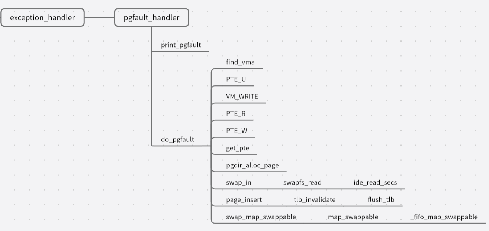
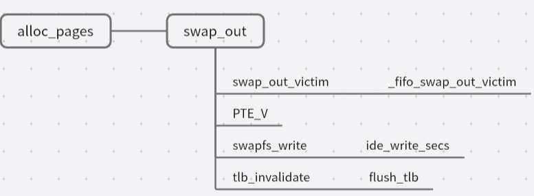

### 练习

对实验报告的要求：
 - 基于markdown格式来完成，以文本方式为主
 - 填写各个基本练习中要求完成的报告内容
 - 完成实验后，请分析ucore_lab中提供的参考答案，并请在实验报告中说明你的实现与参考答案的区别
 - 列出你认为本实验中重要的知识点，以及与对应的OS原理中的知识点，并简要说明你对二者的含义，关系，差异等方面的理解（也可能出现实验中的知识点没有对应的原理知识点）
 - 列出你认为OS原理中很重要，但在实验中没有对应上的知识点
 
#### 练习0：填写已有实验
本实验依赖实验1/2。请把你做的实验1/2的代码填入本实验中代码中有“LAB1”,“LAB2”的注释相应部分。

#### 练习1：理解基于FIFO的页面替换算法（思考题）
描述FIFO页面置换算法下，一个页面从被换入到被换出的过程中，会经过代码里哪些函数/宏的处理（或者说，需要调用哪些函数/宏），并用简单的一两句话描述每个函数在过程中做了什么？（为了方便同学们完成练习，所以实际上我们的项目代码和实验指导的还是略有不同，例如我们将FIFO页面置换算法头文件的大部分代码放在了`kern/mm/swap_fifo.c`文件中，这点请同学们注意）
 - 至少正确指出10个不同的函数分别做了什么？如果少于10个将酌情给分。我们认为只要函数原型不同，就算两个不同的函数。要求指出对执行过程有实际影响,删去后会导致输出结果不同的函数（例如assert）而不是cprintf这样的函数。如果你选择的函数不能完整地体现”从换入到换出“的过程，比如10个函数都是页面换入的时候调用的，或者解释功能的时候只解释了这10个函数在页面换入时的功能，那么也会扣除一定的分数

##### 页面换入

下面是一个页面被换入的过程中主要调用的函数/宏：


- exception_handler
```C
// kern\trap\trap.c
void exception_handler(struct trapframe *tf)
```
当触发缺页异常，即程序试图访问或写入不存在的页面时，该函数就会调用缺页处理函数 pgfault_handler 进行处理。

- pgfault_handler
```C
// kern\trap\trap.c
static int pgfault_handler(struct trapframe *tf)
```
打印缺页信息，然后将内存管理结构`check_mm_struct`、错误码、异常地址等参数传给 do_pgfault 函数进行页面置换等操作。

- do_pgfault
```C
// kern\mm\vmm.c
int do_pgfault(struct mm_struct *mm, <error-type> error_code, uintptr_t addr)
``` 
首先调用 find_vma 函数查找包含`addr`的`vma`并判断其是否可写，然后调用 get_pte 函数来获取`addr`对应的页表项`ptep`，若`ptep`不存在，则为`addr`分配一个物理页并将其与`addr`映射；否则将`ptep`看作一个交换条目，从磁盘加载数据到内存页，将物理地址与逻辑地址映射，记录该页面的访问情况。

- find_vma
```C
// kern\mm\vmm.c
struct vma_struct *find_vma(struct mm_struct *mm, uintptr_t addr)
```
在内存管理结构`mm`中查找包含地址`addr`的虚拟内存区域（`vma`），先看`mm->mmap_cache`是否满足条件，否则遍历`mm->mmap_list`进行查找。

 do_pgfault 中用 PTE_U 初始化了一个权限标志 perm（permission），如果`vma->vm_flags & VM_WRITE == 1`，即找到的 vma 的vm_flags 含有VM_WRITE 标志，就为 perm 添加 PTE_R 和 PTE_W 标志。这些标志都被定义为宏，它们的作用如下：

- PTE_U
```C
// kern\mm\mmu.h
#define PTE_U     0x010 // User
```
页表项和页目录项的标志位，含有该标志即表示该项允许用户访问。

- VM_WRITE
```C
// kern\mm\vmm.h
#define VM_WRITE                0x00000002
```
vma的标志位，含有该标志即表示该vma可写。

- PTE_R
```C
// kern\mm\vmm.h
#define PTE_R     0x002 // Read
```
页表项和页目录项的标志位，含有该标志即表示该项可读。

- PTE_W
```C
// kern\mm\vmm.h
#define PTE_W     0x004 // Write
```
页表项和页目录项的标志位，含有该标志即表示该项可写。

再来看 do_pgfault 中用到的其他函数：
- get_pte
```C
// kern\mm\pmm.c
pte_t *get_pte(pde_t *pgdir, uintptr_t la, bool create)
```
根据传入的线性地址`la`和页目录表`pgdir`获取对应的页表项，并返回该页表项对应的内核虚拟地址。必要时会为各级页表项对应的页表各分配一个页。

- pgdir_alloc_page
```C
// kern\mm\pmm.c
struct Page *pgdir_alloc_page(pde_t *pgdir, uintptr_t la, uint32_t perm)
```
调用 alloc_page 函数分配一个物理页，然后调用 page_insert 函数将其映射到给定的线性地址`la`上，同时设置相应的权限和可交换标记。

- swap_in
```C
// kern\mm\swap.c
int swap_in(struct mm_struct *mm, uintptr_t addr, struct Page **ptr_result)
```
页面换入的核心：为`ptr_result`分配一个内存页，根据`addr`获取要交换的页表项，再调用 swapfs_read 函数把相应磁盘页中的内容读取到分配的内存页中来。

- page_insert
```C
// kern\mm\pmm.c
int page_insert(pde_t *pgdir, struct Page *page, uintptr_t la, uint32_t perm) 
```
在物理页和线性地址`la`之间建立映射：先获取`la`对应的页表项，然后看该页表项当前对应的页是否为要映射的页`page`，否则释放原先映射的页并清除原映射，将新的映射关系写入页表项，由于页表改变了，因此最后要调用 tlb_invalidate 函数刷新TLB。

- tlb_invalidate
```C
// kern\mm\pmm.c
void tlb_invalidate(pde_t *pgdir, uintptr_t la) {flush_tlb()}
```

- flush_tlb();
```C
// kern\mm\pmm.h
static inline void flush_tlb() { asm volatile("sfence.vma"); }
```
tlb_invalidate 函数内部调用了flush_tlb函数，用于执行实际的TLB无效化操作。flush_tlb 函数使用了内联汇编，通过"sfence.vma"指令来刷新TLB。"sfence.vma"指令是用于刷新虚拟地址映射（VMA）的特权指令，它会使TLB中的所有条目无效化。

- swap_map_swappable
```C
// kern\mm\swap.c
int swap_map_swappable(struct mm_struct *mm, uintptr_t addr, struct Page *page, int swap_in)
```
调用页面交换管理器`sm`的`map_swappable`接口来设置页面可交换。

经过前面这些函数的封装处理，程序此时终于进入FIFO算法的实现部分。我们来看可以被设置为`sm`的`map_swappable`接口的 _fifo_map_swappable函数：

- _fifo_map_swappable
```C
// kern\mm\swap_fifo.c
static int _fifo_map_swappable(struct mm_struct *mm, uintptr_t addr, struct Page *page, int swap_in)
```
将最近访问的页面`page`链入页面访问队列的末尾，该队列是由双向链表实现的，链表头指针`head`的前一个节点指针指向队头，后一个节点指针指向队尾，故需要把`page`插入到`head`之后。

swap_in 函数是页面换入过程中的核心函数，而它最主要的功能正是通过调用 swapfs_read 函数来实现的，下面介绍 swapfs_read 的实现：

- swapfs_read
```C
// kern\mm\swap.c
int swapfs_read(swap_entry_t entry, struct Page *page)
```
将交换项`entry`的偏移和`page`的虚拟内核地址等参数传给 ide_read_secs 函数，并以它的结果作为返回值。

- ide_read_secs
```C
// kern\driver\ide.c
int ide_read_secs(unsigned short ideno, uint32_t secno, void *dst, size_t nsecs) 
```
复制磁盘中读取指定扇区的数据到目标内存中：通过将基扇区号`secno`乘以每个扇区的大小 `SECTSIZE` 得到基偏移量 `iobase`。
使用 memcpy 函数将从磁盘上的起始位置`&ide[iobase]`开始的连续数据复制到目标内存`dst`中。复制的字节数为要读取的扇区数`nsecs`乘以每个扇区的大小`SECTSIZE`。

由以上分析，ide_read_secs 函数才是真正实现从磁盘读取数据的函数，虽然它接受`ideno`为参数来决定选择哪块磁盘，但实际上只定义了一块磁盘，所以没用到`ideno`。而swapfs_read 在调用它时，传入的扇区数`nsecs`也是固定的，它等于一个页所需要的扇区数，即4096/512=8，因而基扇区号`secno`即等于交换项的偏移乘`nsecs`。

由于所谓的“磁盘”不过是内核的静态存储(static)区中的一块内存，所以所谓的“磁盘IO”也只是通过 memcpy 函数在内存间的复制。

##### 页面换出
下面是一个页面被换出的过程中主要调用的函数/宏：


- alloc_pages
```C
// kern\mm\pmm.c
struct Page *alloc_pages(size_t n)
```
调用`pmm->alloc_pages`来分配连续n个页大小的内存空间，如果返回的`page != NULL`，表明有足够的物理页面而不必换出其他页面，则跳出循环，或者希望分配多个连续的页，但我们换出页面的时候并不能换出连续的页面，这时也跳出循环，或者`swap_init_ok == 0`，表示还未初始化成功，也跳出循环，之后返回分配的内存页；否则调用swap_out函数换出页面到硬盘上。

- swap_out
```C
// kern\mm\swap.c
int swap_out(struct mm_struct *mm, int n, int in_tick)
```
将n个内存页换到磁盘上。由alloc_pages函数的分析，n其实只能是1。函数首先调用页面换出算法的接口`sm->swap_out_victim`寻找可以换出的页，找到后还要获取页面对应页表项，确保页表项的有效位为1，即确认页面当前在内存中，然后把要换出的物理页写到硬盘上的交换区，并释放该页，最后刷新TLB，返回n。

- _fifo_swap_out_victim
```C
// kern\mm\swap_fifo.c
static int _fifo_swap_out_victim(struct mm_struct *mm, struct Page ** ptr_page, int in_tick)
```
将最早访问的页从链表中卸下。由于最早访问的页位于页面访问队列的头部，根据上文对页面访问队列实现的分析，`head`的前一个节点指针即指向队头，因此从链表中删去该节点，并将该节点对应的页面指针保存到`ptr_page`中。

- PTE_V
```C
// // kern\mm\mmu.h
#define PTE_V     0x001 // Valid
```
页表项和页目录项的标志位，含有该标志即表示该项有效。

- swapfs_write
```C
// kern\mm\swap.c
int swapfs_write(swap_entry_t entry, struct Page *page)
```
也是调用 ide_write_secs 函数，并以它的结果作为返回值。

- ide_write_secs
```C
// kern\fs\swapfs.c
int ide_write_secs(unsigned short ideno, uint32_t secno, const void *src, size_t nsecs)
```
复制给定内存地址上的数据到磁盘指定的扇区，其实现与 ide_read_secs 函数基本一致，不同之处仅在于 memcpy 的方向而已。


#### 练习2：深入理解不同分页模式的工作原理（思考题）
get_pte()函数（位于`kern/mm/pmm.c`）用于在页表中查找或创建页表项，从而实现对指定线性地址对应的物理页的访问和映射操作。这在操作系统中的分页机制下，是实现虚拟内存与物理内存之间映射关系非常重要的内容。
 - get_pte()函数中有两段形式类似的代码， 结合sv32，sv39，sv48的异同，解释这两段代码为什么如此相像。
 - 目前get_pte()函数将页表项的查找和页表项的分配合并在一个函数里，你认为这种写法好吗？有没有必要把两个功能拆开？

##### 问题解答
###### 关于两段相像代码
这两段代码的功能都是查询页目录获取下一级页表地址，其逻辑功能相似，代码内容当然相似。sv32、sv39、sv48甚至没应用的sv57，只不过是页表级数的问题而已，分别对应两级、三级、四级、五级页表。本次实验采用的是sv39，有2层页目录，因此有两段相关代码；相似的，sv32仅需要一段即可，sv48则需要3段。
详细内容请看以下代码解析中的[#两端类似代码的逻辑]

###### 关于页表项的查找和分配
感觉没什么问题，一般而言，我们要查询页表，都是意味着我们需要这个页，而不是说检查它是否有效。所以一般情况下，查询即意味着要分配。但是我的知识面比较窄，也可能有没注意到的其它应用方式，不过，`get_pte`函数也有一个`create`参数，如果将这个参数设置为0，则不会创建。具体见代码解析中的[#两端类似代码的逻辑]的第4点。

##### 代码实现详细解析
###### pte和pde
pte即：page table entry，pde即：page director entry；pde是x86中页表目录的称呼，在riscv中，其实都是页表项(大大页、大页，因为我们有的情况下会直接使用一个大大页或者大页，其实不应该把两者区分开，这个问题稍后再谈论)
`pte_t`和`pde_t`都是`uintptr_t`的重定义，`uintptr_t`本身是`uint`的重定义。我们在上次实验中也用到了`uintptr_t`，这种类型可以方便指针和整数的转换；有时候，我们希望操作一个指针，这样我们可以访问其指向内存的内容，但有的时候，我们希望对这个指针本身做出修改，这时候，它应该是一个整数。在C/C++中，`int`转为`int*`是会报错的(*error C2440: “初始化”: 无法从“int”转换为“int *”*)，但是使用`uintptr_t`则不会，另外由于`uint`是根据系统位数定义的，所以能够很好解决不同位数的兼容问题。相关代码如下：
```C
#if __riscv_xlen == 64
  typedef uint64_t uint_t;
#elif __riscv_xlen == 32
  typedef uint32_t uint_t;

typedef uint_t uintptr_t;

typedef uintptr_t pte_t;
typedef uintptr_t pde_t;
```

###### pgdir
pgdir是大大页的地址，一般由`stap`寄存器传递(体现为`mm->pgdir`)
这里的`la`是指线性虚拟地址，`PDX1(la)、PDX0(la)、PTX(la)`则是分别获取la大大页的页号、大页的页号以及物理页表的页号，la的结构以及`PDX1、PDX0、PTX`的相关代码如下所示，即通过移位以及按位与操作，获取39-31、30-22、21-13位。
```C
// +--------9-------+-------9--------+-------9--------+---------12----------+
// | Page Directory | Page Directory |   Page Table   | Offset within Page  |
// |     Index 1    |    Index 2     |                |                     |
// +----------------+----------------+----------------+---------------------+
//  \-- PDX1(la) --/ \-- PDX0(la) --/ \--- PTX(la) --/ \---- PGOFF(la) ----/
//  \-------------------PPN(la)----------------------/

#define PTXSHIFT        12                      // offset of PTX in a linear address
#define PDX0SHIFT       21                      // offset of PDX0 in a linear address
#define PDX1SHIFT       30                      // offset of PDX0 in a linear address

#define PDX1(la) ((((uintptr_t)(la)) >> PDX1SHIFT) & 0x1FF)
#define PDX0(la) ((((uintptr_t)(la)) >> PDX0SHIFT) & 0x1FF)
#define PTX(la) ((((uintptr_t)(la)) >> PTXSHIFT) & 0x1FF)

pde_t *pdep1 = &pgdir[PDX1(la)];
```
###### 两端类似代码的逻辑
这两段代码的功能都是查询页目录获取下一级页表地址，下图可以直观看出：
![[sv39虚拟地址访问图.png]]

1. 首先判断页表项是不是有效，如果是有效的，那么只需要将页表项转为一个物理地址，这个物理地址就是下一级页表的地址。具体实现方式如下，先清空页表项的低10位，然后左移两位，就能够得到一个物理地址。
```C
#define PTE_ADDR(pte)   (((uintptr_t)(pte) & ~0x3FF) << (PTXSHIFT - PTE_PPN_SHIFT))
#define PDE_ADDR(pde)   PTE_ADDR(pde)
pde_t *pdep0 = &((pde_t *)KADDR(PDE_ADDR(*pdep1)))[PDX0(la)];
```
2. 如果页表项不是有效的，意味着现在还没有物理页分配。如果`create`标识是`true`则我们分配一个页，无页可以分配或者`create`为`false`的话，则返回`NULL`。
3. 分配页。首先调用`alloc_page`，这是lab2实现的页面分配算法，然后初始化该页面(设置引用位 + 获取物理地址 + 清空页空间)，接着更新该页表项，具体代码如下：
```C
    if (!(*pdep1 & PTE_V)) {                    //invalid page
        struct Page *page;
        if (!create || (page = alloc_page()) == NULL) {    //we can't get a page, this alloc_page means get 1 page
            return NULL;
        }
        set_page_ref(page, 1);
        uintptr_t pa = page2pa(page);
        memset(KADDR(pa), 0, PGSIZE);
        *pdep1 = pte_create(page2ppn(page), PTE_U | PTE_V); //user can use
    }
```

4. 更新页表项的方式，相关代码如下。`ppn`即物理页号。`page2ppn`可以将一个`page`结构体的指针，转为`ppn_t`类型，具体方式就是用这个`page`指针，减去page结构体的起始指针`pages`，得到其相对与`pages`的页号，但是`pages`对应的物理地址是0x80000000，因此还需要加上0x80000才能得到其真实的物理页号。`pte_create`将得到的物理页号左移10位(并置位)，这样就能够得到一个新的页表项。
```C
static inline ppn_t page2ppn(struct Page *page) { return page - pages + nbase; }
*pdep1 = pte_create(page2ppn(page), PTE_U | PTE_V);
```
###### 直接使用大大页和大页
假设我们并不用大大页和大页作为页表目录，而是直接使用一个大大页和大页作为分配的空间，那么上述代码就失效了。
首先，我们只能够分配一个page，初始化也只是针对一个page。另外，并没有判断`PTR_X`、`PTR_R`这两个位，根据riscv的硬件手册，如果这两个位被置为1(以及valid位)，就表示找到物理页了，无须再查其它页表。


#### 练习3：给未被映射的地址映射上物理页（需要编程）
补充完成do_pgfault（mm/vmm.c）函数，给未被映射的地址映射上物理页。设置访问权限 的时候需要参考页面所在 VMA 的权限，同时需要注意映射物理页时需要操作内存控制 结构所指定的页表，而不是内核的页表。
请在实验报告中简要说明你的设计实现过程。请回答如下问题：
 - 请描述页目录项（Page Directory Entry）和页表项（Page Table Entry）中组成部分对ucore实现页替换算法的潜在用处。
 - 如果ucore的缺页服务例程在执行过程中访问内存，出现了页访问异常，请问硬件要做哪些事情？
- 数据结构Page的全局变量（其实是一个数组）的每一项与页表中的页目录项和页表项有无对应关系？如果有，其对应关系是啥？

#### 练习4：补充完成Clock页替换算法（需要编程）
通过之前的练习，相信大家对FIFO的页面替换算法有了更深入的了解，现在请在我们给出的框架上，填写代码，实现 Clock页替换算法（mm/swap_clock.c）。
请在实验报告中简要说明你的设计实现过程。请回答如下问题：
 - 比较Clock页替换算法和FIFO算法的不同。

#### 练习5：阅读代码和实现手册，理解页表映射方式相关知识（思考题）
如果我们采用”一个大页“ 的页表映射方式，相比分级页表，有什么好处、优势，有什么坏处、风险？

#### 扩展练习 Challenge：实现不考虑实现开销和效率的LRU页替换算法（需要编程）
challenge部分不是必做部分，不过在正确最后会酌情加分。需写出有详细的设计、分析和测试的实验报告。完成出色的可获得适当加分。


