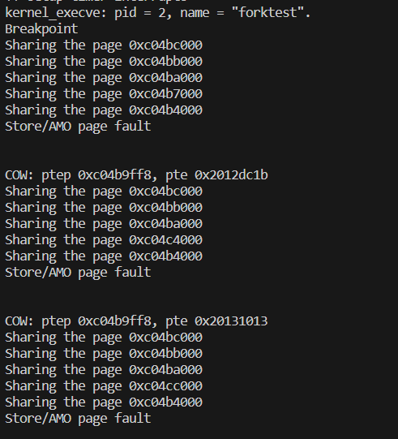
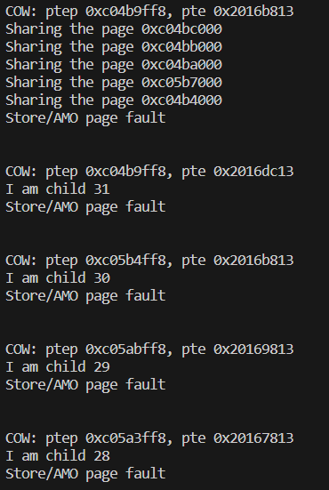
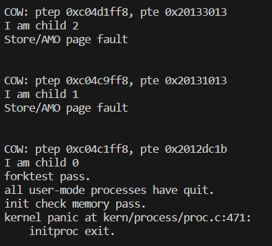
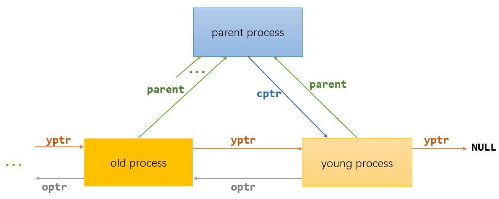

# LAB5实验报告

对实验报告的要求：
 - 基于markdown格式来完成，以文本方式为主
 - 填写各个基本练习中要求完成的报告内容
 - 完成实验后，请分析ucore_lab中提供的参考答案，并请在实验报告中说明你的实现与参考答案的区别
 - 列出你认为本实验中重要的知识点，以及与对应的OS原理中的知识点，并简要说明你对二者的含义，关系，差异等方面的理解（也可能出现实验中的知识点没有对应的原理知识点）
 - 列出你认为OS原理中很重要，但在实验中没有对应上的知识点
 
## 练习0：填写已有实验 

> 本实验依赖实验1/2/3/4。请把你做的实验1/2/3/4的代码填入本实验中代码中有“LAB1”/“LAB2”/“LAB3”/“LAB4”的注释相应部分。注意：为了能够正确执行lab5的测试应用程序，可能需对已完成的实验1/2/3/4的代码进行进一步改进。

由于本次实验不限于只补充原来的实验代码，所以本次实验的练习0也值得来说一说。

首先是lab4练习1的进程控制块的初始化，我们本次实验新增了几个成员变量，具体包括proc_struct * cptr即child ptr，当前线程子线程(链表结构)，* yptr即younger sibling ptr，* optr即older sibling ptr。简单来说，* cptr为当前线程的子线程双向链表头结点，通过yptr和optr可以找到关联的所有子线程。

此外还有wait_state，头文件里也是定义了他的两种取值的宏。
```C
#define WT_CHILD                    (0x00000001 | WT_INTERRUPTED)
#define WT_INTERRUPTED               0x80000000                    // the wait state could be interrupted
```
引入这几个成员变量的原因主要是因为这里用户进程会随着程序的执行不断的被创建、退出并销毁，为此引入了父子进程的概念，在子进程退出时，由于其内核栈和子进程自己的进程控制块无法进行自我回收，因此需要通知其父进程进行最后的回收工作。这里我们初始化为0或者NULL就行。
```C
proc->wait_state = 0;
proc->cptr = proc->yptr = proc->optr = NULL;
```

lab4的练习2的do_fork函数也需要我们修改，首先是确保current process 的 wait_state 为0，因此这里我们可以用一个assert()实现该功能。此外，插入新进程到进程哈希表和进程链表时，我们也要设置好相关进程的链接。设置链接的函数为 set_links ，但是这个函数内部实现了将进程插入链表并将进程总数加1，所以我们要注释掉lab4里面相关内容。

至于lab3的内容就直接填进去就好了，没有改动。

## 练习1: 加载应用程序并执行（需要编码） 
**do\_execv**函数调用`load_icode`（位于kern/process/proc.c中）来加载并解析一个处于内存中的ELF执行文件格式的应用程序。你需要补充`load_icode`的第6步，建立相应的用户内存空间来放置应用程序的代码段、数据段等，且要设置好`proc_struct`结构中的成员变量trapframe中的内容，确保在执行此进程后，能够从应用程序设定的起始执行地址开始执行。需设置正确的trapframe内容。

我们来一步一步分析到执行`load_icode`函数的过程（即指导书的用户进程和系统调用这几章）。首先我们知道在上一个实验中，`init_proc`只是单单在控制台中打印了`hello world`。但是这个实验则不一样，在`init_proc`中fork了一个内核线程执行`user_main`函数。
```C
int pid = kernel_thread(user_main, NULL, 0);
```

而我们在`user_main`所做的，就是执行了`
kern_execve("exit", _binary_obj___user_exit_out_start,_binary_obj___user_exit_out_size)`这么一个函数，用于执行BIOS引导时与ucore内核一起被加载到内存中的用户程序/user/exit.c，让exit.c在用户态中执行。用指导手册的话来说，就是加载了存储在这个位置的程序exit并在user_main这个进程里开始执行。这时user_main就从内核进程变成了用户进程。
那么我们怎么实现这个`kern_execve`函数就很重要了。
```C
// kernel_execve - do SYS_exec syscall to exec a user program called by user_main kernel_thread
static int
kernel_execve(const char *name, unsigned char *binary, size_t size) {
    int64_t ret=0, len = strlen(name);
 //   ret = do_execve(name, len, binary, size);
    asm volatile(
        "li a0, %1\n"
        "lw a1, %2\n"
        "lw a2, %3\n"
        "lw a3, %4\n"
        "lw a4, %5\n"
    	"li a7, 10\n"
        "ebreak\n"
        "sw a0, %0\n"
        : "=m"(ret)
        : "i"(SYS_exec), "m"(name), "m"(len), "m"(binary), "m"(size)
        : "memory");
    cprintf("ret = %d\n", ret);
    return ret;
}
```

实验里没有直接执行`do_execve()`函数，原因也是很简单，就是没有实现上下文的切换。本实验就采用了一种内联汇编的格式，用ebreak产生断点中断进行处理，通过设置a7寄存器的值为10说明这不是一个普通的断点中断，而是要转发到syscall()，实现了在内核态使用系统调用。

下面我们先来看**do\_execve**函数，其基本思路就是借着当前线程的壳（空间），用被加载的二进制程序的内存空间替换掉之前线程的内存空间。

```C
int
do_execve(const char *name, size_t len, unsigned char *binary, size_t size) {
    struct mm_struct *mm = current->mm;
    if (!user_mem_check(mm, (uintptr_t)name, len, 0)) {//检查传入的程序名是否在用户内存空间中是合法的，否就返回错误
        return -E_INVAL;
    }
    if (len > PROC_NAME_LEN) {
        len = PROC_NAME_LEN;//如果程序名的长度超过了预设的最大长度（PROC_NAME_LEN），则将其截断
    }

    char local_name[PROC_NAME_LEN + 1];
    memset(local_name, 0, sizeof(local_name));
    memcpy(local_name, name, len);//将程序名复制到一个本地变量local_name中

    if (mm != NULL) {// 如果当前进程具有内存管理结构体mm，则进行清理释放操作
        cputs("mm != NULL");
        lcr3(boot_cr3);//将CR3寄存器设置为内核页目录的物理地址
        //将当前的页表切换回引导页表（boot_cr3），从而确保不再引用已释放的内存区域
        if (mm_count_dec(mm) == 0) {// 如果当前进程的内存管理结构引用计数减为0，则清空相关内存管理区域和页表
            exit_mmap(mm);//释放内存映射
            put_pgdir(mm);//释放页目录
            mm_destroy(mm);//销毁内存管理结构
        }
        current->mm = NULL;// 将当前进程的内存管理结构指针设为NULL，表示没有有效的内存管理结构
    }
    int ret;
    if ((ret = load_icode(binary, size)) != 0) {// 加载新的可执行程序并建立新的内存映射关系
        goto execve_exit;
    }
    set_proc_name(current, local_name);// 给新进程设置进程名
    return 0;

execve_exit:
    do_exit(ret);// 执行出错，退出当前进程
    panic("already exit: %e.\n", ret);
}

```

我们主要通过do_execve函数来完成用户进程的创建工作。此函数的主要工作流程如下：（摘自清华ucore指导手册）

* 首先为加载新的执行码做好用户态内存空间清空准备。如果mm不为NULL，则设置页表为内核空间页表，且进一步判断mm的引用计数减1后是否为0，如果为0，则表明没有进程再需要此进程所占用的内存空间，为此将根据mm中的记录，释放进程所占用户空间内存和进程页表本身所占空间。最后把当前进程的mm内存管理指针为空。由于此处的initproc是内核线程，所以mm为NULL，整个处理都不会做。

* 接下来的一步是加载应用程序执行码到当前进程的新创建的用户态虚拟空中。这里涉及到读ELF格式的文件，申请内存空间，建立用户态虚存空间，加载应用程序执行码等。load_icode函数完成了整个复杂的工作。

我来小结一下do_execve函数。具体步骤如下：

- 检查传入的进程名是否合法。
- 如果当前进程存在内存管理结构体mm，则进行清理操作，包括清空内存管理部分和对应页表。
- 加载新的可执行程序并建立新的内存映射关系。（load_icode函数）
- 给新进程设置进程名。
- 返回0表示成功执行新程序；如果发生错误，则退出当前进程，并传递相应的错误码。

>**如果set_proc_name的实现不变, 为什么不能直接set_proc_name(current, name)?**
>这里我提出自己的理解，但是不太确定对不对。首先我们明确一点，ucore的内核空间和用户空间是分离的，（有一个文件的注释有画图解释）。我认为这里name是用户空间的，因为它是由用户程序传递给execve系统调用的参数。而do_execve函数是在内核空间中执行的，内核代码是不能直接访问用户空间的内存，否则可能会引发段错误（Segmentation Fault）。所以这里使用了一个内核空间的本地变量local_name来传递文件名。

下面就来看一下本次实验很重要的load_icode函数。
load_icode函数的主要工作就是给用户进程建立一个能够让用户进程正常运行的用户环境。下面来从注释简单说一下。

```C
/* load_icode - load the content of binary program(ELF format) as the new content of current process
 * @binary:  the memory addr of the content of binary program
 * @size:  the size of the content of binary program
 */
static int
load_icode(unsigned char *binary, size_t size) {
    if (current->mm != NULL) {
        panic("load_icode: current->mm must be empty.\n");
    }

    int ret = -E_NO_MEM;
    struct mm_struct *mm;
    //(1) create a new mm for current process
    // 为当前进程创建一个新的mm结构
    if ((mm = mm_create()) == NULL) {
        goto bad_mm;
    }
    //(2) create a new PDT, and mm->pgdir= kernel virtual addr of PDT
    // 为mm分配并设置一个新的页目录表
    if (setup_pgdir(mm) != 0) {
        goto bad_pgdir_cleanup_mm;
    }
    //(3) copy TEXT/DATA section, build BSS parts in binary to memory space of process
    // 从进程的二进制数据空间中分配内存，复制出对应的代码/数据段，建立BSS部分
    struct Page *page;
    //(3.1) get the file header of the bianry program (ELF format)
    // 从二进制程序中得到ELF格式的文件头(二进制程序数据的最开头的一部分是elf文件头,以elfhdr指针的形式将其映射、提取出来)
    struct elfhdr *elf = (struct elfhdr *)binary;
    //(3.2) get the entry of the program section headers of the bianry program (ELF format)
    // 找到并映射出binary中程序段头的入口起始位置
    struct proghdr *ph = (struct proghdr *)(binary + elf->e_phoff);
    //(3.3) This program is valid?
    // 根据elf的e_magic，判断其是否是一个合法的ELF文件
    if (elf->e_magic != ELF_MAGIC) {
        ret = -E_INVAL_ELF;
        goto bad_elf_cleanup_pgdir;
    }

    uint32_t vm_flags, perm;
    struct proghdr *ph_end = ph + elf->e_phnum;
    // 找到并映射出binary中程序段头的入口截止位置
    for (; ph < ph_end; ph ++) {// 遍历每一个程序段头
    //(3.4) find every program section headers
        if (ph->p_type != ELF_PT_LOAD) {
            continue ;// 如果不是需要加载的段，直接跳过
        }
        // 如果文件头标明的文件段大小大于所占用的内存大小(memsz可能包括了BSS，所以这是错误的程序段头)
        if (ph->p_filesz > ph->p_memsz) {
            ret = -E_INVAL_ELF;
            goto bad_cleanup_mmap;
        }
        if (ph->p_filesz == 0) {// 文件段大小为0，直接跳过
            // continue ;
        }
    //(3.5) call mm_map fun to setup the new vma ( ph->p_va, ph->p_memsz)
    // vm_flags => VMA段的权限
    // perm => 对应物理页的权限(因为是用户程序，所以设置为PTE_U用户态)
        vm_flags = 0, perm = PTE_U | PTE_V;
        // 根据文件头中的配置，设置VMA段的权限
        if (ph->p_flags & ELF_PF_X) vm_flags |= VM_EXEC;
        if (ph->p_flags & ELF_PF_W) vm_flags |= VM_WRITE;
        if (ph->p_flags & ELF_PF_R) vm_flags |= VM_READ;
        // modify the perm bits here for RISC-V
        // 设置程序段所包含的物理页的权限
        if (vm_flags & VM_READ) perm |= PTE_R;
        if (vm_flags & VM_WRITE) perm |= (PTE_W | PTE_R);
        if (vm_flags & VM_EXEC) perm |= PTE_X;
        // 在mm中建立ph->p_va到ph->va+ph->p_memsz的合法虚拟地址空间段
        if ((ret = mm_map(mm, ph->p_va, ph->p_memsz, vm_flags, NULL)) != 0) {
            goto bad_cleanup_mmap;
        }
        unsigned char *from = binary + ph->p_offset;
        size_t off, size;
        uintptr_t start = ph->p_va, end, la = ROUNDDOWN(start, PGSIZE);

        ret = -E_NO_MEM;

     //(3.6) alloc memory, and  copy the contents of every program section (from, from+end) to process's memory (la, la+end)
        end = ph->p_va + ph->p_filesz;
     //(3.6.1) copy TEXT/DATA section of bianry program
     // 上面建立了合法的虚拟地址段，现在为这个虚拟地址段分配实际的物理内存页
        while (start < end) {// 分配一个内存页，建立la对应页的虚实映射关系
            if ((page = pgdir_alloc_page(mm->pgdir, la, perm)) == NULL) {
                goto bad_cleanup_mmap;
            }
            off = start - la, size = PGSIZE - off, la += PGSIZE;
            if (end < la) {
                size -= la - end;
            }
            // 根据elf中程序头的设置，将binary中的对应数据复制到新分配的物理页中
            memcpy(page2kva(page) + off, from, size);
            start += size, from += size;
        }

      //(3.6.2) build BSS section of binary program
      // 设置当前程序段的BSS段
        end = ph->p_va + ph->p_memsz;
        // start < la代表BSS段存在，且最后一个物理页没有被填满。剩下空间作为BSS段
        if (start < la) {
            /* ph->p_memsz == ph->p_filesz */
            if (start == end) {
                continue ;
            }
            off = start + PGSIZE - la, size = PGSIZE - off;
            if (end < la) {
                size -= la - end;
            }
            // 将BSS段所属的部分格式化清零
            memset(page2kva(page) + off, 0, size);
            start += size;
            assert((end < la && start == end) || (end >= la && start == la));
        }
        // start < end代表还需要为BSS段分配更多的物理空间
        while (start < end) {
        // 为BSS段分配更多的物理页
            if ((page = pgdir_alloc_page(mm->pgdir, la, perm)) == NULL) {
                goto bad_cleanup_mmap;
            }
            off = start - la, size = PGSIZE - off, la += PGSIZE;
            if (end < la) {
                size -= la - end;
            }
            memset(page2kva(page) + off, 0, size);
            start += size;
        }
    }
    //(4) build user stack memory
    // 建立用户栈空间
    vm_flags = VM_READ | VM_WRITE | VM_STACK;
    // 为用户栈设置对应的合法虚拟内存空间
    if ((ret = mm_map(mm, USTACKTOP - USTACKSIZE, USTACKSIZE, vm_flags, NULL)) != 0) {
        goto bad_cleanup_mmap;
    }
    assert(pgdir_alloc_page(mm->pgdir, USTACKTOP-PGSIZE , PTE_USER) != NULL);
    assert(pgdir_alloc_page(mm->pgdir, USTACKTOP-2*PGSIZE , PTE_USER) != NULL);
    assert(pgdir_alloc_page(mm->pgdir, USTACKTOP-3*PGSIZE , PTE_USER) != NULL);
    assert(pgdir_alloc_page(mm->pgdir, USTACKTOP-4*PGSIZE , PTE_USER) != NULL);
    
    //(5) set current process's mm, sr3, and set CR3 reg = physical addr of Page Directory
    mm_count_inc(mm);// 当前mm被线程引用次数+1
    current->mm = mm;// 设置当前线程的mm
    current->cr3 = PADDR(mm->pgdir);// 设置当前线程的cr3
    lcr3(PADDR(mm->pgdir));// 将指定的页表地址mm->pgdir，加载进cr3寄存器

    //(6) setup trapframe for user environment
    // 设置用户环境下的中断栈帧
    struct trapframe *tf = current->tf;
    // Keep sstatus
    uintptr_t sstatus = tf->status;
    memset(tf, 0, sizeof(struct trapframe));
    /* LAB5:EXERCISE1 YOUR CODE
     * should set tf->gpr.sp, tf->epc, tf->status
     * NOTICE: If we set trapframe correctly, then the user level process can return to USER MODE from kernel. So
     *          tf->gpr.sp should be user stack top (the value of sp)
     *          tf->epc should be entry point of user program (the value of sepc)
     *          tf->status should be appropriate for user program (the value of sstatus)
     *          hint: check meaning of SPP, SPIE in SSTATUS, use them by SSTATUS_SPP, SSTATUS_SPIE(defined in risv.h)
     */
    tf->gpr.sp=USTACKTOP;// 设置用户态的栈顶指针
    tf->epc = elf->e_entry;//epc指向ELF可执行文件加载到内存之后的入口处
    tf->status = sstatus & ~(SSTATUS_SPP | SSTATUS_SPIE);
    ret = 0;
out:
    return ret;
bad_cleanup_mmap:
    exit_mmap(mm);
bad_elf_cleanup_pgdir:
    put_pgdir(mm);
bad_pgdir_cleanup_mm:
    mm_destroy(mm);
bad_mm:
    goto out;
}
```
我简单来叙述一下这个长函数的步骤：

1. 检查当前进程的内存管理结构是否为空。如果不为空，则报错。然后在基础上创建一个新的内存管理结构，用于管理当前进程的内存空间，然后为此分配一个新的页目录表。**这里的主要目的就是为了确保进程的内存管理结构和页目录正确地设置和初始化。**
 
1. 根据elf的e_magic，先判断其是否是一个合法的ELF文件。然后遍历每一个程序段头，对每个类型为ELF_PT_LOAD的section进行处理：（具体细节不是很能理解，大概就是说，**根据程序的程序段头信息，为程序分配内存并将二进制数据复制到内存中的合适位置。**）

    - 调用mm_map函数为每个程序段建立合法的虚拟地址空间段。这个函数会将程序段的虚拟地址映射到物理内存，并设置相应的权限。
    - 为每个程序段分配内存，并将二进制文件中对应的数据复制到新分配的内存中。
    - 处理BSS段。BSS段是程序中未初始化的全局变量和静态变量所占用的内存空间。如果BSS段存在且最后一个物理页没有被填满，则将剩余的空间作为BSS段，并将其清零。然后，代码会为BSS段分配更多的物理内存，并将其清零。

1. 构建用户栈空间。它首先设置了一些vm_flags，然后使用mm_map函数为用户栈分配了一块合法的虚拟内存空间。接下来，通过pgdir_alloc_page函数为用户栈分配了四个页面，并将这些页面映射到用户页表中。**这样，用户程序就可以使用这些页面来存储栈上的数据。**

1. 设置当前进程的内存管理器（mm）和页表寄存器（CR3），**用于进程切换时的地址空间切换。**

1. 最后设置当前用户进程的trapframe结构体，
    - 将tf->gpr.sp设置为用户栈的顶部地址，用于在用户模式下正确操作栈。
    - 将tf->epc设置为用户程序的入口地址，用于执行用户程序。
    - 将tf->status设置为适当的值，清除SSTATUS_SPP和SSTATUS_SPIE位，用于确保特权级别被正确设置为用户模式，并且中断被禁用，以便用户程序在预期的环境中执行。
    
下面来讲一下我们要填写的部分。
- gpr.sp设置为用户栈的顶部地址。在用户模式下，栈通常从高地址向低地址增长，当新的数据被压入栈时，栈指针（SP）会向下移动（即地址减小）。这里USTACKTOP就是用户栈的顶部地址。
- epc设置为用户程序的入口地址。elf->e_entry 是可执行文件的入口地址，也就是用户程序的起始地址。这里赋值是为了sret返回用户态的时候，处理器将会跳转到用户程序的入口开始执行。

关于sstatus的设置，我们知道在sstatus寄存器中与异常和中断有关的位有SPP、SIE、SPIE，下面依次介绍一下。

**SPP位**
SPP记录的是在进入S-Mode之前处理器的特权级别，为0表示陷阱源自用户模式(U-Mode)，为1表示其他模式。当执行一个陷阱时，SPP会由硬件自动根据当前处理器所处的状态自动设置为0或者1。当执行SRET指令从陷阱中返回时，如果SPP位为0，那么处理器将会返回U-Mode，为1则会返回S-Mode，最后无论如何，SPP都被设置为0。

**SIE位**
SIE位是S-Mode下中断的总开关，就像是一个总电闸。如果SIE位置为0，那么无论在S-Mode下发生什么中断，处理器都不会响应。但是如果当前处理器运行在U-Mode，那么这一位不论是0还是1，S-Mode下的中断都是默认打开的。也就是说在任何时候S-Mode都有权因为自己的中断而抢占位于U-Mode下的处理器，这一点要格外注意。想想定时器中断而导致的CPU调度，事实上这种设计是非常合理的。

所以SIE位是S-Mode下的总开关，而不是任何情况下的总开关，真正完全负责禁用或者启用特定中断的位，都在sie寄存器里呢，下面再详细解释。

**SPIE位**
SPIE位记录的是在进入S-Mode之前S-Mode中断是否开启。当进入陷阱时，硬件会自动将SIE位放置到SPIE位上，相当于起到了记录原先SIE值的作用，并最后将SIE置为0，表明硬件不希望在处理一个陷阱的同时被其他中断所打扰，也就是从硬件的实现逻辑上来说不支持嵌套中断(即便如此，我们还是可以手动打开SIE位以支持嵌套中断)。当使用SRET指令从S-Mode返回时，SPIE的值会重新放置到SIE位上来恢复原先的值，并且将SPIE的值置为1。

下面给个省流版：
>spp：中断前系统处于内核态（1）还是用户态（0）
>sie：内核态是否允许中断。对用户态而言，无论 sie 取何值都开启中断。
>spie：中断前是否开中断（用户态中断时可能 sie 为 0）

这里就很显然的看出为什么要对spp和spie清零操作了（**确保在切换到用户模式时，特权级别被正确设置为用户模式，并且中断被禁用**）。（至于没动sie，是因为省流版的第二句话）。

关于指导手册也是给了一个解释：（copy过来）
>进行系统调用sys_exec之后，我们在trap返回的时候调用了sret指令，这时只要sstatus寄存器的SPP二进制位为0，就会切换到U mode，但SPP存储的是“进入trap之前来自什么特权级”，也就是说我们这里ebreak之后SPP的数值为1，sret之后会回到S mode在内核态执行用户程序。所以load_icode()函数在构造新进程的时候，会把SSTATUS_SPP设置为0，使得sret的时候能回到U mode。

下面给出和上面有关的硬件处理流程

* 在中断发生时，系统要切换到内核态。此时，切换前的状态会被保存在 spp 位中（1 表示切换前处于内核态）。同时，切换前是否开中断会被保存在 spie 位中，而 sie 位会被置 0，表示关闭中断。

* 在中断结束，执行 sret 指令时，会根据 spp 位的值决定 sret 执行后是处于内核态还是用户态。与此同时，spie 位的值会被写入 sie 位，而 spie 位置 1。这样，特权状态和中断状态就全部恢复了。

**关于`sscratch` 寄存器：**
`sscratch` 寄存器被用作保存栈指针（sp）的临时存储区。当发生系统调用、中断或异常时，会保存当前的寄存器状态，然后切换到内核模式进行处理。

如果之前是在用户态（U mode），`sscratch` 寄存器会保存内核栈的地址，然后栈指针（sp）会被设置为指向内核栈，为内核模式的执行提供栈空间。

如果之前是在内核态（S mode），`sscratch` 寄存器会保存 0，栈指针（sp）会继续指向当前的栈。

当系统调用、中断或异常处理完毕后，根据 `sscratch` 寄存器的值来恢复栈指针（sp）的值。如果 `sscratch` 寄存器的值为 0，说明之前是在内核态，栈指针（sp）不需要改变。如果 `sscratch` 寄存器的值不为 0，说明之前是在用户态，栈指针（sp）需要被设置为 `sscratch` 寄存器的值，即原来的用户栈的地址。

因此，`sscratch` 寄存器在代码中起到了保存和恢复栈指针（sp）的作用，使得操作系统能够在处理系统调用、中断或异常时，保存和恢复进程的状态。

>请简要描述这个用户态进程被ucore选择占用CPU执行（RUNNING态）到具体执行应用程序第一条指令的整个经过。

- 我们知道用户态进程首先由操作系统内核创建的。操作系统会为该进程分配所需的资源，包括内存空间和其他必要的数据结构。ucore的代码里内核线程initproc创建用户态进程。
- 进程被创建后，它处于就绪态，等待操作系统内核调度选中它来执行。在就绪态下，进程被加入到可运行的进程队列中。
- do_wait函数确认存在可以RUNNABLE的子进程后，调用schedule函数。
- schedule函数通过调用proc_run来运行新线程（上次的练习3）。在proc_run里面它会切换当前进程为要运行的进程，切换页表，以便使用新进程的地址空间。然后调用switch_to()函数实现上下文切换。
- 切换完进程上下文，然后跳转到forkret。forkret函数是直接调用forkrets函数，forkrets再把传进来的参数，也就是进程的中断帧放在了sp，然后跳到__trapret。
- __trapret函数直接从中断帧里面恢复所有的寄存器，然后通过sret指令，跳转到userproc->tf.epc指向的函数，即kernel_thread_entry。
- 由于`int pid = kernel_thread(user_main, NULL, 0)`这里把user_main作为参数传给了tf.gpr.s0（上一次实验说到s0寄存器里放的是新进程要执行的函数），所以kernel_thread_entry里我们跳转到user_main。
- user_main打印userproc的pid和name信息，然后调用kernel_execve。
- kernel_execve这里没有直接调用do_execve函数，而是想在内核态使用系统调用，具体做法是内联汇编的方式，用ebreak产生断点中断进行处理，进入exception_handler函数的断点处理，通过设置a7寄存器的值为10说明这不是一个普通的断点中断，而是要转发到syscall()。而SYS_exec作为系统调用号，告诉syscall()要执行do_execve函数。
>trap_dispatch ->exception_handler-> syscall -> sys_exec -> do_execve ->load_icode
- do_execve检查虚拟内存空间的合法性，释放虚拟内存空间，加载应用程序，创建新的mm结构和页目录表。其中最重要的是do_execve调用load_icode函数，load_icode加载应用程序的各个program section到新申请的内存上，为BSS section分配内存并初始化为全0，分配用户栈内存空间。设置当前用户进程的mm结构、页目录表的地址及加载页目录表地址到cr3寄存器。设置当前用户进程的tf结构。
- 执行完load_icode函数后，就会把user_main传递进来的参数设置当前用户进程的名字后返回。这里一直返回到exception_handler函数，接着执行kernel_execve_ret(tf,current->kstack+KSTACKSIZE)函数。
- kernel_execve_ret函数主要操作是调整栈指针并复制上一个陷阱帧的内容到新的陷阱帧中。然后跳转到_trapret函数。
- 通过__trapret函数RESTORE_ALL，然后sret跳转到epc指向的函数（tf->epc = elf->e_entry），即用户程序的入口。
- 执行应用程序第一条指令。


## 练习2: 父进程复制自己的内存空间给子进程（需要编码） 

创建子进程的函数`do_fork`在执行中将拷贝当前进程（即父进程）的用户内存地址空间中的合法内容到新进程中（子进程），完成内存资源的复制。具体是通过`copy_range`函数（位于kern/mm/pmm.c中）实现的，请补充`copy_range`的实现，确保能够正确执行。

请在实验报告中简要说明你的设计实现过程。

`do_fork`中调用`copy_mm`来根据`clone_flags`标志位决定是让子进程共享当前进程（父进程）的用户内存地址空间，还是复制父进程的用户内存地址空间中的合法内容到子进程中，后者是通过调用`dup_mmap`函数实现的，在`dup_mmap`中，通过遍历父进程管理的所有连续虚拟内存区域（vma），调用`copy_range`函数复制每个vma对应的内存空间中的内容到子进程中。因此，`copy_range`的调用流图为：do_fork-->copy_mm-->dup_mmap-->copy_range

实验代码已经提示了`copy_range`函数每一步的实现过程，下面再以注释的形式说明所补充的每句代码的作用：

```C
int copy_range(pde_t *to, pde_t *from, uintptr_t start, uintptr_t end,
               bool share) {
    assert(start % PGSIZE == 0 && end % PGSIZE == 0);
    assert(USER_ACCESS(start, end));
    // copy content by page unit.
    do {
        // call get_pte to find process A's pte according to the addr start
        pte_t *ptep = get_pte(from, start, 0), *nptep;
        if (ptep == NULL) {
            start = ROUNDDOWN(start + PTSIZE, PTSIZE);
            continue;
        }
        // call get_pte to find process B's pte according to the addr start. If
        // pte is NULL, just alloc a PT
        if (*ptep & PTE_V) {
            if ((nptep = get_pte(to, start, 1)) == NULL) {
                return -E_NO_MEM;
            }
            uint32_t perm = (*ptep & PTE_USER);
            // get page from ptep
            struct Page *page = pte2page(*ptep);
            // alloc a page for process B
            struct Page *npage = alloc_page();
            assert(page != NULL);
            assert(npage != NULL);
            int ret = 0;
            /* LAB5:EXERCISE2 YOUR CODE
             * replicate content of page to npage, build the map of phy addr of
             * nage with the linear addr start
             *
             * Some Useful MACROs and DEFINEs, you can use them in below
             * implementation.
             * MACROs or Functions:
             *    page2kva(struct Page *page): return the kernel vritual addr of
             * memory which page managed (SEE pmm.h)
             *    page_insert: build the map of phy addr of an Page with the
             * linear addr la
             *    memcpy: typical memory copy function
             *
             * (1) find src_kvaddr: the kernel virtual address of page
             * (2) find dst_kvaddr: the kernel virtual address of npage
             * (3) memory copy from src_kvaddr to dst_kvaddr, size is PGSIZE
             * (4) build the map of phy addr of  nage with the linear addr start
             */
            //获父进程页面的内核虚拟地址作为memcpy函数的源地址
            void* src_kvaddr = page2kva(page);
            //获取子进程页面的内核虚拟地址作为memcpy函数的目的地址
            void* dst_kvaddr = page2kva(npage); 
            //复制父进程的页面内容到子进程的页面中
            memcpy(dst_kvaddr, src_kvaddr, PGSIZE);
            //建立子进程页面虚拟地址到物理地址的映射关系
            ret = page_insert(to, npage, start, perm); 

            assert(ret == 0);
        }
        start += PGSIZE;
    } while (start != 0 && start < end);
    return 0;
}
```
由上可见，`copy_range`函数做的就是**以页为单位**调用`memcpy`函数，将父进程的用户内存地址空间中的内容**逐页复制**到子进程中，从而完成内存资源的复制。

- 如何设计实现`Copy on Write`机制？给出概要设计，鼓励给出详细设计。

> Copy-on-write（简称COW）的基本概念是指如果有多个使用者对一个资源A（比如内存块）进行读操作，则每个使用者只需获得一个指向同一个资源A的指针，就可以该资源了。若某使用者需要对这个资源A进行写操作，系统会对该资源进行拷贝操作，从而使得该“写操作”使用者获得一个该资源A的“私有”拷贝—资源B，可对资源B进行写操作。该“写操作”使用者对资源B的改变对于其他的使用者而言是不可见的，因为其他使用者看到的还是资源A。

扩展练习的要求中已经将COW机制的实现思路描述得很清楚了：
> 当一个用户父进程创建自己的子进程时，父进程会把其申请的用户空间设置为只读，子进程可共享父进程占用的用户内存空间中的页面（这就是一个共享的资源）。当其中任何一个进程修改此用户内存空间中的某页面时，ucore会通过page fault异常获知该操作，并完成拷贝内存页面，使得两个进程都有各自的内存页面。这样一个进程所做的修改不会被另外一个进程可见了。

根据上面的思路，给出COW机制的设计思路：

##### copy_range

我们还记得，`copy_range`函数最后还传入了一个`bool share`的参数，于是我们便可以根据这个参数决定是否启用COW机制，来让子进程共享父进程占用的用户内存空间中的页面。

当COW机制启用时，我们可以将父进程用户内存空间中的页都设置为只读，即将这些页的PTE_W置0，可以通过调用`page_insert`来重新设置这些页的权限位，然后再调用`page_insert`将父进程的页插入到子进程的页目录表中，这样就达到了内存共享的目的。当COW机制禁用时，执行原来的内存拷贝操作。

因为我们设置了父进程用户内存空间中的所有页为只读，那么在之后的内存操作中，如果有进程对此空间进行写操作，就会触发缺页异常，操作系统就会在相应的中断处理函数`do_pgfault`中复制该页面。

代码实现如下

```C
int copy_range(pde_t *to, pde_t *from, uintptr_t start, uintptr_t end,
               bool share) {
    assert(start % PGSIZE == 0 && end % PGSIZE == 0);
    assert(USER_ACCESS(start, end));
    // copy content by page unit.
    do {
        //call get_pte to find process A's pte according to the addr start
        pte_t *ptep = get_pte(from, start, 0), *nptep;
        if (ptep == NULL) {
            start = ROUNDDOWN(start + PTSIZE, PTSIZE);
            continue ;
        }
        //call get_pte to find process B's pte according to the addr start. If pte is NULL, just alloc a PT
        if (*ptep & PTE_V) {
            if ((nptep = get_pte(to, start, 1)) == NULL)
                return -E_NO_MEM;
            uint32_t perm = (*ptep & PTE_USER);
            //get page from ptep
            struct Page *page = pte2page(*ptep);
            int ret = 0;
            if(share)
            {//如果COW机制启用
                cprintf("Sharing the page 0x%x\n", page2kva(page));
                //设置父进程的页面为只读
                page_insert(from, page, start, perm & ~PTE_W);
                //插入父进程的页到子进程的页目录表，实现内存共享
                ret = page_insert(to, page, start, perm & ~PTE_W);
            }
            else
            {//完整拷贝内存
                struct Page *npage = alloc_page();
                assert(page!=NULL);
                assert(npage!=NULL);
                cprintf("alloc a new page 0x%x\n", page2kva(npage));
                void* src_kvaddr = page2kva(page);
                void* dst_kvaddr = page2kva(npage); 
                memcpy(dst_kvaddr, src_kvaddr, PGSIZE);
                ret = page_insert(to, npage, start, perm);
            }
            assert(ret == 0);
        }
        start += PGSIZE;
    } while (start != 0 && start < end);
    return 0;
}
```

##### do_pgfault

当某个进程想修改一个共享内存页时，由于该页的PTE_W为0，所以会触发缺页异常。此时需要在`do_pgfault`函数中复制该页内存，并设置该页的PTE_W为1。

需要注意的是，在执行内存复制操作前，需要先检查该物理页的引用次数。如果该引用次数为1，则表明此时的物理页只被当前进程所使用，故可以直接设置该内存页的PTE_W为1，不需要再进行内存复制。

```C
int
do_pgfault(struct mm_struct *mm, uint_t error_code, uintptr_t addr) {
    int ret = -E_INVAL;
    //try to find a vma which include addr
    struct vma_struct *vma = find_vma(mm, addr);

    pgfault_num++;
    //If the addr is in the range of a mm's vma?
    if (vma == NULL || vma->vm_start > addr) {
        cprintf("not valid addr %x, and  can not find it in vma\n", addr);
        goto failed;
    }

    uint32_t perm = PTE_U;
    if (vma->vm_flags & VM_WRITE) {
        perm |= READ_WRITE;
    }
    addr = ROUNDDOWN(addr, PGSIZE);

    ret = -E_NO_MEM;

    pte_t *ptep=NULL;
  
    // try to find a pte, if pte's PT(Page Table) isn't existed, then create a PT.
    // (notice the 3th parameter '1')
    if ((ptep = get_pte(mm->pgdir, addr, 1)) == NULL) {
        cprintf("get_pte in do_pgfault failed\n");
        goto failed;
    }

    if (*ptep == 0) { // if the phy addr isn't exist, then alloc a page & map the phy addr with logical addr
        if (pgdir_alloc_page(mm->pgdir, addr, perm) == NULL) {
            cprintf("pgdir_alloc_page in do_pgfault failed\n");
            goto failed;
        }
    } 
    else 
    {
        struct Page *page=NULL;
        // 如果当前页错误的原因是写入了只读页面
        if (*ptep & PTE_V) {
            cprintf("\n\nCOW: ptep 0x%x, pte 0x%x\n",ptep, *ptep);
            // 获取原先所使用的只读物理页
            page = pte2page(*ptep);
            // 如果该物理页面被多个进程引用
            if(page_ref(page) > 1)
            {
                // 分配一个新物理页
                struct Page* new_page = pgdir_alloc_page(mm->pgdir, addr, perm);
                // 获取原只读页的内核虚拟地址
                void * src_kva = page2kva(page);
                // 获取新分配页的内核虚拟地址
                void * dst_kva = page2kva(new_page);
                // 复制原页内容到新页中
                memcpy(dst_kva, src_kva, PGSIZE);
            }
            // 如果该物理页面只被当前进程所引用,即page_ref等1
            else
                // 保留当前物理页并重设其权限
                page_insert(mm->pgdir, page, addr, perm);
        }
        else
        {
            if(swap_init_ok) {
                swap_in(mm, addr, &page);
                page_insert(mm->pgdir, page, addr, perm);
            }
            else {
                cprintf("no swap_init_ok but ptep is %x, failed\n",*ptep);
                goto failed;
            }
        }
        // 当前缺失的页已经加载回内存中，所以设置当前页为可交换。
        swap_map_swappable(mm, addr, page, 1);
        page->pra_vaddr = addr;
    }
    ret = 0;
failed:
    return ret;
}
```

先在`dup_mmap`中设置share=1，再填入以上代码，运行`make qemu`后结果如下：



可以看到成功创建了32个子进程，并通过了测试。

## 练习3: 阅读分析源代码，理解进程执行 fork/exec/wait/exit 的实现，以及系统调用的实现（不需要编码） 

请在实验报告中简要说明你对 fork/exec/wait/exit函数的分析。并回答如下问题：
 - 请分析fork/exec/wait/exit的执行流程。重点关注哪些操作是在用户态完成，哪些是在内核态完成？内核态与用户态程序是如何交错执行的？内核态执行结果是如何返回给用户程序的？

### 系统调用的实现
为什么要有系统调用？因为不希望用户肆意地访问关键资源，这可能导致严重的后果；但是又不能完全限制用户的行为，不然计算机就没有意义了。所以，操作系统提供了特定的接口，能够允许用户以规定好的方式访问系统资源。

在ucore中，系统调用的实现逻辑大致如我画的两个图：
.png)

.png)

第一个关键的部分是`syscall`函数，我们需要`syscall`能够进入特权态，根据用户的需求调用正确的系统函数，执行正确的系统功能，并将结果返回给用户。

为了实现上述功能，`syscall`通过一个标号num识别用户想要调用的系统函数，可变参数列表`va_list`来获取用户的参数，然后通过`ecall`指令进入特权态，并执行对应的系统函数。
```C
static inline int
syscall(int64_t num, ...) {
    va_list ap;
    va_start(ap, num);
    uint64_t a[MAX_ARGS];
    int i, ret;
    for (i = 0; i < MAX_ARGS; i ++) {
        a[i] = va_arg(ap, uint64_t);
    }
    va_end(ap);
  
    asm volatile (
        "ld a0, %1\n"
        "ld a1, %2\n"
        "ld a2, %3\n"
        "ld a3, %4\n"
        "ld a4, %5\n"
        "ld a5, %6\n"
        "ecall\n"
        "sd a0, %0"
        : "=m" (ret)
        : "m"(num), "m"(a[0]), "m"(a[1]), "m"(a[2]), "m"(a[3]), "m"(a[4])
        :"memory");
    return ret;
}
```

触发`ecall`指令之后，将`sepc`存储为下一条指令的地址，然后就是内核态的工作了(lab1的内容)。首先cpu会进入特权态，然后跳转到`stvec`寄存器中存储的地址，我们在`idt_init`中将其设置为`__alltrap`，所以接下来会去执行异常处理，虽然我们在lab1中已经实现过这套逻辑，但是在lab5中有一些新的改变，所以还得具体看看。

首先在`__alltrap`中将所有寄存器存储到栈中，需要注意的是，我们的现在的sp还是用户那里来的sp，我们需要转到内核态的sp(内核栈)之中。我们需要区分用户态和内核态的异常，使得它们都能够在内核栈中存储上下文环境。

具体的方式在实验手册(lab5-中断处理)已经说得很明白了，简单来说就是看`sscratch`是不是0，如果是0，意味着这是内核态的中断(因为在`idt_init`里面我们将其设置为0)；如果不是0，意味着是从用户态来的，在RESTOREAll有修改，需要加载内核栈进入sscratch


接下来跳转到`trap`函数，在`trap`里面，(待回答：为什么需要将current->tf保存，赋值为trap的参数tf，然后再恢复？)将调用`trap_dispatch`，在`trap_dispatch`中根据不同的cause调用两个处理句柄处理异常，这里是系统调用，调用的是`exception_handler`，在其中进一步用swich语句锁定`CAUSE_USER_ECALL`，进而调用内核态的`syscall`函数。


内核态的`syscall`函数如下：
```C
void

syscall(void) {
    struct trapframe *tf = current->tf;
    uint64_t arg[5];
    int num = tf->gpr.a0;
    if (num >= 0 && num < NUM_SYSCALLS) {
        if (syscalls[num] != NULL) {
            arg[0] = tf->gpr.a1;
            arg[1] = tf->gpr.a2;
            arg[2] = tf->gpr.a3;
            arg[3] = tf->gpr.a4;
            arg[4] = tf->gpr.a5;
            tf->gpr.a0 = syscalls[num](arg);
            return ;
        }
    }
    print_trapframe(tf);
    panic("undefined syscall %d, pid = %d, name = %s.\n",
            num, current->pid, current->name);
}
```

它是用户态的`syscall`的一个对应，传过来的都是用户态的函数编号和参数列表，然后在一个`syscalls`的函数数组中查找相应的函数，然后系统函数执行相应的任务，这样，一个完整的系统调用就完成了。

```C
static int (*syscalls[])(uint64_t arg[]) = {
    [SYS_exit]              sys_exit,
    [SYS_fork]              sys_fork,
    [SYS_wait]              sys_wait,
    [SYS_exec]              sys_exec,
    [SYS_yield]             sys_yield,
    [SYS_kill]              sys_kill,
    [SYS_getpid]            sys_getpid,
    [SYS_putc]              sys_putc,
    [SYS_pgdir]             sys_pgdir,
};
```

系统调用结束后，将返回值存在tf的a0中，这时候如果回到用户态，就能够从a0读取返回值，返回给用户了。

问题在于如何回到用户态呢？这时候需要一次`schedule()`，重新执行用户进程的上下文。

在返回到`trap`函数继续返回的时候，我们跳转到`trap`的时候使用的是`jal`指令，该指令将`ra`存储为`__trapret`的地址，然后返回的时候就跳到`__trapret`，在其中恢复所有寄存器(这里需要恢复用户栈，之前STORE的时候，我们将用户栈的sp通过sscratch存到了sp + 2B的区域(就是tf的sp区域))，并且`sret`。记得吗？我们在`ecall`指令的时候将`sepc`设置为ecall指令的下一条指令的地址(系统调用返回指令的地址)，所以`sret`的时候就能够返回到用户态相应的地址。

有一个例外的函数调用就是exit()，它调用系统的do_exit()之后就直接被清除(还需要等待父进程释放资源)并且变成僵尸了，所以已经不可能执行了，也就没有返回用户态的事情了。


### 进程执行 fork/exec/wait/exit 的实现
##### fork
在用户态调用fork，经过一系列流程，会进入内核态执行`sys_fork`函数，具体可以参考上面的`系统调用实现`。`sys_fork`任务也非常简单，就是将tf和sp准备好，调用`do_fork`函数。`do_fork`函数在lab4的时候实现过，这里主要讲一下不一样的地方：

第一个不同之处在于使用了`set_links`函数来设置进程间的关系，`set_links`的实现如下：
```C

static void
set_links(struct proc_struct *proc) {
    list_add(&proc_list, &(proc->list_link));
    proc->yptr = NULL;
    if ((proc->optr = proc->parent->cptr) != NULL) {
        proc->optr->yptr = proc;
    }
    proc->parent->cptr = proc;
    nr_process ++;
}
```


除了lab4已有的内容，该函数还设置了proc_struct中的optr、yptr以及cptr成员。
  
其中，cptr指针指向当前进程的子进程中最晚创建的那个子进程，yptr指向与当前进程共享同一个父进程，但比当前进程的创建时间更晚的进程，即younger sibling，optr指针与yptr相反，指向older sibling。
  
进程间关系如下图所示  




另一个不同是启用了`copy_mm`的，如果启用`CLONE_VM`，则是`share`模式，相当于浅拷贝，直接将当前的mm指针赋值给新创建的mm指针；但是sys_fork这里传入的参数都是0，也就是`duplicate`模式，相当于深拷贝(也可能是`COW`)。

duplicate时，简单的内容可以参考上面的练习2，具体有一些细节，例如用了`lock`互斥锁，防止mm访问冲突。

后续的操作和lab4一样的，就是`copy_thread`将当前的proc复制一份，然后同样返回一样的地方，因为此时将a0设置为了0，所以返回的如果是子进程，那么得到的返回值就是0。

如何返回子进程的呢？首先`trap`的地方提供了一个可能调度的点，然后······
##### exec
用户陷入还是不多说，具体可以看上面的的`系统调用的实现`；内核的内容也不必多说，可以直接看练习1；
##### wait
令当前进程等待某个特定的或任意一个子进程，并在得到子进程的退出消息后，彻底回收子进程所占用的资源，包括子进程的内核栈和进程控制块。只有在`do_wait`函数执行完成之后，子进程的所有资源才被完全释放。该函数的实现逻辑为：

- 检查当前进程所分配的内存区域是否存在异常。
- 查找特定/所有子进程中是否存在某个等待父进程回收的僵尸态（PROC_ZOMBIE）子进程。
  - 如果有，则回收该进程并函数返回。
  - 如果没有，则设置当前进程状态为休眠态（PROC_SLEEPING）并执行`schedule`函数调度其他进程运行。当该进程的某个子进程结束运行后，当前进程会被唤醒，并在`do_wait`函数中回收子进程的PCB内存资源。

其具体实现如下：
```C
int
do_wait(int pid, int *code_store) {
    struct mm_struct *mm = current->mm;
    if (code_store != NULL) {
        // 检查当前进程所分配的内存区域是否存在异常。
        if (!user_mem_check(mm, (uintptr_t)code_store, sizeof(int), 1)) {
            return -E_INVAL;
        }
    }

    struct proc_struct *proc;
    bool intr_flag, haskid;
repeat:
    haskid = 0;
    // 参数指定了pid(pid不为0)，代表回收pid对应的僵尸态进程
    if (pid != 0) {
        proc = find_proc(pid);
        // 对应的进程不为空且须为当前进程的子进程
        if (proc != NULL && proc->parent == current) {
            haskid = 1;
            // pid对应的进程确实是僵尸态，跳转found进行回收
            if (proc->state == PROC_ZOMBIE) {
                goto found;
            }
        }
    }
    else {
        // 参数未指定pid(pid为0)，代表回收当前进程的任意一个僵尸态子进程
        proc = current->cptr;
        for (; proc != NULL; proc = proc->optr) {
            haskid = 1;
            if (proc->state == PROC_ZOMBIE) {
                // 找到了一个僵尸态子进程，跳转found进行回收
                goto found;
            }
        }
    }
    if (haskid) {
        /* 
        * 当前进程需要回收僵尸态子进程，但是没有找到可以回收的僵尸态子进程。
        * 如果找到可以回收的子进程，函数会跳到found段执行，不会执行到这里。
        */
        // 令当前进程进入休眠态，让出CPU
        current->state = PROC_SLEEPING;
        // 令其等待状态为等待子进程退出
        current->wait_state = WT_CHILD;
        // 调度其他进程运行。
        schedule();
        if (current->flags & PF_EXITING) {
            // 如果当前进程发现自己被关闭了，则将自己退出
            do_exit(-E_KILLED);
        }
        goto repeat;
    }
    return -E_BAD_PROC;

found:
    if (proc == idleproc || proc == initproc) {
        // idleproc和initproc是不应该被回收的
        panic("wait idleproc or initproc.\n");
    }
    if (code_store != NULL) {
        // 将子进程退出的原因保存在*code_store中
        *code_store = proc->exit_code;
    }
    local_intr_save(intr_flag);
    {
        // 从进程控制块hash表中移除被回收的子进程
        unhash_proc(proc);
        // 从进程控制块链表中移除被回收的子进程，并清除其进程关系
        remove_links(proc);
    }
    local_intr_restore(intr_flag);
    // 释放被回收的子进程的内核栈
    put_kstack(proc);
    // 释放被回收的子进程的进程控制块结构
    kfree(proc);
    return 0;
}
```

##### exit
`do_exit`的逻辑如下，具体看注释吧。
```C
// do_exit - called by sys_exit
//   1. call exit_mmap & put_pgdir & mm_destroy to free the almost all memory space of process
//   2. set process' state as PROC_ZOMBIE, then call wakeup_proc(parent) to ask parent reclaim itself.
//   3. call scheduler to switch to other process
int
do_exit(int error_code) {
//如果基础的两个进程退出了，就崩溃了
    if (current == idleproc) {
        panic("idleproc exit.\n");
    }
    if (current == initproc) {
        panic("initproc exit.\n");
    }
    //销毁mm以及其管理的所有内存，将pdt设置为boot_cr3
    struct mm_struct *mm = current->mm;
    if (mm != NULL) {
        lcr3(boot_cr3);
        if (mm_count_dec(mm) == 0) {
            exit_mmap(mm);
            put_pgdir(mm);
            mm_destroy(mm);
        }
        current->mm = NULL;
    }
    //进入僵尸态，等待回收；获得返回码。
    current->state = PROC_ZOMBIE;
    current->exit_code = error_code;
    bool intr_flag;
    struct proc_struct *proc;
    //找到老爹，把老爹唤醒，并且整理进程关系链表
    local_intr_save(intr_flag);
    {
        proc = current->parent;
        if (proc->wait_state == WT_CHILD) {
            wakeup_proc(proc);
        }
        while (current->cptr != NULL) {
            proc = current->cptr;
            current->cptr = proc->optr;
            proc->yptr = NULL;//把孩子全都交给initproc管理
            if ((proc->optr = initproc->cptr) != NULL) {
                initproc->cptr->yptr = proc;
            }
            proc->parent = initproc;
            initproc->cptr = proc;
            if (proc->state == PROC_ZOMBIE) {
                if (initproc->wait_state == WT_CHILD) {
                    wakeup_proc(initproc);
                }
            }
        }
    }
    local_intr_restore(intr_flag);
    schedule();
    panic("do_exit will not return!! %d.\n", current->pid);

}
```

 - 请给出ucore中一个用户态进程的执行状态生命周期图（包执行状态，执行状态之间的变换关系，以及产生变换的事件或函数调用）。（字符方式画即可）

##### 状态图
stateDiagram
    [*] --> PROC_UNINIT: alloc_proc
    PROC_UNINIT --> PROC_RUNNABLE: proc_init / wakeup_proc
    PROC_RUNNABLE --> RUNNING: proc_run
    RUNNING --> PROC_SLEEPING: try_free_pages / do_wait / do_sleep
    PROC_SLEEPING --> PROC_ZOMBIE: do_exit
    PROC_ZOMBIE --> [*]
    RUNNING --> PROC_ZOMBIE: do_exit
    PROC_SLEEPING --> PROC_RUNNABLE: wakeup_proc

这个程序框架中也给了状态图：
```C
process state changing:
                                            
  alloc_proc                                 RUNNING
      +                                   +--<----<--+
      +                                   + proc_run +
      V                                   +-->---->--+ 
PROC_UNINIT -- proc_init/wakeup_proc --> PROC_RUNNABLE -- try_free_pages/do_wait/do_sleep --> PROC_SLEEPING --
                                           A      +                                                           +
                                           |      +--- do_exit --> PROC_ZOMBIE                                +
                                           +                                                                  + 
                                           -----------------------wakeup_proc----------------------------------
-----------------------------
```

执行：make grade。如果所显示的应用程序检测都输出ok，则基本正确。（使用的是qemu-1.0.1）

## 扩展练习 Challenge
1. 实现 Copy on Write  （COW）机制 

    给出实现源码,测试用例和设计报告（包括在cow情况下的各种状态转换（类似有限状态自动机）的说明）。

    这个扩展练习涉及到本实验和上一个实验“虚拟内存管理”。在ucore操作系统中，当一个用户父进程创建自己的子进程时，父进程会把其申请的用户空间设置为只读，子进程可共享父进程占用的用户内存空间中的页面（这就是一个共享的资源）。当其中任何一个进程修改此用户内存空间中的某页面时，ucore会通过page fault异常获知该操作，并完成拷贝内存页面，使得两个进程都有各自的内存页面。这样一个进程所做的修改不会被另外一个进程可见了。请在ucore中实现这样的COW机制。

    由于COW实现比较复杂，容易引入bug，请参考 https://dirtycow.ninja/  看看能否在ucore的COW实现中模拟这个错误和解决方案。需要有解释。

    这是一个big challenge.

2. 说明该用户程序是何时被预先加载到内存中的？与我们常用操作系统的加载有何区别，原因是什么？

我们正常的操作系统的程序，是编译好放到磁盘中的，具体被加载到内存并运行如下：
1.从磁盘读取应用程序并装入内存（加载器的作用1）。
2.应用程序被装入内存后需要加载器对内存中的应用程序部分地址进行重定位（加载器的作用2）。
3.加载器将执行权移交应用程序（加载器的作用3）

而由于我们ucore没有真正的磁盘，所以这里在调用kernel_execve() 函数时里面的load_icode() 函数将用户程序加载到内存中的，因此并不是一个编译好的程序。