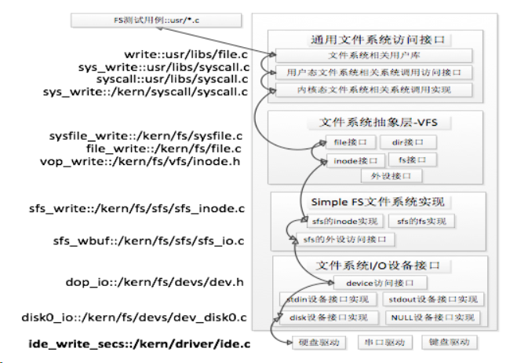

## 练习0：填写已有实验
本实验依赖实验2/3/4/5/6/7。请把你做的实验2/3/4/5/6/7的代码填入本实验中代码中有“LAB2”/“LAB3”/“LAB4”/“LAB5”/“LAB6” /“LAB7”的注释相应部分。并确保编译通过。注意：为了能够正确执行lab8的测试应用程序，可能需对已完成的实验2/3/4/5/6/7的代码进行进一步改进。

本次实验练习0无需修改已完成实验的代码，但由于lab6和lab7没有要求，还是有必要简单说明有关这两个实验需要填写的部分。

### lab6
lab6是关于ucore的系统调度器框架，需要基于此实现一个Stride Scheduling调度算法，简言之，这个算法能够让**每个进程得到的时间资源与它们的优先级成正比关系**，从而更加智能地为每个进程分配合理的CPU资源。

首先在lab5的基础上修改`alloc_proc`函数的初始化：
```C
// kern/process/proc.c
static struct proc_struct * alloc_proc(void) {
    struct proc_struct *proc = kmalloc(sizeof(struct proc_struct));
    if (proc != NULL) {
        ...
        // Lab6 code
        proc->rq = NULL; //初始化运行队列为空
        list_init(&(proc->run_link)); 
        proc->time_slice = 0; //初始化时间片
        proc->lab6_run_pool.left = proc->lab6_run_pool.right = proc->lab6_run_pool.parent = NULL;//初始化指针为空
        proc->lab6_stride = 0;    //设置步长为0
        proc->lab6_priority = 0;  //设置优先级为0
    }
    return proc;
}
```

然后是Stride Scheduling算法的实现部分，主要在kern/schedule/default_sched_stride.c中完成，需要实现的部分如下：

**为BIG_STRIDE赋值**
```C
#define BIG_STRIDE  (1 << 30) /* you should give a value, and is ??? */
```

**初始化运行队列**
```C
static void stride_init(struct run_queue *rq) {
     list_init(&(rq->run_list));
     rq->lab6_run_pool = NULL;
     rq->proc_num = 0;
}
```

**将进程加入就绪队列**
```C
static void
stride_enqueue(struct run_queue *rq, struct proc_struct *proc) {
    //将进程加入就绪队列
     rq->lab6_run_pool = skew_heap_insert(rq->lab6_run_pool, &(proc->lab6_run_pool), proc_stride_comp_f);
     if (proc->time_slice == 0 || proc->time_slice > rq->max_time_slice) {
        proc->time_slice = rq->max_time_slice;
     }
     proc->rq = rq;
     rq->proc_num++;
}
```

**将进程从就绪队列中移除**
```C
static void
stride_dequeue(struct run_queue *rq, struct proc_struct *proc) {
     assert(proc->rq == rq && rq->proc_num > 0);
     rq->lab6_run_pool = skew_heap_remove(rq->lab6_run_pool, &(proc->lab6_run_pool), proc_stride_comp_f);
     rq->proc_num--;
}
```

**选择进程调度**
```C
static struct proc_struct* stride_pick_next(struct run_queue *rq) {
     if (rq->lab6_run_pool == NULL) {
        return NULL;
     }
     struct proc_struct* proc = le2proc(rq->lab6_run_pool, lab6_run_pool);
   
     if (proc->lab6_priority != 0) {//优先级不为0
        //步长设置为优先级的倒数
        proc->lab6_stride += BIG_STRIDE / proc->lab6_priority;
     } 
     else {
        //步长设置为最大值
        proc->lab6_stride += BIG_STRIDE;
     }
     return proc;
}
```

**时间片部分**
```C
static void
stride_proc_tick(struct run_queue *rq, struct proc_struct *proc) {
     if (proc->time_slice > 0) {//到达时间片
        proc->time_slice--;//执行进程的时间片减一
     }
     if (proc->time_slice == 0) {//时间片为0
        //设置此进程成员变量need_resched标识为1,进程需要调度
        proc->need_resched = 1;
     }
}
```

### lab7
lab7是关于ucore中同步互斥机制的实现，需要完成内核级条件变量和基于内核级条件变量的哲学家就餐问题。

首先是基于信号量实现完成条件变量实现，主要填充的是kern/sync/monitor.c中的两个函数`cond_signal`和`cond_wait`，前者用于等待某一个条件，后者提醒某一个条件已经达成。

```C
void cond_signal (condvar_t *cvp) {
   cprintf("cond_signal begin: cvp %x, cvp->count %d, cvp->owner->next_count %d\n", cvp, cvp->count, cvp->owner->next_count);
     if(cvp->count>0) { //当前存在执行cond_wait而睡眠的进程 
        cvp->owner->next_count ++; //睡眠的进程总个数加一  
        up(&(cvp->sem)); //唤醒等待在cv.sem上睡眠的进程 
        down(&(cvp->owner->next)); //自己需要睡眠
        cvp->owner->next_count --; //睡醒后等待此条件的睡眠进程个数减一
      }
   cprintf("cond_signal end: cvp %x, cvp->count %d, cvp->owner->next_count %d\n", cvp, cvp->count, cvp->owner->next_count);
}
```

```C
void cond_wait (condvar_t *cvp) {
    cprintf("cond_wait begin:  cvp %x, cvp->count %d, cvp->owner->next_count %d\n", cvp, cvp->count, cvp->owner->next_count);
      cvp->count++; //需要睡眠的进程个数加一
      if(cvp->owner->next_count > 0) 
         up(&(cvp->owner->next)); //唤醒进程链表中的下一个进程
      else
         up(&(cvp->owner->mutex)); //唤醒睡在monitor.mutex上的进程 
      down(&(cvp->sem));  //将此进程等待  
      cvp->count --;  //睡醒后等待此条件的睡眠进程个数减一
    cprintf("cond_wait end:  cvp %x, cvp->count %d, cvp->owner->next_count %d\n", cvp, cvp->count, cvp->owner->next_count);
}

```

然后是用管程机制解决哲学家就餐问题，要补充的是kern/sync/check_sync.c中的两个函数`phi_take_forks_condvar`和`phi_put_forks_condvar`。

哲学家先尝试获取刀叉，如果刀叉没有获取到，则等待刀叉。
```C
void phi_take_forks_condvar(int i) {
    down(&(mtp->mutex));  //通过P操作进入临界区
    state_condvar[i]=HUNGRY; //记录哲学家i是否饥饿
    phi_test_condvar(i);   //试图拿到叉子 
    if (state_condvar[i] != EATING) {
        cprintf("phi_take_forks_condvar: %d didn't get fork and will wait\n",i);
        cond_wait(&mtp->cv[i]); //得不到叉子就睡眠
    }
    if(mtp->next_count>0)  //如果存在睡眠的进程则那么将之唤醒
        up(&(mtp->next));
    else
        up(&(mtp->mutex));
}
```

当哲学家放下刀叉时，如果左右两边的哲学家都满足条件可以进餐，则设置对应的条件变量。
```C
void phi_put_forks_condvar(int i) {
    down(&(mtp->mutex)); ;//通过P操作进入临界区
    state_condvar[i]=THINKING; //记录进餐结束的状态
    phi_test_condvar(LEFT); //看一下左边哲学家现在是否能进餐
    phi_test_condvar(RIGHT); //看一下右边哲学家现在是否能进餐
    if(mtp->next_count>0) //如果有哲学家睡眠就予以唤醒
        up(&(mtp->next));
    else
        up(&(mtp->mutex)); //离开临界区
}
```

## 练习1: 完成读文件操作的实现（需要编码）

首先了解打开文件的处理流程，然后参考本实验后续的文件读写操作的过程分析，填写在 kern/fs/sfs/sfs_inode.c中 的sfs_io_nolock()函数，实现读文件中数据的代码。
首先我们要知道ucore 的文件系统架构主要由四部分组成：

* 通用文件系统访问接口层：该层提供了一个从用户空间到文件系统的标准访问接口。这一层访问接口让应用程序能够通过一个简单的接口获得 ucore 内核的文件系统服务。
* 文件系统抽象层：向上提供一个一致的接口给内核其他部分（文件系统相关的系统调用实现模块和其他内核功能模块）访问。向下提供一个同样的抽象函数指针列表和数据结构屏蔽不同文件系统的实现细节。
* Simple FS 文件系统层：一个基于索引方式的简单文件系统实例。向上通过各种具体函数实现以对应文件系统抽象层提出的抽象函数。向下访问外设接口
* 外设接口层：向上提供 device 访问接口屏蔽不同硬件细节。向下实现访问各种具体设备驱动的接口，比如 disk 设备接口/串口设备接口/键盘设备接口等。
具体的文件写的流程如下图：

对照上面的层次我们再大致介绍一下文件系统的访问处理过程，加深对文件系统的总体理解。假如应用程序操作文件（打开/创建/删除/读写），首先需要通过文件系统的通用文件系统访问接口层给用户空间提供的访问接口进入文件系统内部，接着由文件系统抽象层把访问请求转发给某一具体文件系统（比如 SFS 文件系统），具体文件系统（Simple FS 文件系统层）把应用程序的访问请求转化为对磁盘上的 block 的处理请求，并通过外设接口层交给磁盘驱动例程来完成具体的磁盘操作。
### 读文件过程
>通用文件访问接口层

用户进程调用下面的`read`函数，也就是进入通用文件访问接口层的处理流程，进一步调用如下用户态函数：`read->sys_read->syscall`，进入系统调用那些。
```C
int
read(int fd, void *base, size_t len) {
    return sys_read(fd, base, len);
}

int
sys_read(int64_t fd, void *base, size_t len) {
    return syscall(SYS_read, fd, base, len);
}
```
通过中断处理例程，会调用到`sys_read`内核函数
```C
static int
sys_read(uint64_t arg[]) {
    int fd = (int)arg[0];
    void *base = (void *)arg[1];
    size_t len = (size_t)arg[2];
    return sysfile_read(fd, base, len);
}
```
>文件系统抽象层

这里就是一个很关键的内核函数`sysfile_read`，进入到文件系统抽象层处理流程完成进一步读文件的操作。

这个函数主要的流程简化一下就是：

1. 测试当前待读取的文件是否存在读权限
1. 在内核中创建一块缓冲区。
1. 循环执行file_read函数读取数据至缓冲区中，并将该缓冲区中的数据复制至用户内存（即传入sysfile_read的base指针所指向的内存）

```C
//sysfile.c
/* sysfile_read - read file */
int
sysfile_read(int fd, void *base, size_t len) {
    struct mm_struct *mm = current->mm;
    if (len == 0) {//如果读取长度为0，直接返回
        return 0;
    }
    if (!file_testfd(fd, 1, 0)) {//是否可读
        return -E_INVAL;
    }
    void *buffer;
    if ((buffer = kmalloc(IOBUF_SIZE)) == NULL) {//分配4096的buffer
        return -E_NO_MEM;
    }

    int ret = 0;
    size_t copied = 0, alen;
    while (len != 0) {//循环读取
        if ((alen = IOBUF_SIZE) > len) {
            alen = len;
        }
        ret = file_read(fd, buffer, alen, &alen);//读取文件,alen为实际读取长度
        if (alen != 0) {
            lock_mm(mm);
            {
                if (copy_to_user(mm, base, buffer, alen)) {//将读取的内容拷贝到用户空间
                    assert(len >= alen);
                    base += alen, len -= alen, copied += alen;//更新base,len,copied
                }
                else if (ret == 0) {
                    ret = -E_INVAL;
                }
            }
            unlock_mm(mm);
        }
        if (ret != 0 || alen == 0) {
            goto out;
        }
    }

out:
    kfree(buffer);
    if (copied != 0) {
        return copied;
    }
    return ret;
}
```
file_read函数是内核提供的一项文件读取函数。在这个函数中会涉及到IO缓冲区的数据结构iobuf，
```C
struct iobuf {
    void *io_base;     // IO缓冲区的内存地址
    off_t io_offset;   // 当前读取/写入的地址
    size_t io_len;     // 缓冲区的大小
    size_t io_resid;   // 剩余尚未读取/写入的内存空间.
};
```

file_read函数会先初始化一个IO缓冲区，并执行vop_read函数将数据读取至缓冲区中。
```C
// read file
int
file_read(int fd, void *base, size_t len, size_t *copied_store) {
    /*
    fd是文件描述符，base是缓存的基地址，len是要读取的长度，copied_store存放实际读取的长度
    */
    int ret;
    struct file *file;
    *copied_store = 0;
    if ((ret = fd2file(fd, &file)) != 0) {//调用fd2file函数找到对应的file结构，并检查是否可读
        return ret;
    }
    if (!file->readable) {
        return -E_INVAL;
    }
    fd_array_acquire(file);//增加file的引用计数

    struct iobuf __iob, *iob = iobuf_init(&__iob, base, len, file->pos);//初始化iobuf结构
    ret = vop_read(file->node, iob);//将文件内容读到iob中,其实是调用sfs_read函数
    size_t copied = iobuf_used(iob);//实际读取的长度
    if (file->status == FD_OPENED) {
        file->pos += copied;
    }
    *copied_store = copied;//将实际读取的长度存放到copied_store中
    fd_array_release(file);//减少file的引用计数
    return ret;
}
```
而我们定义了.vop_read                       = sfs_read,因此`vop_read`函数实际上是对`sfs_read`的包装。
> SFS文件系统层
sfs_read->sfs_io->sfs_io_nolock
`sfs_read`函数调用`sfs_io`函数。它有三个参数，node是对应文件的inode，iob是缓存，write表示是读还是写的布尔值（0表示读，1表示写），这里是0。`sfs_io`函数先找到inode对应sfs和sin，然后调用`sfs_io_nolock`函数进行读取文件操作，最后调用iobuf_skip函数调整iobuf的指针。

```C
static int
sfs_read(struct inode *node, struct iobuf *iob) {
    return sfs_io(node, iob, 0);
}

static inline int
sfs_io(struct inode *node, struct iobuf *iob, bool write) {
    struct sfs_fs *sfs = fsop_info(vop_fs(node), sfs);
    struct sfs_inode *sin = vop_info(node, sfs_inode);
    int ret;
    lock_sin(sin);
    {
        size_t alen = iob->io_resid;
        ret = sfs_io_nolock(sfs, sin, iob->io_base, iob->io_offset, &alen, write);
        // 如果当前缓冲区中存在尚未读取/写入的数据
        // 则跳过该部分数据，写入/读取至该块数据的下一个地址处
        if (alen != 0) {
            iobuf_skip(iob, alen);
        }
    }
    unlock_sin(sin);
    return ret;
}
```
`sfs_io_nolock`函数主要实现的就是对设备上基础块数据的读取与写入。从参数角度来看就是从偏移位置offset到offset+长度length读取/写入文件内容，磁盘块<-->缓冲区（内存中）的功能，这也是我们本个练习要填写的函数，下面来具体说一说：

在进行读取/写入前，我们需要先将数据与基础块对齐，以便于使用`sfs_block_op`函数来操作基础块，提高读取/写入效率。

但一旦将数据对齐后会存在一个问题：
* 待操作数据的前一小部分有可能在最前的一个基础块的末尾位置
* 待操作数据的后一小部分有可能在最后的一个基础块的起始位置

因此我们需要单独处理上述两个特殊情况，其他对齐的块相对好集中处理。
```C
/*  
 * sfs_io_nolock - 从偏移位置offset到offset+长度length读取/写入文件内容，磁盘块<-->缓冲区（内存中）
 * @sfs:      sfs文件系统
 * @sin:      内存中的sfs inode
 * @buf:      读取/写入的缓冲区
 * @offset:   文件的偏移量
 * @alenp:    需要读取的长度（是一个指针），并将返回实际读取/写入的长度
 * @write:    布尔值，0表示读取，1表示写入
 */
static int
sfs_io_nolock(struct sfs_fs *sfs, struct sfs_inode *sin, void *buf, off_t offset, size_t *alenp, bool write) {
    struct sfs_disk_inode *din = sin->din;
    assert(din->type != SFS_TYPE_DIR);
    // 计算缓冲区读取/写入的终止位置
    off_t endpos = offset + *alenp, blkoff;
    *alenp = 0;
    //处理一些特殊情况
    if (offset < 0 || offset >= SFS_MAX_FILE_SIZE || offset > endpos) {
        return -E_INVAL;
    }
    if (offset == endpos) {
        return 0;
    }
    if (endpos > SFS_MAX_FILE_SIZE) {
        endpos = SFS_MAX_FILE_SIZE;
    }
    if (!write) {
        if (offset >= din->size) {
            return 0;
        }
        if (endpos > din->size) {
            endpos = din->size;
        }
    }
    
    // 根据不同的执行函数，设置对应的函数指针
    int (*sfs_buf_op)(struct sfs_fs *sfs, void *buf, size_t len, uint32_t blkno, off_t offset);
    int (*sfs_block_op)(struct sfs_fs *sfs, void *buf, uint32_t blkno, uint32_t nblks);
    if (write) {
        sfs_buf_op = sfs_wbuf, sfs_block_op = sfs_wblock;
    }
    else {
        sfs_buf_op = sfs_rbuf, sfs_block_op = sfs_rblock;
    }
    
    int ret = 0;
    size_t size, alen = 0;//alen表示实际读取/写入的长度
    uint32_t ino;
    uint32_t blkno = offset / SFS_BLKSIZE;          // 块的编号
    uint32_t nblks = endpos / SFS_BLKSIZE - blkno;  // 需要读取/写入的块数

      //LAB8:EXERCISE1 YOUR CODE HINT: 调用 sfs_bmap_load_nolock, sfs_rbuf, sfs_rblock 等函数读取不同类型的块
        /*
         * (1) 如果偏移量不与第一个块对齐，则从偏移量到第一个块的末尾读取/写入一些内容
         *       注意：有用的函数：sfs_bmap_load_nolock, sfs_buf_op
         *               读取/写入的大小 = (nblks != 0) ? (SFS_BLKSIZE - blkoff) : (endpos - offset)
         * (2) 读取/写入对齐的块
         *       注意：有用的函数：sfs_bmap_load_nolock, sfs_block_op
         * (3) 如果结束位置不与最后一个块对齐，则从第一个块开始读取/写入一些内容，直到最后一个块的 (endpos % SFS_BLKSIZE) 处
         *       注意：有用的函数：sfs_bmap_load_nolock, sfs_buf_op	
        */
       // 1. 如果偏移量不与第一个块对齐，则从偏移量到第一个块的末尾读取/写入一些内容
    if ((blkoff = offset % SFS_BLKSIZE) != 0) {
        /*
        计算了offset相对于SFS_BLKSIZE的余数，并将结果赋值给blkoff变量。
        SFS_BLKSIZE是一个常量，表示文件系统中的块大小。
        如果offset不是SFS_BLKSIZE的倍数，即存在一个不完整的块，那么blkoff将不为零。
        */
        size = (nblks != 0) ? (SFS_BLKSIZE - blkoff) : (endpos - offset);//读取/写入的大小
        // 获取第一个基础块所对应的block的编号`ino`
        if ((ret = sfs_bmap_load_nolock(sfs, sin, blkno, &ino)) != 0) {
            goto out;
        }
        // 通过上一步取出的`ino`，读取/写入一部分第一个基础块的末尾数据
        if ((ret = sfs_buf_op(sfs, buf, size, ino, blkoff)) != 0) {
            goto out;
        }

        alen += size;
        buf += size;

        if (nblks == 0) {
            goto out;
        }

        blkno++;
        nblks--;
    }
    // 2. 读取/写入对齐的块
    if (nblks > 0) {
    //获取inode对应的基础块编号
        if ((ret = sfs_bmap_load_nolock(sfs, sin, blkno, &ino)) != 0) {
            goto out;
        }
        // 单次读取/写入一基础块的数据
        if ((ret = sfs_block_op(sfs, buf, ino, nblks)) != 0) {
            goto out;
        }

        alen += nblks * SFS_BLKSIZE;
        buf += nblks * SFS_BLKSIZE;
        blkno += nblks;
        nblks -= nblks;
    }
    // 3. 如果结束位置不与最后一个块对齐，则最后一个块的开始读取/写入一些内容，直到最后一个块的 (endpos % SFS_BLKSIZE) 处
    if ((size = endpos % SFS_BLKSIZE) != 0) {
        if ((ret = sfs_bmap_load_nolock(sfs, sin, blkno, &ino)) != 0) {
            goto out;
        }
        if ((ret = sfs_buf_op(sfs, buf, size, ino, 0)) != 0) {
            goto out;
        }
        alen += size;
    }

    

out:
    *alenp = alen;
    if (offset + alen > sin->din->size) {
        sin->din->size = offset + alen;
        sin->dirty = 1;
    }
    return ret;
    

}
```
这里面用到了三个关键的函数。首先是sfs_bmap_load_nolock函数，得到blkno对应的inode编号。其次是函数里面定义的sfs_buf_op = sfs_rbuf和 sfs_block_op = sfs_rblock，这里就是读取数据的作用。
前者调用的是sfs_rblock->sfs_rwblock->sfs_rwblock_nolock，后者是sfs_rbuf-> sfs_rwblock_nolock，这就进入了文件系统I/O设备接口。

> 文件系统I/O设备接口

通过在 sfs_rwblock_nolock->dop_io->disk0_io->disk0_read_blks_nolock->ide_read_secs完成对磁盘的操作。

### 文件写过程
其实文件写入的流程和文件读取几乎类似，而我们那张图也是写明了对应的流程，这里就不赘述了。


### 文件打开过程
打开文件的过程就是:给当前进程分配一个新的文件,将这个文件与参数中 path 对应的 inode 关联起来.
> 通用文件访问接口层

用户进程调用open函数时，open()->sys_open->sys_call通过系统中断进入内核态，系统调用sys_open()->sysfile_open()函数。
在sysfile_open()函数里面需要把位于用户空间的字符串__path拷贝到内核空间中的字符串path中，然后调用了file_open（path, open_flags)，file_open里面调用了vfs_open, 使用了VFS的接口。

>VFS文件系统抽象层

在file_open函数中，程序主要做了以下几个操作：

* 在当前进程的文件管理结构filesp中，分配一个空闲的file对象。
* 调用vfs_open函数，并存储该函数返回的inode结构
* 根据上一步返回的inode，设置file对象的属性。如果打开方式是append，则还会设置file的pos成员为当前文件的大小。
* 最后返回file->fd

```C
// open file
int
file_open(char *path, uint32_t open_flags) {
    bool readable = 0, writable = 0;
    switch (open_flags & O_ACCMODE) {
    case O_RDONLY: readable = 1; break;
    case O_WRONLY: writable = 1; break;
    case O_RDWR:
        readable = writable = 1;
        break;
    default:
        return -E_INVAL;
    }
    int ret;
    struct file *file;
    if ((ret = fd_array_alloc(NO_FD, &file)) != 0) { //在当前进程分配file descriptor
        return ret;
    }
    struct inode *node;
    if ((ret = vfs_open(path, open_flags, &node)) != 0) {//打开文件的工作在vfs_open完成
        fd_array_free(file);//打开失败，释放file descriptor
        return ret;
    }
    file->pos = 0;
    if (open_flags & O_APPEND) {
        struct stat __stat, *stat = &__stat;
        if ((ret = vop_fstat(node, stat)) != 0) {
            vfs_close(node);
            fd_array_free(file);
            return ret;
        }
        file->pos = stat->st_size;//追加写模式，设置当前位置为文件尾
    }
    file->node = node;
    file->readable = readable;
    file->writable = writable;
    fd_array_open(file);//设置该文件的状态为“打开”
    return file->fd;
}
```
这里我们需要调用vfs_open函数来找到path指出的文件所对应的基于inode数据结构的VFS索引节点node。

vfs_open函数主要完成以下操作：

* 调用vfs_lookup搜索给出的路径，判断是否存在该文件。如果存在，则vfs_lookup函数返回该文件所对应的inode节点至当前函数vfs_open中的局部变量node。

* 如果给出的路径不存在，即文件不存在，则根据传入的flag，选择调用vop_create创建新文件或直接返回错误信息。

* 执行到此步时，当前函数中的局部变量node一定非空，此时进一步调用vop_open函数打开文件。

* 如果文件打开正常，则根据当前函数传入的open_flags参数来判断是否需要将当前文件截断（truncate）至0（即清空）。如果需要截断，则执行vop_truncate函数。最后函数返回。

> SFS文件系统层

下面看看vop_lookup也就是sfs_lookup函数的具体操作：
```C
/*
 * sfs_lookup - Parse path relative to the passed directory
 *              DIR, and hand back the inode for the file it
 *              refers to.
 */
static int
sfs_lookup(struct inode *node, char *path, struct inode **node_store) {
    struct sfs_fs *sfs = fsop_info(vop_fs(node), sfs);
    assert(*path != '\0' && *path != '/');
    vop_ref_inc(node);
    struct sfs_inode *sin = vop_info(node, sfs_inode);
    if (sin->din->type != SFS_TYPE_DIR) {
        vop_ref_dec(node);
        return -E_NOTDIR;
    }
    struct inode *subnode;
    int ret = sfs_lookup_once(sfs, sin, path, &subnode, NULL);

    vop_ref_dec(node);
    if (ret != 0) {
        return ret;
    }
    *node_store = subnode;
    return 0;
}
```
下面摘自实验手册：
sfs_lookup函数以“/”为分割符，从左至右逐一分解path获得各个子目录和最终文件对应的inode节点。在本例中是调用sfs_lookup_once查找以根目录下的文件sfs_filetest1所对应的inode节点。当无法分解path后，就意味着找到了sfs_filetest1对应的inode节点，就可顺利返回了。

## 练习2: 完成基于文件系统的执行程序机制的实现（需要编码）
改写proc.c中的load_icode函数和其他相关函数，实现基于文件系统的执行程序机制。执行：make qemu。如果能看看到sh用户程序的执行界面，则基本成功了。如果在sh用户界面上可以执行”ls”,”hello”等其他放置在sfs文件系统中的其他执行程序，则可以认为本实验基本成功。

## 扩展练习 Challenge1：完成基于“UNIX的PIPE机制”的设计方案
如果要在ucore里加入UNIX的管道（Pipe）机制，至少需要定义哪些数据结构和接口？（接口给出语义即可，不必具体实现。数据结构的设计应当给出一个（或多个）具体的C语言struct定义。在网络上查找相关的Linux资料和实现，请在实验报告中给出设计实现”UNIX的PIPE机制“的概要设方案，你的设计应当体现出对可能出现的同步互斥问题的处理。）

## 扩展练习 Challenge2：完成基于“UNIX的软连接和硬连接机制”的设计方案
如果要在ucore里加入UNIX的软连接和硬连接机制，至少需要定义哪些数据结构和接口？（接口给出语义即可，不必具体实现。数据结构的设计应当给出一个（或多个）具体的C语言struct定义。在网络上查找相关的Linux资料和实现，请在实验报告中给出设计实现”UNIX的软连接和硬连接机制“的概要设方案，你的设计应当体现出对可能出现的同步互斥问题的处理。）